# 🎯 Interview Preparation — Master Index

> **Candidate:** Rohit Sharma | **Title:** AI Engineer — Generative AI & Voice Systems
>
> **Total Study Material:** ~300 KB across 10 detailed guides | **350+ Q&A** | **50+ Diagrams**

---

## 📚 Study Guide Map

```mermaid
graph TD
    ROOT[Interview Prep] --> INTRO[Introduction and Profile]
    ROOT --> PROJECTS[Projects]
    ROOT --> SKILLS[Technical Skills]
    ROOT --> DEVOPS[DevOps and Design]
    ROOT --> CS[CS Fundamentals]
    ROOT --> WORK[Work Experience]
    ROOT --> PYTHON[Python Deep Dive]
    ROOT --> MLMATH[ML Math and Evaluation]
    ROOT --> HR[HR, Security and Tips]

    INTRO --> I1[Tell Me About Yourself]
    INTRO --> I2[Education and GATE]
    INTRO --> I3[Behavioral STAR Questions]

    PROJECTS --> P1[Siren Eyes]
    PROJECTS --> P2[MeetAI]
    P1 --> P1a[YOLOv8, Stereo Audio DSP]
    P1 --> P1b[Multi-modal Fusion, Safety Gate]
    P2 --> P2a[WebRTC, Transcription Pipeline]
    P2 --> P2b[RAG, Analytics Engine]

    SKILLS --> S1[LLMs, Fine-tuning, PEFT]
    SKILLS --> S2[RAG, Vector DBs, Agents]
    SKILLS --> S3[Speech AI, TTS, SNAC]

    DEVOPS --> D1[Docker, K8s, CI/CD]
    DEVOPS --> D2[AWS/GCP, Monitoring]
    DEVOPS --> D3[System Design]

    CS --> C1[DSA and Algorithms]
    CS --> C2[OOP, DBMS, OS, Networks]

    WORK --> W1[Voice AI Agent Architecture]
    WORK --> W2[30x Throughput, TTS Fine-tuning]
    WORK --> W3[Production Deployment]

    PYTHON --> PY1[GIL, Memory, Decorators]
    PYTHON --> PY2[Async Python, Generators]
    PYTHON --> PY3[Testing, Performance]

    MLMATH --> ML1[Backprop, Optimizers, Loss]
    MLMATH --> ML2[Evaluation Metrics]
    MLMATH --> ML3[MLOps, Advanced AI]

    HR --> HR1[Cultural Fit Questions]
    HR --> HR2[Security - OWASP, OAuth]
    HR --> HR3[Salary Negotiation]

    ROOT --> COMP[Comparisons & Core Flows]
    COMP --> C1[FastAPI vs Flask vs Django]
    COMP --> C2[MongoDB vs PostgreSQL]
    COMP --> C3[Transformers & Attention]
    COMP --> C4[RAG Pipeline Deep Dive]
```

---

## 📖 File Guide

| # | File | Focus Area | Key Topics |
|---|---|---|---|
| 01 | [Introduction & Profile](./01_introduction_and_profile.md) | Self-Intro, Education, Behavioral | "Tell me about yourself" (3 versions), GATE, STAR answers |
| 02 | [Siren Eyes Project](./02_siren_eyes_project.md) | Computer Vision + Audio ML | YOLOv8, mel spectrograms, GCC-PHAT, fusion, safety gate, ICACIS paper |
| 03 | [MeetAI Project](./03_meetai_project.md) | Full-Stack + AI Platform | WebRTC, transcription pipeline, RAG, JWT auth, Zustand, Deepgram |
| 04 | [Skills & Technical Concepts](./04_skills_technical_concepts.md) | AI/ML Deep Dives | LLMs, transformers, LoRA/PEFT, RAG, AI agents, Speech AI, SNAC, vLLM |
| 05 | [DevOps, Cloud & System Design](./05_devops_cloud_system_design.md) | Infrastructure & Architecture | Docker, K8s, CI/CD, AWS/GCP, Prometheus, system design, Redis |
| 06 | [DSA & CS Fundamentals](./06_dsa_cs_fundamentals.md) | Core CS | Data structures, algorithms, OOP, DBMS, OS, networks |
| 07 | [Work Experience Deep Dive](./07_work_experience_deep_dive.md) | IndusLabs AI Role | Voice AI agent, TTS fine-tuning, 30x throughput, deployment, founding engineer |
| 08 | [Python Deep Dive](./08_python_deep_dive.md) | Python Internals & Patterns | GIL, async Python, decorators, generators, testing, performance |
| 09 | [ML Math & Evaluation](./09_ml_math_and_evaluation.md) | ML Theory & Metrics | Backprop, optimizers, loss functions, metrics, MLOps, advanced AI |
| 10 | [HR, Security & Tips](./10_hr_security_and_tips.md) | Soft Skills & Security | HR questions, OWASP, OAuth, salary negotiation, interview tips |
| 11 | [Agentic AI & Modern Trends](./11_agentic_ai_and_modern_trends.md) | Cutting-edge AI | Agentic AI, MCP, frameworks, emerging buzzwords, 50 quick-fire Q&A |
| 12 | [Comparisons & Core Flows](./12_comparison_cheatsheet_and_deep_dives.md) | Interview Cheat Sheet | **NEW** — FastAPI vs Flask, Mongo vs Postgres, Attention math, RAG flow |

---

## 🗓️ Suggested Study Plan (10 Days)

### Day 1: First Impressions
- [ ] Read **01 — Introduction** → Practice "Tell me about yourself" out loud 3 times
- [ ] Read **10 — HR & Tips** → Prepare answers for "Why should we hire you?" and reverse questions

### Day 2-3: Projects Deep Dive
- [ ] Read **02 — Siren Eyes** → Draw the 7-stage pipeline from memory
- [ ] Read **03 — MeetAI** → Explain WebSocket transcription and RAG flow without notes

### Day 4: Work Experience
- [ ] Read **07 — Work Experience** → Know your STAR stories cold (especially 30x throughput)
- [ ] Practice explaining Voice AI architecture on a whiteboard

### Day 5-6: Technical Depth
- [ ] Read **04 — Skills & Concepts** → Focus on LLMs, RAG, Speech AI (your differentiators)
- [ ] Read **09 — ML Math & Evaluation** → Understand backprop, loss functions, evaluation metrics

### Day 7: Python Mastery
- [ ] Read **08 — Python Deep Dive** → GIL, async patterns, decorators, testing (asked in EVERY interview)

### Day 8: Infrastructure & Design
- [ ] Read **05 — DevOps & System Design** → Practice 2-3 system design walkthroughs

### Day 9: CS Fundamentals
- [ ] Read **06 — DSA & CS Fundamentals** → Quick refresh of GATE topics

### Day 10: Final Review
- [ ] Re-read all **"Potential Follow-up Questions"** and **"Hard Mode"** sections
- [ ] Practice salary negotiation scripts from File 10
- [ ] Do a full mock interview with a friend

---

## 💡 Key Differentiators to Highlight

> [!IMPORTANT]
> These are your **unique selling points** — make sure you bring these up naturally in interviews:

| Differentiator | Where to Read |
|---|---|
| **Published researcher** (ICACIS 2026) — not just a coder, you contribute to the field | File 01, File 02 |
| **30x throughput improvement** — quantifiable production impact | File 07, Section 3 |
| **Founding engineer** at an AI startup — built systems from 0 to 1 | File 07, Section 7 |
| **Multi-modal AI** — fusing vision + audio + DSP (rare skill combination) | File 02 |
| **Full-stack AI** — from fine-tuning models to deploying with Prometheus/Grafana | File 05, File 07 |
| **Real-time systems expertise** — WebRTC, WebSockets, low-latency pipelines | File 03, File 07 |
| **GATE Qualified** — strong CS fundamentals, not just application-level knowledge | File 01, File 06 |

---

## 🎯 Quick Confidence Boosters

> [!TIP]
> Before walking into the interview, review these numbers:

- **Siren Eyes:** 92.6% mAP, 89.3% direction accuracy, 1.2% false preemption rate, 43% wait time reduction
- **MeetAI:** Real-time transcription with <500ms latency, RAG with 384-d embeddings, zero-API-cost analytics
- **IndusLabs:** 30x throughput, <300ms TTFB, production Voice AI on AWS/GCP
- **Academic:** GATE 2026 CS Qualified, ICACIS 2026 published, StarForge hackathon winner

---

*Generated on September 13, 2026. Good luck, Rohit! 🚀*
