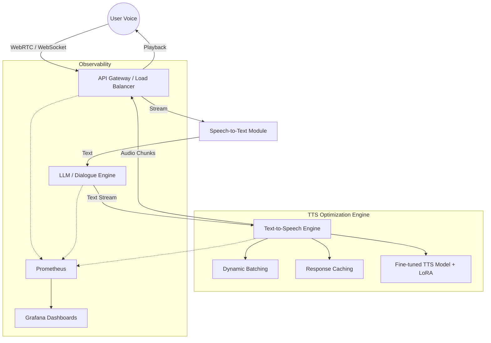

# Interview Study Material: Introduction & Profile

> [!NOTE]
> **Candidate Profile:** Rohit Sharma | AI Engineer — Generative AI & Voice Systems
> **Contact:** +91 8439381549 | rohitqwer0@gmail.com | [LinkedIn](https://linkedin.com/in/irohitsharma21) | [GitHub](https://github.com/irohitsharma21)
> **Location:** Noida, UP | **Education:** B.Tech CSE (Expected Aug 2027), JSSATEN

---

## 1. Tell Me About Yourself

### ⏱️ 30-Second Elevator Pitch
"Hi, I'm Rohit. I'm currently a Founding AI Engineer at IndusLabs AI, specializing in Generative AI and Voice Systems. Over the past year, I architected a production-grade Voice AI Agent from scratch, scaling our real-time TTS throughput by 30x and reducing latency to under 300 milliseconds. I'm deeply passionate about low-latency AI pipelines and model fine-tuning. I'm currently pursuing my B.Tech in CSE, finishing in 2027, and I'm looking to bring my expertise in scalable AI architectures to a dynamic, forward-thinking team."

### ⏱️ 1-Minute Standard Pitch
"Hello, I'm Rohit. I'm an AI Engineer with a strong focus on Generative AI and voice technologies. For the last year and a half, I've been working as the Founding AI Engineer at IndusLabs AI, where I led the development of a highly scalable, low-latency Voice AI Agent. My core technical work involved fine-tuning TTS models for emotionally expressive speech and optimizing inference pipelines to increase throughput by 30x, bringing our Time-to-First-Byte down to under 300ms. 

Before this, I built a strong foundation in computer science through my B.Tech at JSS Academy and by qualifying GATE in CS. I also recently published a paper on multi-modal detection systems. I thrive in fast-paced environments where I can bridge the gap between cutting-edge AI research and production-grade deployments, which is exactly why I'm excited about this opportunity."

### ⏱️ 2-Minute Detailed Pitch
"Hi, I'm Rohit. My journey into AI started with a deep curiosity for how machines process multi-modal data, which eventually led to my paper on a Stereo-Aware Multi-Modal Ambulance Detection System. This academic foundation, combined with qualifying for GATE 2026, gave me the rigor needed to tackle complex, real-world engineering problems.

Professionally, I've been the Founding AI Engineer at IndusLabs AI since March 2025. In this role, I had the unique challenge of building our core Voice AI Agent architecture from the ground up using a scalable FastAPI backend. One of my proudest achievements was tackling our latency bottleneck. By implementing advanced batching, async processing, and streaming chunked responses, I increased our TTS throughput by 30x and consistently achieved a Time-to-First-Byte of under 300 milliseconds. 

I also went deep into model optimization, fine-tuning TTS models to achieve controllable prosody so our AI sounded natural and emotionally expressive, not robotic. I managed the full lifecycle—from building multilingual speech datasets to deploying the system on AWS and GCP using Docker, while setting up Prometheus and Grafana for monitoring.

I'm someone who loves the zero-to-one phase of building products but also respects the engineering discipline required to keep them running at scale. I'm looking for a role where I can continue pushing the boundaries of Generative AI and voice systems."

---

## 2. Education & Academic Questions

> [!TIP]
> Emphasize how your academic rigor (GATE, Research) directly translates to your ability to read whitepapers and implement complex AI architectures.

**Q: What did you study and why?**
**A:** I am currently pursuing my B.Tech in Computer Science and Engineering at JSS Academy of Technical Education, Noida (expected 2027). I chose CSE because I have always been fascinated by software engineering and algorithm optimization. As my studies progressed, I gravitated heavily toward Generative AI and data science, which led me to take specialized courses like the 150+ Hour Data Science with Generative AI certification from PW Skills.

**Q: Tell me about your GATE qualification.**
**A:** I qualified for GATE (Graduate Aptitude Test in Engineering) in CS in 2026. This is one of the most competitive engineering exams in India. Preparing for it deeply solidified my foundational knowledge in core CS subjects like Data Structures, Algorithms, Operating Systems, and Computer Networks. This theoretical foundation has been incredibly useful in my work, especially when dealing with low-level optimizations like connection pooling and concurrent processing in my AI pipelines.

**Q: How does your academic background prepare you for this role?**
**A:** My academics gave me a dual advantage: the standard coursework (backed by GATE prep) made me a strong software engineer, while my independent certifications and research (ICACIS 2026) made me an effective AI researcher. I don't just know how to call APIs; I understand the underlying distributed systems and algorithmic complexities, which allows me to build production-grade, low-latency AI architectures.

---

## 3. Work Experience Deep Dive: IndusLabs AI

> [!IMPORTANT]
> This is the core of your interview. Be prepared to draw the architecture on a whiteboard if asked.

### 🏗️ Architecture Overview

### Deep Dive Q&A

**Q: What does a 'Founding AI Engineer' mean in your context?**
**A:** It means taking ownership of the entire AI lifecycle from day one. I wasn't just joining an existing codebase; I had to make the foundational architectural choices. I chose FastAPI for our backend due to its async capabilities, designed the overall AI pipeline (STT -> LLM -> TTS), built our own multilingual dataset pipeline, and set up our CI/CD and deployment infrastructure on AWS/GCP.

**Q: How did you achieve a 30x TTS throughput improvement?**
**A:** When we initially deployed our TTS, it was a massive bottleneck. I achieved the 30x improvement through a combination of infrastructural and model-level optimizations:
1.  **Dynamic Batching:** I implemented an async queue that intelligently batched concurrent TTS requests before sending them to the GPU, maximizing VRAM utilization.
2.  **Model Compilation/Quantization:** We optimized the underlying model weights, utilizing techniques like FP16 inference and ONNX/TensorRT runtimes where applicable.
3.  **Caching:** I implemented a semantic caching layer for highly frequent system responses so the inference engine could be bypassed entirely for common intents.

**Q: How did you reduce Time-to-First-Byte (TTFB) to <300ms?**
**A:** TTFB is critical in voice agents because any delay breaks the illusion of a natural conversation. 
*   **Streaming & Chunking:** Instead of waiting for the LLM to generate the full sentence and the TTS to synthesize the whole audio, I pipelined the process. As soon as the LLM generated a complete phrase (chunk), it was sent to the TTS engine. The TTS then streamed the audio back to the client in small byte chunks.
*   **Connection Pooling & Keep-Alives:** I ensured persistent WebSocket connections between the client and our FastAPI backend to eliminate TCP/TLS handshake latency on every turn.

**Q: Explain your TTS fine-tuning process.**
**A:** 
| Phase | Details |
| :--- | :--- |
| **Data Prep** | Built a pipeline to scrape, clean, and align multilingual speech data. Handled noise reduction and transcript alignment. |
| **Tokenization** | Used advanced acoustic tokenizers (like SNAC) to discretize the audio into tokens, allowing the model to learn acoustic representations efficiently. |
| **Fine-Tuning** | Used Parameter-Efficient Fine-Tuning (PEFT), specifically LoRA (Low-Rank Adaptation), to train on top of base TTS models without updating all billions of parameters, saving compute while achieving high fidelity. |

**Q: What is prosody control and why does it matter?**
**A:** Prosody refers to the rhythm, stress, and intonation of speech. A standard TTS sounds robotic because it lacks contextual prosody. By fine-tuning the model with prosody control, we could instruct the model to sound empathetic, urgent, or cheerful based on the LLM's intent output. This makes the AI Agent feel vastly more human.

**Q: Explain your deployment pipeline.**
**A:** I containerized all microservices (STT, LLM connector, TTS) using **Docker**. Depending on client needs and GPU availability, we deployed on either **AWS (EC2/EKS)** or **GCP**. To ensure reliability, I integrated **Prometheus** to scrape metrics (latency, GPU memory, error rates) and visualized them using **Grafana**, allowing us to set up alerts for when TTFB spiked above our 300ms SLA.

---

## 4. Achievements & Publications

**Q: Tell me about your research paper at ICACIS 2026.**
**A:** I published a paper titled "Stereo-Aware Multi-Modal Ambulance Detection System." The research focused on combining visual data (cameras) with directional acoustic data (stereo audio) to detect approaching ambulances faster and more accurately than single-modality systems. This required aligning and fusing features from both computer vision models and audio processing models, which deeply enhanced my understanding of multi-modal AI architectures.

**Q: What was the StarForge 2026 hackathon about?**
**A:** It was a high-stakes hackathon organized by the E-Cell at JSSATEN. My team and I built a prototype under severe time constraints, focusing on practical AI application and business viability. Winning first place and the INR 20,000 prize validated not just my coding skills, but my ability to ideate and deliver a working product quickly.

---

## 5. Behavioral Questions (STAR Method)

> [!CAUTION]
> Always stick to the **STAR** framework: **S**ituation, **T**ask, **A**ction, **R**esult. Keep your answers under 2 minutes.

### 🌟 Tell me about a time you solved a difficult technical problem.
*   **Situation:** At IndusLabs, our initial Voice Agent was too slow. Users were experiencing a 2-3 second delay before the AI responded, causing them to talk over the bot.
*   **Task:** I needed to bring the Time-to-First-Byte (TTFB) down to human-conversation levels (under 500ms) without sacrificing audio quality.
*   **Action:** I profiled the system and identified that TTS synthesis was the bottleneck. I refactored the pipeline from a synchronous REST architecture to an async WebSocket architecture. I implemented text chunking from the LLM, feeding sentence fragments into the TTS, and streaming the resulting audio bytes directly to the client immediately.
*   **Result:** This reduced our TTFB from 2.5 seconds to <300ms, creating a seamless, interruptible conversational experience, and helped us secure our next two major B2B clients.

### 🌟 Tell me about a time you had to learn something quickly.
*   **Situation:** To make our AI voice sound more natural, we needed to implement custom prosody control, but I had minimal experience with advanced acoustic tokenization like SNAC at the time.
*   **Task:** I had two weeks to build a fine-tuning pipeline for our TTS engine.
*   **Action:** I dove straight into the latest research papers and open-source audio modeling repositories. I spent my nights experimenting with LoRA on discrete audio tokens. I built a small script to test various hyperparameter configurations on a subset of our data to learn empirically.
*   **Result:** Within 10 days, I had a working LoRA fine-tuning pipeline that allowed us to successfully inject emotion into our AI's voice, which became a core selling point of our product.

### 🌟 Describe a situation where you had to make a tradeoff.
*   **Situation:** While scaling the voice agent, we had a choice between using a massive, ultra-realistic TTS model vs. a smaller, slightly lower-fidelity model.
*   **Task:** Determine the best architecture for production deployment.
*   **Action:** I set up A/B tests. The large model sounded 10% better but had a baseline latency of 800ms and required an expensive A100 GPU. The smaller model, when dynamically batched and accelerated with ONNX, had a latency of 250ms and ran on a cheaper L4 GPU.
*   **Result:** I made the tradeoff to use the smaller model. The significant reduction in latency resulted in a much better user experience than the slight gain in audio fidelity would have provided, and it reduced our cloud compute costs by 60%.

### 🌟 Tell me about a failure and what you learned.
*   **Situation:** Early on at IndusLabs, we deployed an update to our FastAPI backend that inadvertently caused memory leaks during high concurrent load.
*   **Task:** The server crashed during a demo with a potential client.
*   **Action:** I immediately rolled back the deployment to restore service. Afterward, I realized our failure wasn't just the code bug, but our lack of visibility into system health. I spent the next two days integrating Prometheus and Grafana.
*   **Result:** We now have real-time dashboards monitoring VRAM and CPU usage. I learned that in a startup, having robust observability is just as important as having good code. We've never had a silent crash since.
