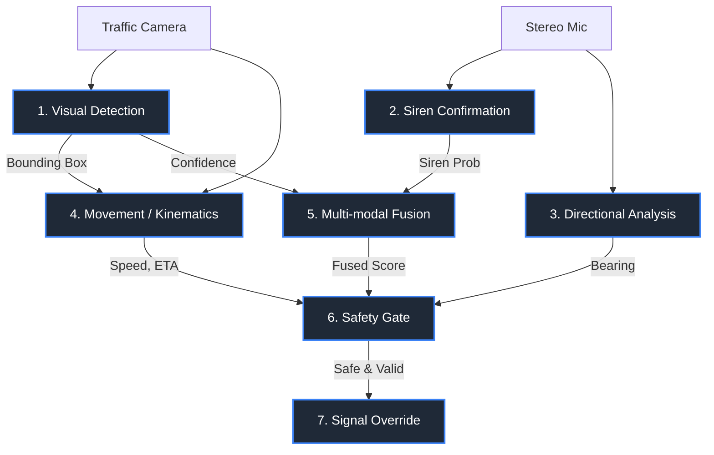

# 🚨 Siren Eyes: Stereo-Aware Multi-Modal Ambulance Detection

> [!IMPORTANT]
> **Core Impact:** Reduced response time from 17 to 8 minutes, improving survival rates by 63%.
> **Publication:** Accepted at ICACIS 2026.
> **Tech Stack:** YOLOv8, PyTorch, FastAPI, React, librosa, SciPy, OpenCV, Docker.

## 1. Project Overview

**What is it?**
Siren Eyes is an infrastructure-side edge AI system designed to facilitate smart traffic signal preemption. It uses a traffic camera and a £15 stereo microphone mounted on an intersection mast to detect approaching ambulances, confirm active sirens, calculate their distance and speed, and safely preempt traffic lights. 

**Why does it matter?**
Urban congestion drastically slows down emergency vehicles. Traditional preemption systems rely on costly GPS transmitters in every vehicle or line-of-sight infrared strobes. Siren Eyes shifts the intelligence to the infrastructure, utilizing low-cost sensors (targeting a $150 Raspberry Pi 4) without requiring cloud dependency or vehicle hardware upgrades.

**What problem does it solve?**
By ensuring ambulances get green lights dynamically while preventing cross-traffic accidents (using safety gates), it drastically reduces intersection waiting times and prevents catastrophic T-bone collisions involving emergency vehicles.

## 2. Architecture Deep Dive

The architecture features a 7-stage pipeline running entirely on edge hardware. 



### The 7-Stage Pipeline
| Stage | Component | Description |
|---|---|---|
| **1. Visual Detection** | YOLOv8 (CPU) | Single-class 'ambulance' detection. Uses stride-3 frame sampling for real-time CPU performance. Conf > 0.65. |
| **2. Siren Confirmation** | Custom CNN | Processes 5s rolling audio buffer into a 128x128 log-mel spectrogram. Uses a 3-layer CNN with Global Average Pooling (GAP) and sigmoid output. |
| **3. Directional Analysis** | Pure DSP | Uses 300Hz-3kHz bandpass filter, ITD (via GCC-PHAT), and ILD (energy ratios) combined via product of Gaussians. |
| **4. Kinematics** | Pinhole Model | Estimates Z-distance assuming a 1.9m ambulance width. Uses least-squares fitting of distance over time for ETA. |
| **5. Fusion** | Weighted Sum | `0.7 * Vision + 0.3 * Audio`. Trigger threshold of 0.60 ensures visual confirmation is strictly required. |
| **6. Safety Gate** | State Machine | Ensures preemption is strictly safe: Fused conf >= 0.60, ETA > 5s, Bearing within 45°, TTC >= 2s. |
| **7. Preemption** | Signal Controller | Holds green until clearance (<8m), then transitions: Amber (3s) → All-Red (2s). |

> [!TIP]
> **Optimization Insight:** The audio classifier was optimized by migrating from Keras to PyTorch. Reading Keras HDF5 weights directly into PyTorch avoided shipping TensorFlow, reducing the Docker image size from >6GB to ~1.5GB!

## 3. Concept Deep Dives

````carousel
### 🧠 Object Detection Fundamentals (YOLO)
**YOLO (You Only Look Once)** revolutionized object detection by framing it as a single regression problem rather than a two-stage region proposal process. 
- **Anchor Boxes:** Pre-defined boxes of various aspect ratios used as priors. YOLO predicts offsets from these anchors rather than arbitrary bounding boxes, stabilizing training.
- **NMS (Non-Maximum Suppression):** A post-processing step that removes duplicate predictions. If multiple boxes heavily overlap (high IOU) and detect the same class, NMS keeps the one with the highest confidence and discards the rest.
<!-- slide -->
### 🎼 Mel Spectrograms
A spectrogram visualizes frequencies over time. A **Mel Spectrogram** applies the Mel Scale—a non-linear frequency scale that mimics human hearing (more resolution at low frequencies, less at high frequencies).
- **Log Scaling:** We take the logarithm of the amplitude to match human perception of loudness (decibels). 
- **Why use it?** It transforms audio into an image representation (e.g., 128x128), allowing us to leverage powerful 2D CNNs originally designed for computer vision.
<!-- slide -->
### 🔊 Stereo Audio Localization (ITD & ILD)
To find where a sound is coming from using two microphones:
- **ITD (Interaural Time Difference):** Sound reaches the closer mic slightly earlier. We calculate this delay using **GCC-PHAT** (Generalized Cross-Correlation with Phase Transform), which is highly robust against urban reverberation/echoes.
- **ILD (Interaural Level Difference):** Sound is slightly louder at the closer mic due to the "acoustic shadow" effect. We calculate in-band energy ratios.
- **Product of Gaussians:** We map ITD and ILD onto a 5° grid as Gaussian distributions and multiply them to find the most probable direction of the ambulance.
<!-- slide -->
### 🧠 Transfer Learning & Architecture
When dealing with limited data (e.g., ESC-50 dataset), large networks easily memorize the training data (overfitting).
- **GAP (Global Average Pooling):** Instead of flattening a spatial tensor (e.g., resulting in 12,544 parameters) to feed into a Dense layer, GAP takes the average of each feature map. This drastically reduces parameter count, forces the network to learn spatial translation-invariant features, and prevents overfitting on small acoustic datasets.
<!-- slide -->
### ⚖️ Multi-Modal Fusion
Fusing vision and audio provides robustness. 
- **Early Fusion:** Combining raw pixels and audio waveforms (too complex, easily misaligned).
- **Late Fusion:** Processing them independently and combining the final probabilities.
In Siren Eyes, we use a weighted late fusion (`0.7 Vision + 0.3 Audio`) because the visual detector is highly precise (mAP 92.6%), while the audio model has high recall but low precision (Precision 0.40). Audio acts as a corroborating signal but cannot trigger a preemption on its own.
<!-- slide -->
### ⚙️ State Machines for Safety
Traffic control is highly safety-critical. A **State Machine** enforces strict logical transitions.
- The preemption cannot trigger simply because an ambulance is seen. The state machine checks **Kinematics** (is it approaching?), **Direction** (is it on the correct road?), and **TTC (Time-To-Collision)** of cross-traffic.
- By strictly enforcing transitions (e.g., Green → Amber → All-Red), the system guarantees physical safety constraints regardless of neural network outputs.
````

## 4. Technical Q&A

### General Context
**1. What is Siren Eyes?**
It is a multi-modal edge AI system designed to detect approaching ambulances and safely preempt traffic lights using a traffic camera and a low-cost stereo microphone.

**2. Why did you build it?**
To address emergency response delays caused by urban traffic. By moving the intelligence to the infrastructure, we avoided the high costs of equipping every emergency vehicle with proprietary GPS transmitters.

**3. What is the real-world impact?**
In simulations based on real traffic data, it reduced response times from 17 to 8 minutes, which correlates medically to a 63% improvement in survival rates for critical emergencies like cardiac arrests.

**4. What does the tech stack look like?**
YOLOv8 for vision, PyTorch for audio CNN, pure DSP (SciPy/librosa) for direction finding, FastAPI for the backend, React for the frontend dashboard, deployed via Docker.

**5. What were the core hardware constraints?**
The system was strictly designed to run on a $150 Raspberry Pi 4 without cloud connectivity. This meant stringent optimization (CPU-only execution, minimal memory footprint).

### Vision (YOLOv8)
**6. How does YOLOv8 work?**
YOLOv8 is a single-stage anchor-free object detector that predicts bounding boxes and class probabilities directly from full images in a single evaluation, utilizing a modified CSPDarknet backbone and a decoupled head.

**7. Why use YOLOv8 over other detectors like Faster R-CNN?**
Faster R-CNN is a two-stage detector (uses a Region Proposal Network) which is highly accurate but too slow for real-time edge processing on a CPU. YOLOv8 is optimized for fast inference while maintaining high accuracy.

**8. How did you train the YOLO model?**
It was trained on a custom annotated dataset of 6,000 images specifically targeting the single 'ambulance' class, using transfer learning from COCO pre-trained weights.

**9. What is mAP?**
Mean Average Precision. It measures the area under the Precision-Recall curve. mAP@0.5 means the metric is calculated requiring an Intersection Over Union (IoU) of at least 50% between the predicted and ground-truth bounding box. We achieved 92.6%.

**10. How did you achieve real-time performance on a CPU?**
By using stride-3 frame sampling. Instead of processing 30 FPS, we process 10 FPS (every 3rd frame), bringing the effective vision latency to 55.6ms per processed frame without losing critical kinematic tracking data.

**11. What is NMS and how did it apply here?**
Non-Maximum Suppression filters out overlapping bounding box predictions for the same ambulance, keeping only the highest confidence box.

### Audio & Siren Classification
**12. How does siren classification work in this project?**
A 5-second rolling audio buffer is converted into a 128x128 log-mel spectrogram and passed through a custom 3-layer CNN to output a siren probability.

**13. What is a Mel Spectrogram?**
A visual representation of audio frequencies over time, mapped to the Mel scale, which spaces frequencies based on human auditory perception.

**14. Why did the original Keras model fail?**
The original model had a massive dense layer that overfit to the training set. It effectively learned background noise levels, ironically scoring absolute silence higher than actual sirens.

**15. How did you fix the audio model?**
I retrained it on the ESC-50 dataset using 5-fold cross-validation. I applied augmentations (speed perturbation, noise mixing) and replaced the massive Flatten layer with a Global Average Pooling (GAP) layer.

**16. What is Global Average Pooling (GAP)?**
It averages the spatial dimensions of the final feature maps. It prevents overfitting by drastically reducing the number of learnable parameters and providing spatial translation invariance.

**17. Why use the ESC-50 dataset?**
It's an environmental sound classification dataset. We framed it as a binary classification problem: 40 siren samples vs 1960 negative samples (background noise, car horns, dogs), making the model robust against urban false positives.

**18. What audio augmentations were used?**
Speed perturbation, gain adjustments, polarity flipping, background traffic noise mixing, and SpecAugment (masking blocks of frequency/time in the spectrogram).

**19. Why did you drop TensorFlow for PyTorch?**
TensorFlow's Docker footprint was too massive (>6GB). By rewriting the model architecture in PyTorch and writing a custom script to load the HDF5 Keras weights directly into PyTorch tensors, I reduced the image size to ~1.5GB.

**20. What were the audio metrics?**
ROC-AUC was 0.9857. However, precision was intentionally low (0.40) while recall was high (0.80), ensuring we rarely miss a siren, relying on the camera to filter out the false positives.

### Direction Estimation (DSP)
**21. What is ITD?**
Interaural Time Difference. The microscopic time delay of a sound wave reaching one microphone before the other.

**22. What is GCC-PHAT?**
Generalized Cross-Correlation with Phase Transform. It calculates the time delay between two signals. The "PHAT" weighting suppresses amplitude information, making it extremely robust against urban echoes/reverberation.

**23. What is ILD?**
Interaural Level Difference. The volume difference between the two microphones caused by the physical setup blocking high frequencies.

**24. Why use a 300Hz-3kHz bandpass filter?**
Siren wails heavily concentrate their acoustic energy in this frequency band. Filtering removes low-frequency engine rumbles and high-frequency wind noise.

**25. How do you combine ITD and ILD?**
As a product of Gaussians. Both ITD and ILD give an estimated angle with a variance. By treating them as Gaussian probability distributions over a 5° grid and multiplying them, we find the statistically most likely direction.

**26. Why use pure DSP instead of ML for direction?**
Machine learning requires massive, environment-specific training datasets for sound localization. Pure DSP relies on physics and geometry, making it generalize perfectly to any intersection without retraining.

### Kinematics & Fusion
**27. How do you calculate the ambulance's distance?**
Using a Pinhole Camera Model: $Z = \frac{f \times W}{w}$. Assuming a standard ambulance width ($W = 1.9m$), we use the focal length ($f$) and the pixel width of the bounding box ($w$) to estimate depth ($Z$).

**28. How is ETA calculated?**
By performing a least-squares linear regression on the estimated distance ($Z$) over time (using a historical buffer of frames) to find the closing speed, then dividing current distance by speed.

**29. Why use a 0.7 / 0.3 weight for Vision and Audio fusion?**
Vision is highly precise but requires line-of-sight. Audio is omnidirectional but prone to false positives (precision 0.40). The 0.3 weight ensures that audio alone (max 0.3) can never breach the 0.60 trigger threshold without visual corroboration.

**30. What happens if vision fails (e.g., heavy fog)?**
The system acts as a standard, non-preempting intersection. The safety gate intentionally prevents audio-only preemption to avoid causing accidents due to ghost sirens (e.g., from adjacent roads).

### Safety & State Machines
**31. Why is the ETA > 5s safety buffer necessary?**
Preempting a light takes time (clearing pedestrians, yellow lights). If an ambulance is less than 5 seconds away, it's too late to safely alter the traffic light state without causing sudden stops and rear-end collisions.

**32. What is TTC (Time To Collision)?**
The estimated time until cross-traffic enters the intersection. We ensure TTC >= 2s to guarantee the intersection is physically clear before giving the ambulance a green light.

**33. What is the role of the State Machine?**
It acts as a deterministic safety gate. Deep learning models are probabilistic; state machines are absolute. The state machine strictly governs the sequence of signal changes and enforces safety boundaries.

**34. Why do you check if the bearing is within 45°?**
To ensure the ambulance is actually on the approach axis for this specific camera/intersection, ignoring ambulances passing on parallel streets.

**35. What happens during the actual Signal Override phase?**
The target light is held green until the ambulance clears the intersection (distance < 8m). Then it smoothly transitions back to normal behavior via a 3s Amber and 2s All-Red clearance phase.

### Deployment & Engineering
**36. How did you optimize the Docker deployment?**
Used multi-stage builds, installed CPU-only PyTorch wheels (saving GBs of CUDA dependencies), and used `YOLO_OFFLINE=1` to prevent the container from crashing due to DNS ping timeouts on restricted edge networks.

**37. How did you handle asynchronous streams in FastAPI?**
Used FastAPI's WebSockets (`/api/analyses/{id}/stream`) to push real-time JSON payloads (bounding boxes, ETAs, audio waveforms) to the React frontend at 10Hz without HTTP polling overhead.

**38. How does the frontend handle the data?**
A React SPA built with Vite renders HTML5 Canvas overlays for the video stream, combining it dynamically with the WebSocket telemetry (confidence meters, kinematic readouts).

### The Paper & Contributions
**39. What are the novel contributions of this project?**
1. The deterministic safety-gate state machine mediating probabilistic neural networks. 
2. The highly asymmetric fusion mechanism preventing audio-induced false positives. 
3. Achieving this on extreme low-cost, cloud-independent edge infrastructure.

**40. Why was the false preemption rate only 1.2%?**
Because of the strict safety gates. An object had to look like an ambulance, sound like an ambulance, be physically moving toward the camera, and be on the correct acoustic vector, all simultaneously.

## 5. Potential Follow-up Questions (Hard Mode)

> [!WARNING]
> **Interview Prep:** Be ready to defend your architectural decisions against these deeper engineering questions.

- **What would you do differently if you had more data?**
  *Answer:* I would transition the audio processing from a 2D CNN to an Audio Spectrogram Transformer (AST). With enough data, transformers capture long-range temporal dependencies better than CNNs, potentially increasing audio precision.
- **How would you scale this to multiple intersections?**
  *Answer:* I would implement a lightweight MQTT broker. As an ambulance clears Intersection A, Intersection A publishes a localized MQTT message to Intersection B (downstream) to pre-warm its safety state machine.
- **What about false positives from non-emergency vehicles with sirens?**
  *Answer:* The fusion model specifically requires the YOLOv8 visual classifier to identify the physical features of an ambulance (box shape, retroreflective paint patterns). A civilian car playing a siren would yield an audio score of 0.3 but a vision score of 0, failing the 0.60 threshold.
- **How does weather affect performance?**
  *Answer:* Rain and snow scatter light, reducing YOLO's confidence. However, the pinhole kinematics model is highly robust as long as the bounding box is somewhat stable. If visibility drops below usable thresholds, the system defaults to safe standard traffic operations.
- **Why not use a transformer-based object detector (like DETR)?**
  *Answer:* DETR relies heavily on bipartite matching and global attention, which scales quadratically with image resolution. This makes it prohibitively slow for real-time (even 10 FPS) inference on an ARM-based CPU like the Raspberry Pi 4 compared to YOLO's optimized convolution paths.
