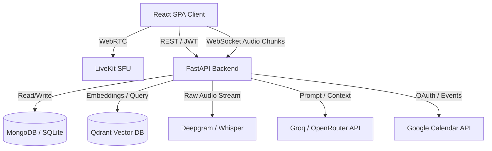
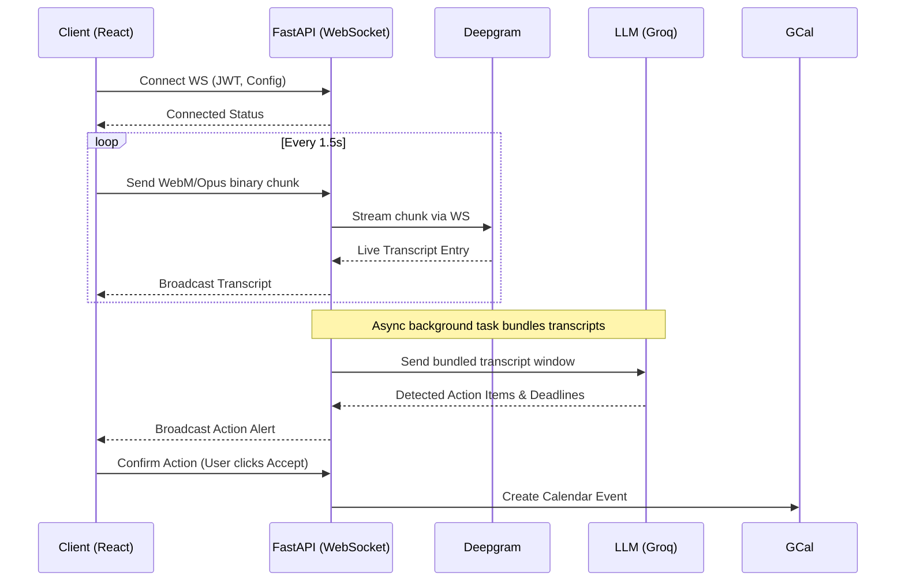
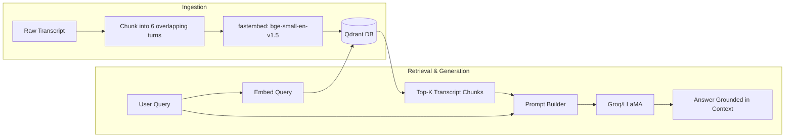

# 🎙️ MeetAI: AI-Enhanced Meeting Platform – Study Guide

> [!IMPORTANT]
> **Core Value Proposition**: MeetAI acts as an intelligent co-pilot for meetings. It doesn't just host audio/video calls; it passively listens, transcribes in real-time without costly video processing, detects action items, syncs them to Google Calendar, and builds a searchable semantic database of all your past conversations.

## 1. 🚀 Project Overview

**Project:** MeetAI – AI-Enhanced Meeting Platform
**Real-World Use Case:** Remote teams, project managers, and interviewers who spend hours in meetings and lose context. Instead of manual note-taking, MeetAI extracts action items live, provides zero-API-cost meeting analytics (talk-time share, participation balance), and enables users to "chat with their past meetings" using RAG.

**Tech Stack at a Glance:**
| Layer | Technology | Key Usage |
|-------|------------|-----------|
| **Backend** | FastAPI (Python) | Async API, WebSocket handling for live audio ingest |
| **Frontend** | React 18, Vite, TS | SPA, Zustand state, Tailwind styling |
| **Real-time Media** | LiveKit | WebRTC SFU for audio/video transport |
| **Database** | MongoDB (Motor) / SQLite | Pluggable architecture; abstract base classes |
| **AI / NLP** | Groq (Whisper/LLaMA), Deepgram | Fast transcription, LLM cascading for rate limits |
| **Search (RAG)** | Qdrant (Embedded), fastembed | `bge-small-en-v1.5` embeddings, local execution |
| **Deployment** | Docker, Vercel, Render | Containerized backend, static frontend |

---

## 2. 🏛 Architecture Deep Dive

### 2.1 Overall System Architecture

### 2.2 WebSocket Transcription & Live Action Detection Flow

### 2.3 RAG Pipeline (Ask Your Meetings)

> [!TIP]
> **Why fastembed and Qdrant?** 
> `fastembed` uses ONNX to generate embeddings locally on the CPU without needing a heavy PyTorch dependency or external API calls, keeping costs to zero and latency low. Qdrant runs embedded within the Python process (no separate container needed for the vector DB).

---

## 3. 🧠 Technical Q&A (40+ Questions)

### General
1. **What is MeetAI?** 
   *Answer:* A real-time conferencing app that augments meetings with live transcription, automated calendar integrations for action items, and a RAG-based search for past conversations.
2. **What problem does MeetAI solve?** 
   *Answer:* It mitigates meeting fatigue and context loss. It automates note-taking, tracks commitments, provides analytics, and ensures past discussions are searchable.
3. **Walk me through the main user journey.** 
   *Answer:* User logs in -> Creates/Joins a meeting -> Speaks via WebRTC -> App transcribes audio via WebSockets -> AI detects actions -> User confirms action -> Synced to Google Calendar -> Post-meeting, user queries insights via RAG.

### Backend (FastAPI, Python)
4. **Why choose FastAPI over Django/Flask?** 
   *Answer:* Built-in async support for WebSockets, automatic OpenAPI docs (Swagger), type validation via Pydantic (crucial for LLM JSON outputs), and high performance (Starlette/Uvicorn).
5. **How does async Python help your application?** 
   *Answer:* It allows the single-threaded event loop to handle thousands of I/O bound operations concurrently, like awaiting LLM responses, database queries, and WebSocket streams, without blocking other requests.
6. **How do you handle WebSocket connections in FastAPI?** 
   *Answer:* Using `@app.websocket()`, managing active connections in a `ConnectionManager` class, and using `asyncio` tasks to listen to client messages and upstream transcription services simultaneously.
7. **Explain your "No-Wait Boot" design decision.** 
   *Answer:* The server starts immediately and accepts connections even if 3rd-party APIs (like LLM or DB) are slow to initialize. APIs are probed in a detached background task. If an API is down, the app gracefully degrades (e.g., meeting works, but AI insights are disabled).

### Authentication
8. **Explain the JWT flow in MeetAI.** 
   *Answer:* User logs in -> Server hashes password, compares with bcrypt -> Generates short-lived Access Token and long-lived Refresh Token -> Client sends Access Token in `Authorization` header for protected routes.
9. **Why use Refresh Tokens?** 
   *Answer:* To balance security and UX. Access tokens expire quickly (e.g., 15 mins) to minimize risk if stolen. The refresh token allows obtaining a new access token without re-authenticating, but it can be revoked in the database.
10. **How is bcrypt used?** 
    *Answer:* To salt and hash user passwords before storing them. It uses a computationally expensive algorithm to deter brute-force and rainbow table attacks.
11. **Where is AES-256-GCM used?** 
    *Answer:* For field-level encryption (e.g., encrypting Google Calendar OAuth refresh tokens stored in the database), ensuring that even if the DB is compromised, sensitive API tokens remain secure.

### Database
12. **Why build a pluggable database architecture?** 
    *Answer:* It enables smooth environments. Developers can run the app locally using SQLite (`aiosqlite`) with zero setup, while production runs on MongoDB (`Motor`) for scalability. It relies on an abstract base class enforcing a contract (e.g., `get_meeting`, `save_transcript`).
13. **What are the tradeoffs between SQLite and MongoDB?** 
    *Answer:* SQLite is a local file-based RDBMS (ACID compliant, zero config, but limited concurrency/scaling). MongoDB is a NoSQL document store (great for unstructured transcript/AI data, horizontal scaling, flexible schema, but requires infrastructure).
14. **What is Motor?** 
    *Answer:* An asynchronous Python driver for MongoDB. It allows FastAPI to query Mongo without blocking the asyncio event loop.

### LiveKit & WebRTC
15. **How does WebRTC work at a high level?** 
    *Answer:* It establishes peer-to-peer connections for audio/video using UDP. It uses SDP (Session Description Protocol) to negotiate media formats and ICE candidates to find network paths.
16. **What is an SFU and why use LiveKit?** 
    *Answer:* SFU (Selective Forwarding Unit) receives a single stream from a client and routes it to all other clients, reducing client upload bandwidth. LiveKit abstracts WebRTC complexities, handles STUN/TURN, and provides robust React components.
17. **SFU vs MCU vs Mesh?** 
    *Answer:* Mesh (P2P): Doesn't scale beyond ~4 users. MCU (Multipoint Control Unit): Mixes all streams into one on the server (heavy CPU). SFU: Routes individual streams (best balance of bandwidth and CPU).
18. **What are STUN and TURN servers?** 
    *Answer:* STUN helps clients discover their public IP address. TURN relays traffic if firewalls/NATs block direct P2P connections. LiveKit manages this infrastructure.
19. **How is audio captured for transcription?** 
    *Answer:* The frontend uses `MediaRecorder API` to capture the local microphone stream, chunks it into WebM format, and sends it to the backend via a separate WebSocket connection.

### Transcription
20. **Why stream WebM Opus directly to Deepgram?** 
    *Answer:* By sending native browser WebM chunks directly to Deepgram, we bypass the need to decode/transcode the audio using FFmpeg on our server. This drastically reduces CPU overhead and latency.
21. **What is the fallback if Deepgram fails?** 
    *Answer:* The backend cascades to Groq's Whisper Large v3 model.
22. **What are the challenges of real-time streaming?** 
    *Answer:* Handling network jitter, out-of-order packets, partial utterances (where the last word isn't fully spoken yet), and maintaining low latency.
23. **How does Deepgram nova-3 compare to Whisper?** 
    *Answer:* Nova-3 is often faster and cheaper for live streaming via WebSockets, whereas Whisper excels at batch processing and robust language translation, though Groq makes Whisper very fast.

### AI / LLM
24. **How do you handle rate limits (HTTP 429)?** 
    *Answer:* A unified LLM client automatically catches `429 Too Many Requests` errors and cascades to fallback models or providers (e.g., OpenRouter primary -> Groq secondary), with exponential backoff.
25. **How do you extract action items reliably using an LLM?** 
    *Answer:* Using few-shot prompt engineering and enforcing JSON schema output constraints. We parse the output with a tolerant JSON parser that handles markdown backticks or partial JSON.
26. **What is the prompt strategy for action detection?** 
    *Answer:* Provide a sliding window of the last N transcript turns, specify the system role ("You are a strict meeting assistant"), define the JSON schema required, and instruct it to ignore casual conversation.
27. **Why bundle transcripts asynchronously for action detection?** 
    *Answer:* Doing it on every spoken word is too expensive and slow. Bundling 10-15 seconds of context into an async background task allows the LLM to understand full sentences and intent.

### RAG (Retrieval Augmented Generation)
28. **Explain the chunking strategy.** 
    *Answer:* Transcripts are chunked into 6 overlapping conversational turns (e.g., Turns 1-6, then 4-9). This preserves conversational context (Q&A pairs) better than standard character-count chunking.
29. **Why use `fastembed` instead of OpenAI embeddings?** 
    *Answer:* `fastembed` uses ONNX runtime to compute embeddings locally on CPU extremely fast. It costs nothing, ensures privacy (no data sent to external APIs), and removes network latency.
30. **Why use Qdrant as the vector DB?** 
    *Answer:* It supports an embedded mode in Python. It runs in the same process, requiring no external docker containers, making deployment on restricted environments (like Render free tier) much easier.
31. **What is semantic search vs keyword search?** 
    *Answer:* Keyword search looks for exact string matches. Semantic search uses vector embeddings to understand intent (e.g., searching "vacation policy" will match "time off rules").
32. **How does RAG ground the LLM?** 
    *Answer:* Instead of relying on the LLM's internal weights (which hallucinate), we retrieve actual meeting transcripts from Qdrant, inject them into the system prompt, and instruct the LLM: "Answer strictly using the provided context."

### Analytics
33. **What is Shannon entropy and how is it used here?** 
    *Answer:* Shannon entropy is a concept from information theory. In MeetAI, it measures participation balance. If one person speaks 90% of the time, entropy is low (monologue). If 4 people speak equally, entropy is high (balanced discussion).
34. **Why are the analytics "zero-API-cost"?** 
    *Answer:* Metrics like talk-time share, longest turn, and filler word frequency are calculated algorithmically directly from the stored transcript text and timestamps in the database, requiring no LLM calls.

### Deployment & DevOps
35. **Why Render and Vercel?** 
    *Answer:* Vercel provides excellent global CDN and CI/CD for Vite/React static sites. Render offers easy PaaS deployment for the Python backend via `render.yaml`. Both offer generous free/hobby tiers.
36. **What is `WEB_CONCURRENCY=1` and why use it?** 
    *Answer:* It limits Uvicorn to run only 1 worker process. On Render's 512MB free tier, multiple Python workers loading heavy ML models (like fastembed) would cause out-of-memory (OOM) crashes.
37. **How does Docker Compose help local development?** 
    *Answer:* It spins up the frontend, backend, and MongoDB simultaneously on a shared bridge network, ensuring identical environments across developers without manually installing databases.
38. **How do you handle environment variables securely?** 
    *Answer:* Using `.env` files locally (gitignored), and configuring secret variables directly in the Render/Vercel dashboards for production. Pydantic `BaseSettings` validates their existence on startup.

### Real-Time Systems
39. **WebSocket vs SSE vs Long Polling?** 
    *Answer:* Long polling keeps HTTP requests open until data is ready (high overhead). SSE (Server-Sent Events) is one-way (Server -> Client). WebSockets provide full-duplex, bi-directional communication, essential for streaming audio *up* and receiving transcripts *down* simultaneously.
40. **How do you manage WebSocket connection lifecycles?** 
    *Answer:* A `ConnectionManager` dictates `connect()`, `disconnect()`, and `broadcast()`. `try-except` blocks catch `WebSocketDisconnect` exceptions to clean up resources, preventing memory leaks on dropped connections.
41. **How do you normalize join codes?** 
    *Answer:* Join codes remove ambiguous glyphs (O/0, I/1/l). The backend sanitizes input (e.g., extracting the code if a user accidentally pastes the full URL) to ensure robust meeting entry.

---

## 4. 🔬 Concept Deep Dives

### WebRTC Fundamentals
WebRTC (Web Real-Time Communication) allows direct peer-to-peer data, audio, and video sharing.
- **SDP (Session Description Protocol):** A string that describes media capabilities (e.g., "I support Opus audio and VP8 video"). Peers exchange SDPs (Offer/Answer) to agree on formats.
- **ICE (Interactive Connectivity Establishment):** A framework to find the best network path between peers.
- **STUN:** A lightweight server that tells a client, "Here is your public IP address."
- **TURN:** A heavy server that acts as a relay if corporate firewalls block direct peer-to-peer UDP traffic.
- **SFU:** Instead of P2P (which kills your laptop if 10 people connect), clients send exactly 1 stream to the SFU server, which then forwards it to the 9 other clients. 

### RAG (Retrieval Augmented Generation) Pipeline
RAG fixes LLM hallucinations by giving the AI an open book.
1. **Index Time:**
   - **Chunking:** Split transcript into overlapping windows (e.g., Turn 1-6).
   - **Embedding:** Pass text through `bge-small-en-v1.5`. It outputs a dense vector (array of 384 floats).
   - **Storage:** Save vector and raw text into Qdrant.
2. **Query Time:**
   - **Embed Query:** Convert user question into a 384-d vector.
   - **Search:** Qdrant calculates Cosine Similarity between the query vector and database vectors.
   - **Generate:** Retrieve the top 3 transcript chunks, paste them into the LLM prompt, and ask the LLM to answer.

> [!WARNING]
> **Chunking Strategy Matters:** Naive chunking (splitting every 500 characters) might cut a sentence in half, destroying semantic meaning. Conversational turn-based chunking preserves speaker context.

### JWT Authentication In-Depth
JWTs are stateless; the server doesn't need to look up a session in the database.
- **Structure:** `Header.Payload.Signature`
- **Signing:** The backend hashes the header/payload with a secret key (`HS256`). If a user alters the payload (e.g., changing `"role": "user"` to `"admin"`), the signature becomes invalid.
- **Refresh Tokens:** Access tokens are stored in memory and expire fast (15m). Refresh tokens are stored in HttpOnly cookies or secure storage, live for days, and are used to request new access tokens.

### Async Python & Event Loop
Python is traditionally synchronous (execution blocks until a task finishes). `asyncio` introduces an Event Loop.
- When an `async def` function hits an `await` keyword (e.g., `await db.find()`), it yields control back to the Event Loop.
- The Event Loop immediately starts executing other pending tasks (like handling a new WebSocket connection).
- When the database responds, the Event Loop resumes the original function.
- **Crucial:** Never run CPU-bound tasks (like heavy mathematical loops or blocking HTTP requests like `requests.get()`) in an async function, as it freezes the *entire* event loop for all users.

---

## 5. 🎯 Potential Follow-Up Questions (The "Hard" Interview)

**Q: How would you handle 10,000 concurrent meetings?**
*A:* Currently, the API is stateful with WebSockets bound to a specific server. I would introduce **Redis Pub/Sub** as a message broker. WebSockets connect to any API instance (load balanced). When an audio chunk arrives, the API publishes it to a Redis channel for that meeting. Dedicated worker nodes subscribe to Redis, process transcription/AI, and publish the result back. LiveKit handles media scaling natively via clustering.

**Q: What about speaker diarization (knowing WHO is speaking)?**
*A:* LiveKit makes this trivial. Because we have an SFU, each client's audio stream is isolated. We know exactly which user is associated with which WebSocket connection. We don't need AI to guess who is speaking; we tag the transcription request with the user's ID before sending it to Deepgram.

**Q: How do you ensure transcription accuracy with industry-specific jargon?**
*A:* I would leverage Deepgram's custom vocabulary feature, injecting keywords, project names, or acronyms into the streaming configuration context. I could also dynamically build this vocabulary list by extracting keywords from the meeting title or connected calendar event.

**Q: Privacy and data security considerations?**
*A:* 
1. Transcripts are stored in MongoDB; I would implement **Client-Side Field Level Encryption (CSFLE)** for transcript fields.
2. Embeddings are generated entirely locally via `fastembed`—no sensitive meeting data is sent to external embedding APIs like OpenAI.
3. Access control mechanisms to ensure users can only RAG query meetings they were explicitly invited to.

**Q: How would you add End-to-End Encryption (E2EE)?**
*A:* LiveKit supports E2EE using WebRTC Insertable Streams. However, enabling E2EE means the server cannot read the audio. To maintain transcription, the transcription would have to happen entirely on the edge (in the user's browser) using WebAssembly models like Whisper.cpp, and only the generated text would be sent to the server.
