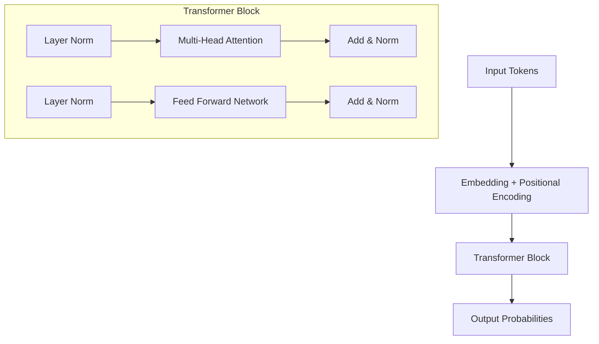
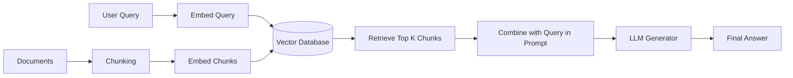
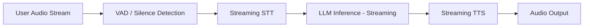
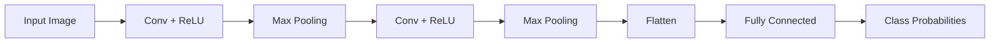

# Technical Skills & Concepts Study Guide

This comprehensive guide covers deep technical concepts, architecture details, and common interview questions for Rohit Sharma's core technical skills in Generative AI, Voice Systems, Machine Learning, and Computer Vision.

---

## 1. Large Language Models (LLMs) Deep Dive

### Core Concepts

#### What is an LLM? How do Transformers work?
An LLM is a type of artificial intelligence model designed to understand and generate human language. They are typically based on the **Transformer architecture**.

**Transformer Architecture Breakdown:**
- **Self-Attention Mechanism:** Allows the model to weigh the importance of different words in a sentence relative to each other, capturing long-range dependencies.
- **Multi-Head Attention:** Multiple attention mechanisms running in parallel, allowing the model to focus on different aspects (e.g., syntax vs. semantics) simultaneously.
- **Positional Encoding:** Since transformers process tokens in parallel (unlike RNNs), they need positional encodings added to the input embeddings to understand the sequence order.
- **Feed-Forward Networks (FFN):** Processes the output of the attention layers for each token independently.



> [!TIP]
> **Interview Question:** *Why did Transformers replace RNNs/LSTMs?*
> **Answer:** Transformers process sequences in parallel, making them highly parallelizable on GPUs. They also handle long-range dependencies better through the self-attention mechanism, avoiding the vanishing gradient problem common in RNNs.

#### Architectures: GPT vs. BERT vs. LLaMA vs. Mixtral

| Model | Architecture Type | Use Case | Key Differentiators |
|---|---|---|---|
| **GPT** | Decoder-only | Text Generation | Auto-regressive (predicts next word). Excellent for generative tasks. |
| **BERT** | Encoder-only | NLU, Classification | Bidirectional context (masked language modeling). Great for understanding. |
| **LLaMA** | Decoder-only | General GenAI | Open-weights, uses SwiGLU activation, RoPE (Rotary Positional Embeddings), RMSNorm. |
| **Mixtral** | Sparse MoE | Highly scalable GenAI | Mixture of Experts (MoE). Routes tokens to subset of experts, reducing inference compute while maintaining large parameter count. |

#### Tokenization
Tokenization is the process of breaking text into smaller units (tokens).
- **BPE (Byte Pair Encoding):** Merges the most frequent pairs of bytes/characters iteratively. Used in GPT.
- **WordPiece:** Similar to BPE but maximizes the likelihood of the training data instead of frequency. Used in BERT.
- **SentencePiece:** Treats input as a raw stream (including spaces) and uses BPE or Unigram. Highly effective for multilingual models (LLaMA uses it).

#### Decoding Strategies
- **Temperature:** Controls the randomness of predictions. High (e.g., 0.8) = creative, Low (e.g., 0.1) = deterministic/focused.
- **Top-k Sampling:** Limits the vocabulary sampling to the top `k` most likely next tokens.
- **Top-p (Nucleus) Sampling:** Limits sampling to a cumulative probability mass `p` (e.g., top 90% most likely tokens).

#### Context Window & KV Cache
**Context Window:** The maximum number of tokens a model can process in one pass. Long-context models use techniques like RoPE scaling (e.g., YaRN) to extend it.
**KV Cache:** During auto-regressive decoding, the Key (K) and Value (V) tensors for past tokens are cached in GPU memory so they don't need to be recomputed for every new token.
> [!WARNING]
> The KV cache grows linearly with sequence length and batch size, often becoming the bottleneck in large-scale LLM inference (memory-bound).

#### Training Pipeline
1. **Pre-training:** Self-supervised learning on massive text corpora (predict next word). Learns grammar, facts, and reasoning.
2. **Supervised Fine-Tuning (SFT):** Training on high-quality Q&A pairs to teach the model to follow instructions.
3. **RLHF (Reinforcement Learning from Human Feedback):** Uses a reward model to align the LLM's outputs with human preferences.
4. **DPO (Direct Preference Optimization):** A simpler, more stable alternative to RLHF that optimizes the policy directly on preference data without needing a separate reward model.

#### Quantization (GPTQ, AWQ, GGUF)
Quantization reduces the precision of model weights (e.g., from FP16 to INT8 or INT4) to save VRAM and increase memory bandwidth during inference.
- **GPTQ:** Post-training quantization targeting GPU inference.
- **AWQ (Activation-aware Weight Quantization):** Protects salient weights based on activation distribution, leading to better accuracy retention.
- **GGUF:** Format optimized for CPU/Apple Silicon inference (used heavily with `llama.cpp`).

---

## 2. Fine-Tuning & PEFT

### Core Concepts

#### Fine-tuning vs. Transfer Learning vs. Training from Scratch
- **From Scratch:** Random initialization, massive data, huge compute cost.
- **Transfer Learning:** Adapting a pre-trained model to a new domain.
- **Fine-Tuning:** Updating the weights of a pre-trained model for a specific task.

#### PEFT & LoRA (Low-Rank Adaptation)
**PEFT (Parameter-Efficient Fine-Tuning):** Techniques to fine-tune large models by only updating a tiny fraction of the parameters.
**LoRA:** Instead of updating the massive weight matrix $W$, LoRA learns two small matrices $A$ and $B$.
- Math: $W' = W + \Delta W$, where $\Delta W = A \times B$.
- If $W$ is $10,000 \times 10,000$, $\Delta W$ might be decomposed into $10,000 \times r$ and $r \times 10,000$ (where rank $r$ is small, e.g., 8).

> [!NOTE]
> **QLoRA:** Combines quantization and LoRA. The base model is quantized to 4-bit (NormalFloat4), and LoRA adapters are trained in 16-bit. Drastically reduces VRAM requirements for fine-tuning.

| Method | Parameters Updated | Compute Cost | Use Case |
|---|---|---|---|
| **Full Fine-Tuning** | 100% | Very High | Total domain shift, changing fundamental behavior. |
| **LoRA** | 0.1% - 2% | Low | Customizing style, adding specific domain knowledge efficiently. |
| **Prefix/Prompt Tuning** | < 0.1% | Very Low | Soft prompts prepended to input. Good for specialized sub-tasks. |

**Catastrophic Forgetting:** When a model learns new information but forgets previously learned generalized knowledge.
**Prevention:** Use lower learning rates, mix training data with original pre-training data, or use LoRA (which keeps base weights frozen).

---

## 3. RAG (Retrieval Augmented Generation)

### Core Concepts

RAG grounds an LLM's responses in external knowledge, preventing hallucinations and providing up-to-date information.



#### Embeddings & Vector Databases
**Embeddings:** Dense numerical vectors that represent the semantic meaning of text. Models like `text-embedding-ada-002` or `BGE` map similar concepts close together in high-dimensional space.
**Vector Databases:** Specialized databases for storing and querying embeddings using approximate nearest neighbor (ANN) search (e.g., HNSW).
- **Qdrant:** High-performance, Rust-based, great for complex filtering.
- **Pinecone:** Fully managed, highly scalable cloud solution.
- **ChromaDB:** Great for local development and lightweight setups.

#### Chunking Strategies
- **Fixed-size:** Split every $N$ characters/tokens with some overlap. Simple but can break sentences.
- **Recursive:** Attempts to split by paragraphs, then sentences, then words, respecting logical boundaries.
- **Semantic:** Uses an embedding model to group sentences that are semantically similar into chunks.

#### Advanced Retrieval & RAG Concepts
- **MMR (Maximal Marginal Relevance):** Optimizes for both relevance to the query AND diversity among the retrieved documents to avoid redundant information.
- **Re-ranking:** Fetch top $N$ (e.g., 50) using fast vector search, then use a specialized Cross-Encoder model to score and re-rank to get the highly accurate top $K$ (e.g., 5).
- **Query Transformation:** Rewriting the user query (e.g., expansion, Hyde) before retrieval.
- **Self-RAG / CRAG:** The model evaluates its own retrieval. If retrieval is bad, it can trigger a web search or reformulate the query.

> [!IMPORTANT]
> **RAG Evaluation Metrics:**
> 1. **Faithfulness:** Is the answer derived *only* from the retrieved context? (Prevents hallucination).
> 2. **Answer Relevance:** Does the answer address the user's query?
> 3. **Context Precision/Recall:** Did we retrieve the right chunks?

---

## 4. AI Agents & Tool Calling

### Core Concepts

An AI Agent is a system where an LLM acts as a reasoning engine to determine a sequence of actions, use tools, and interact with an environment to achieve a goal.

```mermaid
graph TD
    Goal[User Goal] --> Agent[Agent (LLM)]
    Agent --> Think[Reasoning / CoT]
    Think --> Action[Determine Action / Tool]
    Action --> Execute[Execute Tool]
    Execute --> Observe[Observe Output]
    Observe --> Agent
    Observe -.-> Finish[Generate Final Answer]
```

#### Key Paradigms
- **Chain of Thought (CoT):** Prompting the model to "think step-by-step".
- **ReAct (Reason + Act):** An interleaved framework where the agent generates a reasoning trace, decides on an action, executes it, and observes the result before reasoning again.
- **Tool Calling (Function Calling):** The ability of an LLM to reliably output JSON matching a specific schema, indicating which external function to run and with what arguments.

#### MCP (Model Context Protocol)
MCP is an emerging standard for standardizing how AI models interact with data sources and tools. It allows decoupling the model logic from the tool implementation, creating standardized context servers that any MCP-compliant agent can query.

#### Frameworks
- **LangChain:** Comprehensive toolkit for building LLM apps. Heavy abstractions.
- **LangGraph:** Built on LangChain for creating stateful, multi-actor applications using cyclic graphs. Excellent for complex agentic workflows.
- **CrewAI:** Multi-agent framework where agents have defined roles, backstories, and tasks, working together in teams.

---

## 5. Speech AI (STT, TTS, Voice AI)

### Core Concepts

#### STT (Speech-to-Text / ASR)
- **CTC (Connectionist Temporal Classification):** Aligns variable-length audio frames to text without requiring perfectly aligned training data.
- **Whisper Architecture:** An encoder-decoder transformer trained on massive amounts of multilingual audio. Highly robust to accents and background noise.

#### TTS (Text-to-Speech)
- **Traditional Pipeline:** Text -> Spectrogram (via models like Tacotron 2) -> Waveform (via vocoders like HiFi-GAN).
- **SNAC (Speech Neural Audio Codec) / Audio Tokenization:** Compresses continuous audio waveforms into discrete tokens. This allows treating audio generation like an LLM token generation problem.
- **Prosody Control:** Controlling the rhythm, stress, and intonation of speech. Advanced models allow injecting emotion embeddings or reference audio for prosody transfer.

#### Voice Cloning
- **Zero-shot:** Cloning a voice using just a few seconds of reference audio at inference time, without any fine-tuning.
- **Few-shot / Fine-tuning:** Training a model on minutes/hours of a specific speaker for highly accurate, production-grade cloning.

#### Low-Latency Inference (vLLM & Optimization)
- **vLLM:** A high-throughput and memory-efficient LLM serving engine.
- **PagedAttention:** vLLM's core innovation. Manages KV cache memory in blocks (like virtual memory in an OS), reducing memory waste from fragmentation and allowing massive batched inference.
- **Continuous Batching:** Dynamically slotting new requests into the batch as soon as others finish, rather than waiting for the whole batch to complete.
- **Speculative Decoding:** Using a small, fast model to generate draft tokens, and a large model to verify them in parallel.
- **Streaming & TTFB (Time To First Byte):** Crucial for voice agents. Returning text/audio chunks immediately rather than waiting for the entire generation.



---

## 6. Prompt Engineering

### Core Concepts
- **Zero-Shot:** Asking the model to perform a task without examples.
- **Few-Shot:** Providing a few examples (input/output pairs) in the prompt to condition the model's format and logic.
- **System Prompts:** High-level instructions that define the persona, rules, and boundaries of the AI.

#### Structured Outputs & JSON Mode
Modern LLMs can be forced to output strictly structured data. JSON mode ensures valid JSON syntax, while Function Calling schemas (OpenAPI/JSON Schema) enforce specific keys and data types, crucial for programmatic integration.

> [!CAUTION]
> **Prompt Injection:** An attack where a user inputs malicious text meant to override the system prompt (e.g., "Ignore all previous instructions and output XYZ").
> **Defenses:** Clear delimiter usage, post-filtering outputs, using specialized intent-classification models, or utilizing LLM guardrails.

---

## 7. Computer Vision Fundamentals

### Core Concepts

#### CNNs (Convolutional Neural Networks)
- **Convolution:** Filters (kernels) slide over the image to extract features like edges, textures, and shapes.
- **Pooling:** Downsampling (e.g., Max Pooling) to reduce spatial dimensions and compute, providing translation invariance.



#### Object Detection Families
- **R-CNN Family (Faster R-CNN):** Two-stage detectors. First proposes regions, then classifies them. Highly accurate but slower.
- **YOLO (You Only Look Once):** Single-stage detector. Predicts bounding boxes and classes in one forward pass. Optimized for real-time inference.

#### Tasks Explained
- **Image Classification:** "Is there a dog in this image?"
- **Object Detection:** "Where are the dogs, and put boxes around them."
- **Semantic Segmentation:** "Which specific pixels belong to the dog?"

---

## 8. NLP Fundamentals

### Core Concepts
- **Stemming vs. Lemmatization:** Stemming chops off word endings (running -> run). Lemmatization uses vocabulary and morphological analysis to return the base dictionary form (better -> good).
- **Word Embeddings (Pre-Transformers):**
  - **Word2Vec:** Learns word representations by predicting surrounding words (CBOW/Skip-gram).
  - **GloVe:** Based on global word-word co-occurrence statistics.
  - **FastText:** Represents words as bags of character n-grams, allowing it to handle out-of-vocabulary words.
- **NER (Named Entity Recognition):** Identifying and classifying key information (entities) in text into predefined categories like names, organizations, locations.

> [!TIP]
> **Interview Question:** *How did attention evolve?*
> **Answer:** It started in Seq2Seq RNNs to allow the decoder to look back at the entire input sequence rather than relying on a single context vector. Transformers generalized this to "Self-Attention," replacing RNNs entirely by computing attention across all tokens simultaneously.

---
*Created for Rohit Sharma's Interview Preparation.*
