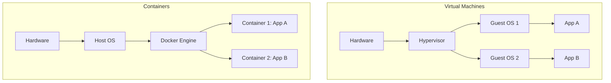
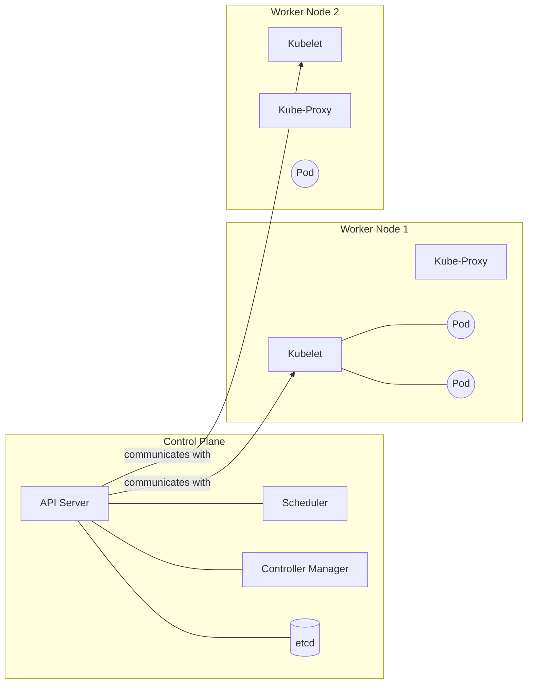
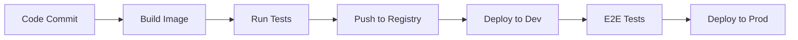
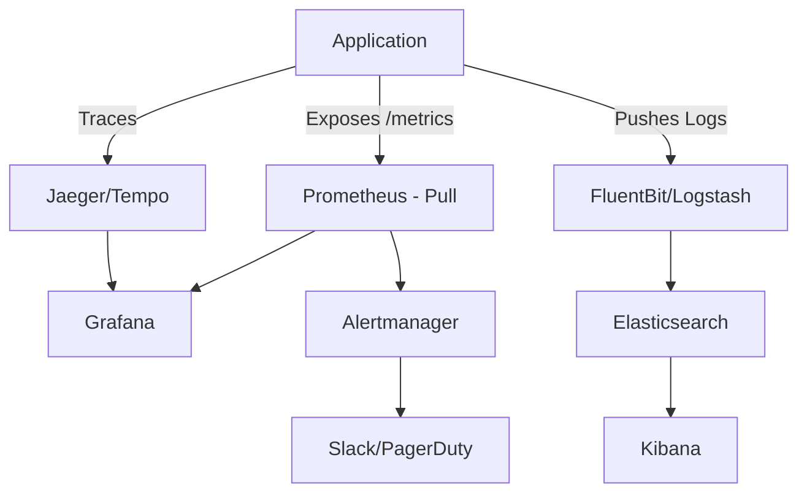
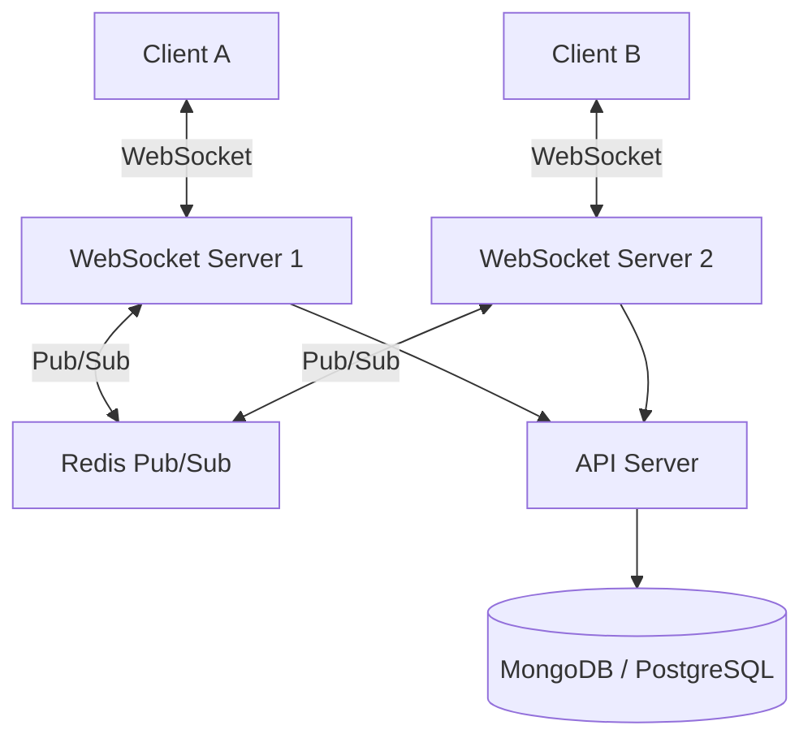

# DevOps, Cloud & System Design Interview Guide

> [!NOTE]
> This guide is tailored for **Rohit Sharma**, focusing on DevOps, Cloud, System Design, and related technologies based on his experience at IndusLabs AI and projects like Siren Eyes and MeetAI.

---

## 1. Docker Deep Dive

### What is Docker? Containers vs VMs

Docker is a platform for developing, shipping, and running applications in containers.

| Feature | Containers (Docker) | Virtual Machines (VMs) |
| :--- | :--- | :--- |
| **OS Support** | Shared Host OS (Kernel) | Independent Guest OS per VM |
| **Boot Time** | Milliseconds | Minutes |
| **Resource Usage** | Lightweight (MBs) | Heavyweight (GBs) |
| **Isolation** | Process-level isolation | Hardware-level isolation |
| **Portability** | High (run anywhere Docker runs) | Lower (hypervisor dependent) |



### Dockerfile Instructions

*   **`FROM`**: Base image to start from (e.g., `python:3.9-slim`).
*   **`RUN`**: Executes commands in a new layer (e.g., `apt-get install`, `pip install`).
*   **`COPY`**: Copies files from host to container.
*   **`CMD`**: Default command executed when container starts (can be overridden).
*   **`ENTRYPOINT`**: Command executed when container starts (harder to override, arguments appended).
*   **`EXPOSE`**: Documents the port the container listens on (does NOT actually publish it).
*   **`ARG`**: Build-time variables (not available at runtime).
*   **`ENV`**: Runtime environment variables (also available during build).

### Multi-stage Builds

> [!TIP]
> **Real-world application**: You used this to reduce the Siren Eyes Docker image from **6GB to 1.5GB**.

Multi-stage builds allow you to use multiple `FROM` statements in your Dockerfile. Each `FROM` begins a new stage. You can selectively copy artifacts from one stage to another, leaving behind everything you don't need in the final image (e.g., build tools, intermediate files).

```dockerfile
# Stage 1: Build
FROM python:3.9 AS builder
WORKDIR /app
COPY requirements.txt .
RUN pip wheel --no-cache-dir --no-deps --wheel-dir /app/wheels -r requirements.txt

# Stage 2: Production
FROM python:3.9-slim
WORKDIR /app
COPY --from=builder /app/wheels /wheels
COPY --from=builder /app/requirements.txt .
RUN pip install --no-cache /wheels/*
COPY . .
CMD ["python", "app.py"]
```

### Docker Compose

Used for defining and running multi-container Docker applications via a `docker-compose.yml` file.

*   **`services`**: Defines the containers to run (e.g., `web`, `db`, `redis`).
*   **`networks`**: Defines custom networks for containers to communicate securely.
*   **`volumes`**: Persistent storage mechanisms (bind mounts or named volumes).
*   **`depends_on`**: Expresses dependency between services (e.g., `web` starts after `db`).

### Docker Networking

1.  **Bridge (Default)**: Private network on the host. Containers on the same bridge network can communicate.
2.  **Host**: Removes network isolation; container shares host's network namespace. High performance.
3.  **Overlay**: Connects multiple Docker daemons together (used in Swarm/Kubernetes).
4.  **Macvlan**: Assigns a MAC address to a container, making it appear as a physical device.
5.  **None**: Completely disables networking for the container.

### Q&A (Docker)

1.  **Q: What is the difference between CMD and ENTRYPOINT?**
    **A:** `CMD` sets default commands/parameters, which can be easily overridden by passing arguments to `docker run`. `ENTRYPOINT` configures a container that will run as an executable; arguments passed to `docker run` are appended to the `ENTRYPOINT` command.
2.  **Q: How do you reduce the size of a Docker image?**
    **A:** Use smaller base images (Alpine or slim), leverage multi-stage builds, combine `RUN` commands to reduce layers, use `.dockerignore`, and clean up package manager caches (`apt-get clean`).
3.  **Q: What is a Docker layer?**
    **A:** Each instruction in a Dockerfile (like `RUN`, `COPY`) creates a layer. Layers are cached, which speeds up future builds. An image is a stack of these read-only layers.
4.  **Q: What is the difference between `COPY` and `ADD`?**
    **A:** `COPY` just copies files. `ADD` does the same but can also extract tar files and download from remote URLs (though `COPY` is generally preferred unless extraction is needed).
5.  **Q: How do Docker volumes work?**
    **A:** Volumes are data persistence mechanisms independent of the container lifecycle. Data written to a volume remains even if the container is deleted.
6.  **Q: Explain Docker architecture.**
    **A:** It's a client-server architecture. The Docker Client talks to the Docker Daemon (Engine), which does the heavy lifting of building, running, and distributing containers.
7.  **Q: What happens if a container runs out of memory?**
    **A:** If no limits are set, the host OS's OOM (Out Of Memory) killer may kill the container process or other host processes. You should set limits using `--memory`.
8.  **Q: How do you share data between containers?**
    **A:** By mounting the same Docker volume or bind mount to both containers.
9.  **Q: What is `.dockerignore`?**
    **A:** It tells Docker which files/directories to exclude when sending the build context to the Docker daemon, saving time and image space.
10. **Q: How does `docker-compose` link containers?**
    **A:** It automatically creates a default network for the application, and services can discover each other using their service names as hostnames.
11. **Q: Can you run Docker inside Docker (DinD)?**
    **A:** Yes, usually by mounting the host's Docker socket (`/var/run/docker.sock`) into the container or by running a dedicated daemon, but it has security implications.
12. **Q: What is a dangling image?**
    **A:** An image that is not tagged and is not referenced by any container. Cleaned up with `docker image prune`.
13. **Q: How do you debug a failing container that crashes immediately?**
    **A:** Inspect logs using `docker logs`, or override the entrypoint to run a shell (`docker run -it --entrypoint sh <image>`) to explore the filesystem.
14. **Q: What is Docker Swarm?**
    **A:** Docker's native orchestration tool (though Kubernetes is far more popular now).
15. **Q: How do you handle secrets in Docker?**
    **A:** Use Docker Secrets (if using Swarm) or pass via environment variables (less secure), or better, inject them at runtime using a secrets manager or Kubernetes Secrets.

---

## 2. Kubernetes Fundamentals

### Architecture



*   **API Server**: The frontend; all communication goes through it.
*   **etcd**: Highly available key-value store holding cluster state.
*   **Scheduler**: Assigns Pods to nodes based on resource constraints.
*   **Controller Manager**: Runs controller loops (e.g., node controller, replicaset controller) to match desired state.
*   **Kubelet**: Agent on each node ensuring containers are running in a Pod.
*   **Kube-Proxy**: Maintains network rules on nodes, allowing communication to Pods.

### Core Resources

*   **Pods**: Smallest deployable unit; one or more containers sharing network/storage.
*   **Deployments**: Manages stateless applications, providing declarative updates and scaling (manages ReplicaSets).
*   **Services**: Stable IP and DNS name for a set of Pods.
    *   *ClusterIP*: Internal only.
    *   *NodePort*: Exposes service on a static port on each Node's IP.
    *   *LoadBalancer*: Provisions a cloud provider's load balancer.
*   **Ingress**: Manages external access (HTTP/HTTPS) to services, providing load balancing and SSL termination.
*   **ConfigMaps & Secrets**: Externalize configuration and sensitive data from the image.

### Scaling & Ecosystem

*   **HPA (Horizontal Pod Autoscaler)**: Scales Pods based on CPU/Memory or custom metrics.
*   **VPA (Vertical Pod Autoscaler)**: Adjusts CPU/Memory requests/limits for Pods.
*   **Cluster Autoscaler**: Adds/removes worker nodes based on Pod resource requirements.
*   **Namespaces**: Logical partitioning of the cluster (e.g., `dev`, `prod`).
*   **RBAC**: Role-Based Access Control to restrict who can do what.
*   **Helm Charts**: Package manager for K8s (templates YAML files).

### Q&A (Kubernetes)

1.  **Q: What is the difference between a Pod and a Container?**
    **A:** A container encapsulates an application. A Pod encapsulates one or more tightly coupled containers, sharing IP, network namespace, and volumes.
2.  **Q: How does a Service route traffic to Pods?**
    **A:** Using **Labels and Selectors**. The Service's selector matches the labels on the Pods.
3.  **Q: What is a StatefulSet?**
    **A:** Manages stateful applications (like databases). It provides stable, unique network identifiers and stable persistent storage.
4.  **Q: What happens when a worker node fails?**
    **A:** The master node notices the node is unhealthy. The Controller Manager evicts the Pods and creates new ones on healthy nodes to maintain the desired replica count.
5.  **Q: What is an Ingress controller?**
    **A:** A reverse proxy (like Nginx, Traefik) that runs in the cluster and implements the rules defined by Ingress resources.
6.  **Q: Difference between Readiness and Liveness probes?**
    **A:** *Liveness*: If it fails, Kubelet restarts the container (app is dead). *Readiness*: If it fails, the Pod is removed from the Service endpoints (app is not ready to serve traffic).
7.  **Q: What is a DaemonSet?**
    **A:** Ensures that exactly one copy of a Pod runs on *all* (or some) nodes. Useful for logging agents or node monitoring (like Prometheus node-exporter).
8.  **Q: How do you perform a zero-downtime deployment?**
    **A:** Using a `Deployment` with a RollingUpdate strategy, readiness probes, and multiple replicas.
9.  **Q: What is etcd?**
    **A:** A distributed, consistent key-value store used as K8s' backing store for all cluster data.
10. **Q: How does HPA work?**
    **A:** It queries the Metrics Server periodically. If CPU utilization exceeds the target, it updates the Deployment's replica count.
11. **Q: What is a Sidecar container?**
    **A:** A helper container running in the same Pod as the main app container (e.g., for logging, proxying like Istio Envoy).
12. **Q: What are resource Requests and Limits?**
    **A:** *Requests*: Guaranteed resources for the container (used by scheduler). *Limits*: Maximum resources allowed (enforced by container runtime; exceeding memory causes OOMKilled).
13. **Q: Explain RBAC in K8s.**
    **A:** Uses `Roles` (namespace-scoped) or `ClusterRoles` (cluster-scoped) to define permissions, and `RoleBindings` to grant those roles to Users or ServiceAccounts.
14. **Q: How do you troubleshoot a Pending Pod?**
    **A:** Run `kubectl describe pod <name>`. It usually means the scheduler can't find a node with enough resources, or it's waiting for a PersistentVolume claim.
15. **Q: What is Helm?**
    **A:** Helm is the package manager for K8s. It bundles YAML manifests into 'charts', supports templating (with values.yaml), and manages release versions.

---

## 3. CI/CD & GitHub Actions

### CI/CD Pipeline Stages



### GitHub Actions Core Concepts

*   **Workflow**: Automated process defined in a YAML file (`.github/workflows/`).
*   **Events**: Triggers for workflows (e.g., `push`, `pull_request`, `schedule`).
*   **Jobs**: A set of steps executing on the same runner. Jobs run in parallel by default.
*   **Steps**: Individual tasks (running a script or an Action).
*   **Actions**: Reusable components (e.g., `actions/checkout@v3`).
*   **Runners**: Servers that run your workflows (GitHub-hosted or self-hosted).

### Deployment Strategies

| Strategy | Description | Pros | Cons |
| :--- | :--- | :--- | :--- |
| **Rolling** | Gradually replaces old instances with new ones. | No downtime, standard in K8s. | Slow rollback, mixed versions temporarily. |
| **Blue/Green** | Deploy new (Green) alongside old (Blue). Switch traffic instantly. | Zero downtime, instant rollback. | Requires 2x resources. |
| **Canary** | Roll out to a small subset of users (e.g., 5%), then monitor, then 100%. | Safe, tests in prod with real users. | Complex routing logic needed. |

### Q&A (CI/CD)

1.  **Q: What is Continuous Integration?**
    **A:** The practice of automating the integration of code changes from multiple contributors into a single software project frequently, involving automated building and testing.
2.  **Q: How do you securely pass secrets to a GitHub Action?**
    **A:** Store them in GitHub Repository/Environment Secrets and access them via `${{ secrets.MY_SECRET }}`. Never hardcode them.
3.  **Q: What is the difference between CI and CD?**
    **A:** CI = Continuous Integration (Build + Test). CD can be Continuous Delivery (automated up to staging, manual approval for prod) or Continuous Deployment (automated all the way to prod).
4.  **Q: How do you optimize a slow CI pipeline?**
    **A:** Cache dependencies (e.g., pip cache, docker layer caching), run tests in parallel, optimize Docker builds, and use larger runners if CPU bound.
5.  **Q: What is GitOps?**
    **A:** A paradigm where a Git repository is the single source of truth for infrastructure and applications (e.g., ArgoCD, Flux). The cluster pulls changes rather than the pipeline pushing them.
6.  **Q: In GitHub Actions, how do you make Job B depend on Job A?**
    **A:** Use the `needs: [job_a]` keyword in Job B.
7.  **Q: What are ephemeral runners?**
    **A:** Runners created dynamically for a single job and destroyed immediately after, ensuring a clean state and better security.
8.  **Q: How do you handle database migrations in CI/CD?**
    **A:** Usually executed as a pre-deployment step. For zero-downtime, migrations must be backward compatible (e.g., add columns, don't drop/rename them yet).
9.  **Q: What is an artifact in GitHub Actions?**
    **A:** Files generated by a workflow (e.g., compiled binaries, test coverage reports) that can be passed between jobs or downloaded after the run.
10. **Q: How do you trigger an action manually?**
    **A:** Use the `workflow_dispatch` event trigger in the YAML file.

---

## 4. AWS & Cloud Services

### Core Services

*   **Compute**:
    *   **EC2**: Virtual servers.
    *   **Lambda**: Serverless functions.
    *   **ECS / EKS**: Container orchestration (Elastic Container Service / Elastic Kubernetes Service).
*   **Storage**:
    *   **S3**: Object storage (images, videos, backups).
    *   **EBS**: Block storage (hard drives for EC2).
*   **Database**:
    *   **RDS**: Managed relational databases (PostgreSQL, MySQL).
    *   **DynamoDB**: Managed NoSQL.
    *   **ElastiCache**: Managed Redis/Memcached.
*   **Networking & Management**:
    *   **VPC**: Virtual Private Cloud (isolated network).
    *   **Route 53**: DNS.
    *   **CloudFront**: CDN (Content Delivery Network).
    *   **IAM**: Identity and Access Management.
    *   **CloudWatch**: Monitoring and logging.

### AWS to GCP Mapping

| Category | AWS | GCP |
| :--- | :--- | :--- |
| Compute | EC2 | Compute Engine |
| Managed K8s | EKS | GKE (Google Kubernetes Engine) |
| Object Storage | S3 | Cloud Storage |
| Serverless | Lambda | Cloud Functions / Cloud Run |
| Relational DB | RDS | Cloud SQL |
| Monitoring | CloudWatch | Cloud Monitoring (Operations Suite) |

### Q&A (AWS/Cloud)

1.  **Q: What is an IAM Role vs IAM User?**
    **A:** A User has permanent credentials (access keys). A Role has temporary credentials and can be assumed by a person, application, or AWS service (e.g., an EC2 instance).
2.  **Q: How do you secure an S3 bucket?**
    **A:** Block Public Access, use Bucket Policies, enforce IAM policies, enable server-side encryption, and enable versioning/MFA delete.
3.  **Q: What is the difference between a Region and an Availability Zone (AZ)?**
    **A:** A Region is a geographical area. An AZ is a distinct, physically isolated data center within a Region.
4.  **Q: How does an Application Load Balancer (ALB) differ from a Network Load Balancer (NLB)?**
    **A:** ALB operates at Layer 7 (HTTP/HTTPS) and routes based on URL paths/headers. NLB operates at Layer 4 (TCP/UDP) and is meant for extreme performance and ultra-low latency.
5.  **Q: What is a VPC Peering connection?**
    **A:** A networking connection between two VPCs that enables you to route traffic between them using private IPv4/IPv6 addresses.
6.  **Q: Describe AWS serverless architecture.**
    **A:** Architectures built using managed services that scale automatically and charge per usage (e.g., API Gateway + Lambda + DynamoDB).
7.  **Q: What are Spot Instances?**
    **A:** Unused EC2 capacity available at a steep discount, but can be interrupted with a 2-minute warning. Ideal for fault-tolerant, stateless workloads (like batch processing).
8.  **Q: How do you optimize AWS costs?**
    **A:** Right-size instances, use Spot Instances for non-critical jobs, reserve instances/compute savings plans, setup billing alerts, and configure S3 lifecycle policies.
9.  **Q: What is the difference between S3 Standard, IA, and Glacier?**
    **A:** Standard: Frequent access. IA (Infrequent Access): Cheaper storage, higher retrieval cost. Glacier: Archival storage, retrieval takes minutes to hours.
10. **Q: How does AWS ECS differ from EKS?**
    **A:** ECS is AWS's proprietary container orchestration tool (simpler). EKS is managed Kubernetes (more complex, open-source standard). Both can run on EC2 or Fargate (serverless).
11. **Q: What is AWS CloudFormation / Terraform?**
    **A:** Infrastructure as Code (IaC) tools to provision and manage cloud resources using configuration files.
12. **Q: How do you monitor AWS infrastructure?**
    **A:** Using CloudWatch for metrics, logs, and alarms. CloudTrail is used for API auditing (who did what).
13. **Q: What is Auto Scaling?**
    **A:** Automatically adjusting the number of compute resources based on load (e.g., EC2 Auto Scaling Groups).
14. **Q: How do you migrate data to AWS?**
    **A:** Over the internet, via Direct Connect, or for massive data, using AWS Snowball (physical device).
15. **Q: What is an Internet Gateway (IGW) vs NAT Gateway?**
    **A:** IGW allows instances in a public subnet to access the internet. NAT Gateway allows instances in a private subnet to initiate outbound internet traffic, but blocks inbound internet traffic.

---

## 5. Monitoring & Observability

> [!IMPORTANT]
> Observability answers: **What** is happening (Metrics), **Why** is it happening (Logs), and **Where** is the bottleneck (Traces).

### The Four Golden Signals
1.  **Latency**: The time it takes to service a request.
2.  **Traffic**: A measure of how much demand is being placed on your system (requests/sec).
3.  **Errors**: The rate of requests that fail (e.g., HTTP 500s).
4.  **Saturation**: How "full" your service is (e.g., CPU, memory, database connection pool).



### Prometheus & Grafana
*   **Prometheus**: Time-series database designed for reliability. It **pulls (scrapes)** metrics from HTTP endpoints. Uses **PromQL** for querying.
*   **Grafana**: Visualization tool that connects to Prometheus (and other data sources) to build dashboards.

### Q&A (Monitoring)

1.  **Q: Pull vs Push monitoring (Prometheus vs Datadog/StatsD)?**
    **A:** Pull (Prometheus) simplifies agent configuration; the server knows who to scrape and can detect if a target is down. Push is better for ephemeral jobs (serverless) that don't live long enough to be scraped.
2.  **Q: What are Prometheus Metric Types?**
    **A:** Counter (only goes up), Gauge (goes up and down), Histogram (buckets observations like duration), Summary (similar to histogram but calculates quantiles client-side).
3.  **Q: Write a PromQL query for error rate.**
    **A:** `rate(http_requests_total{status=~"5.."}[5m]) / rate(http_requests_total[5m])`
4.  **Q: What is Alertmanager?**
    **A:** Handles alerts sent by Prometheus. It handles deduplicating, grouping, and routing them to integrations like Slack or PagerDuty.
5.  **Q: What is structured logging?**
    **A:** Logging in a structured format like JSON instead of plain text. It makes logs easily indexable and searchable by machines (e.g., Elasticsearch).
6.  **Q: Explain Distributed Tracing.**
    **A:** Tracks a request as it flows across multiple microservices. A `Trace ID` is generated at the entry point and passed via HTTP headers. Each service generates a `Span` with start/end times.
7.  **Q: What is the ELK/EFK stack?**
    **A:** Elasticsearch (search/storage), Logstash or Fluentd/FluentBit (log collection/parsing), Kibana (visualization).
8.  **Q: How do you monitor a K8s cluster?**
    **A:** Deploy `kube-state-metrics` (for object state) and `node-exporter` (for host hardware metrics) alongside Prometheus and Grafana.
9.  **Q: High cardinality issue in Prometheus?**
    **A:** Having too many unique label combinations (e.g., using user_id as a label). It blows up the time-series database and causes severe memory/performance issues.
10. **Q: How do you monitor an application that is not natively instrumented?**
    **A:** Use Exporters (e.g., MySQL exporter, Redis exporter) which query the system and expose the data in a Prometheus-readable format.

---

## 6. System Design

### How to approach interviews
1.  **Requirements Clarification**: Functional (features) vs Non-Functional (scale, latency, CAP theorem choices).
2.  **Back-of-the-envelope Estimation**: Traffic, storage, bandwidth.
3.  **High-Level Design**: Draw boxes, components (Client -> Load Balancer -> Web -> DB).
4.  **Deep Dive**: Database choice, scaling bottlenecks, caching, message queues.

### Key Concepts
*   **Load Balancing**: Distributing incoming traffic (Nginx, HAProxy, AWS ALB).
*   **Caching**: Storing frequently accessed data in RAM (Redis, Memcached). Reduces DB load.
*   **Database Sharding**: Splitting a large database horizontally across multiple servers.
*   **Message Queues**: Decoupling services for async processing (RabbitMQ, Kafka, SQS).
*   **CAP Theorem**: Consistency, Availability, Partition Tolerance. You can only choose two (usually AP or CP in distributed systems).

### Scenario: Real-Time Meeting Platform (MeetAI / WebSocket Scaling)



**Challenges:** WebSockets are persistent connections. A load balancer needs sticky sessions, or the application needs a Pub/Sub mechanism (like Redis) so if User A is on Server 1 and User B is on Server 2, a message from A gets published to Redis and Server 2 pushes it to B.

### Q&A (System Design)

1.  **Q: SQL vs NoSQL?**
    **A:** SQL (PostgreSQL, MySQL): Relational, structured schema, ACID compliance, good for complex joins/transactions. NoSQL (MongoDB, Cassandra): Flexible schema, horizontal scalability, better for massive write loads or unstructured data.
2.  **Q: How do you scale a database?**
    **A:** 1. Vertical scaling (bigger instance). 2. Read Replicas (offload read traffic). 3. Caching. 4. Sharding/Partitioning (splitting data across nodes).
3.  **Q: What is an API Gateway?**
    **A:** Single entry point for clients. Handles routing, authentication, rate limiting, and SSL termination.
4.  **Q: Explain Event-Driven Architecture.**
    **A:** Services communicate by producing and consuming events/messages via a broker (Kafka/RabbitMQ) rather than synchronous HTTP calls. Highly decoupled.
5.  **Q: How do you design a traffic monitoring system like Siren Eyes?**
    **A:** Video feeds -> Edge Processing / IoT Gateway -> Message Queue (Kafka for high throughput) -> Stream Processing (Flink/Spark) -> Database (Time-series for metrics) + Object Storage (for frames).
6.  **Q: What is a CDN?**
    **A:** Content Delivery Network (Cloudflare, CloudFront). Caches static assets geographically closer to the user to reduce latency.
7.  **Q: What is rate limiting and how do you implement it?**
    **A:** Controlling the rate of requests. Implemented using Redis (Token bucket or sliding window algorithms).
8.  **Q: Microservices vs Monolith?**
    **A:** Monolith is easy to develop/deploy initially but hard to scale and maintain as the team grows. Microservices are independently deployable and scalable but introduce network complexity and distributed data management issues.
9.  **Q: What is consistent hashing?**
    **A:** A distributed hashing scheme that operates independently of the number of servers in a cluster. When a server is added/removed, only a small fraction of keys need to be remapped. Useful for caching layers.
10. **Q: Explain long polling vs WebSockets vs Server-Sent Events (SSE).**
    **A:** Long polling: Client requests, server holds request open until data is ready. WebSocket: Full duplex bi-directional TCP connection. SSE: One-way (Server to Client) push over HTTP.
11. **Q: How to prevent cache stampede?**
    **A:** When a popular cache key expires, thousands of requests hit the DB at once. Fix: Cache locking (mutex), or probabilistic early expiration.
12. **Q: What is idempotency?**
    **A:** An operation that can be executed multiple times without changing the result beyond the initial application (crucial for payment APIs or retry mechanisms).
13. **Q: Explain Database replication mechanisms.**
    **A:** Master-Slave (write to master, read from slaves), Master-Master (write to both, harder to resolve conflicts).
14. **Q: What are the challenges of distributed transactions?**
    **A:** Maintaining ACID properties across microservices. Usually solved using the Saga pattern or Two-Phase Commit (2PC).
15. **Q: How do you ensure high availability (HA)?**
    **A:** Redundancy at every level: Multi-AZ deployments, Load balancing, Database replication, Auto-scaling.

---

## 7. Networking & Protocols

### Key Protocols
*   **SIP (Session Initiation Protocol)**: Used for signaling and controlling multimedia communication sessions (voice/video calls). Key component of VoIP.
*   **WebRTC**: Enables peer-to-peer audio, video, and data sharing directly in the browser.
*   **HTTP/2**: Multiplexing over a single TCP connection, header compression, server push.
*   **gRPC**: RPC framework by Google using HTTP/2 and Protocol Buffers (protobuf) for binary payload. Fast, heavily used in microservices.

### TCP vs UDP

| Feature | TCP (Transmission Control Protocol) | UDP (User Datagram Protocol) |
| :--- | :--- | :--- |
| **Connection** | Connection-oriented (3-way handshake) | Connectionless |
| **Reliability** | Guaranteed delivery, ordering, error checking | Best effort, packets can drop/arrive out of order |
| **Speed** | Slower (overhead) | Fast |
| **Use Cases** | HTTP, DB connections, File transfer | Video streaming, VoIP, Gaming, DNS |

### Q&A (Networking)

1.  **Q: What happens when you type a URL into a browser?**
    **A:** DNS lookup -> TCP Handshake -> TLS Handshake (if HTTPS) -> HTTP Request -> Server processes -> HTTP Response -> Browser renders HTML.
2.  **Q: How does DNS work?**
    **A:** Resolves human-readable hostnames to IP addresses. Checks local cache -> recursive resolver -> Root server -> TLD server -> Authoritative Name Server.
3.  **Q: REST vs GraphQL?**
    **A:** REST has fixed endpoints returning fixed data structures (leads to over/under fetching). GraphQL exposes a single endpoint and the client queries exactly what it needs.
4.  **Q: What is an SSL/TLS handshake?**
    **A:** Client and server negotiate cipher suites, authenticate the server using a certificate, and establish a symmetric session key for encrypted communication.
5.  **Q: What is BGP (Border Gateway Protocol)?**
    **A:** The protocol that makes the internet work. It routes packets between different Autonomous Systems (AS).
6.  **Q: Explain OSI Model.**
    **A:** 7 Layers: Physical, Data Link, Network (IP), Transport (TCP/UDP), Session, Presentation, Application (HTTP).
7.  **Q: What is a Subnet Mask?**
    **A:** Divides an IP address into a network address and host address (e.g., /24 means 255.255.255.0).
8.  **Q: How do WebSockets handle proxy servers and load balancers?**
    **A:** They require HTTP `Upgrade` headers. Load balancers must be configured to support WebSocket connection upgrades and maintain long-lived TCP connections.
9.  **Q: What is a Reverse Proxy?**
    **A:** Sits in front of backend servers, forwarding client requests to them. Provides load balancing, caching, and security (e.g., Nginx).
10. **Q: What is the difference between a MAC address and an IP address?**
    **A:** MAC is the physical, permanent address of the network interface card (Layer 2). IP is a logical address assigned to a device on a network (Layer 3).

---

## 8. Linux & Git

### Essential Linux Commands
*   **Networking**: `ping`, `curl`, `netstat -tulpn` / `ss -tulpn` (check listening ports), `nslookup` / `dig` (DNS testing).
*   **Processes**: `top`, `htop`, `ps aux`, `kill -9 <pid>`.
*   **Files**: `grep`, `awk`, `sed`, `find`, `tail -f` (follow logs).
*   **System**: `df -h` (disk space), `free -m` (memory), `chmod` / `chown` (permissions).

### Git Concepts

> [!TIP]
> **Merge vs Rebase**: `git merge` preserves history and creates a merge commit. `git rebase` rewrites history, moving your feature branch commits to the tip of main, creating a clean linear history.

### Q&A (Linux & Git)

1.  **Q: How do you find which process is using port 8080?**
    **A:** `sudo lsof -i :8080` or `sudo netstat -tulpn | grep 8080`.
2.  **Q: What are inodes?**
    **A:** Data structures in a Unix filesystem that store metadata about a file (permissions, size, blocks), but not the filename or data itself. If you run out of inodes, you can't create new files even if there is disk space.
3.  **Q: Explain Linux permissions (`chmod 755`).**
    **A:** 7 (Owner: rwx), 5 (Group: r-x), 5 (Others: r-x). Read=4, Write=2, Execute=1.
4.  **Q: What is a zombie process?**
    **A:** A process that has completed execution but still has an entry in the process table because its parent hasn't read its exit status.
5.  **Q: How do you search for a string in all files in a directory?**
    **A:** `grep -rn "search_string" /path/to/dir`
6.  **Q: What is the difference between a hard link and a soft (symbolic) link?**
    **A:** Soft link points to the file name. Hard link points directly to the inode. Deleting the original file breaks a soft link, but the hard link retains the data.
7.  **Q: How do you undo the last git commit without losing changes?**
    **A:** `git reset --soft HEAD~1`.
8.  **Q: What is `git stash`?**
    **A:** Temporarily shelves (stashes) changes you've made to your working copy so you can work on something else, and then apply them back later.
9.  **Q: What does `git fetch` do compared to `git pull`?**
    **A:** `fetch` downloads commits, files, and refs from a remote repository into your local repo but doesn't integrate them. `pull` runs `fetch` and then immediately `merge`.
10. **Q: What is a cherry-pick?**
    **A:** Applying the changes introduced by some existing commits onto another branch. `git cherry-pick <commit-hash>`.

---

## 9. Redis

### Core Data Structures
1.  **Strings**: Simple key-value (cache, counters).
2.  **Lists**: Linked lists (message queues, recent items).
3.  **Sets**: Unordered collection of unique strings (tags, mutual friends).
4.  **Sorted Sets (ZSET)**: Sets ordered by a score (leaderboards, rate limiters).
5.  **Hashes**: Maps between string fields and string values (representing objects/user sessions).

### Q&A (Redis)

1.  **Q: How does Redis achieve high performance?**
    **A:** It is entirely in-memory, uses a single-threaded event loop (avoiding context switching and lock overhead), and uses efficient C data structures.
2.  **Q: What is the difference between RDB and AOF persistence?**
    **A:** RDB (Redis Database) takes point-in-time snapshots of the dataset. Fast recovery, but can lose recent data. AOF (Append Only File) logs every write operation. More durable, but slower and larger file size. Usually, both are used together.
3.  **Q: How does Redis Pub/Sub work?**
    **A:** Senders (publishers) send messages to channels. Receivers (subscribers) subscribe to channels. Messages are fire-and-forget; if a subscriber is offline, it misses the message.
4.  **Q: How is Redis used for Session Management?**
    **A:** Web servers are often stateless. Session data (like login status) is stored in Redis using a session ID as the key. This allows any load-balanced server to fetch the session.
5.  **Q: What is Redis Cluster?**
    **A:** Provides a way to run a Redis installation where data is automatically sharded across multiple Redis nodes, providing high availability and scalability.
6.  **Q: How does Redis handle key expiration?**
    **A:** Passive (keys are expired when accessed and found to be timed out) and Active (Redis periodically tests a random sample of keys with expires and deletes expired ones).
7.  **Q: How would you implement a rate limiter in Redis?**
    **A:** Using a combination of `INCR` (incrementing a counter) and `EXPIRE` (setting a TTL for a time window), or using a Sorted Set for a sliding window algorithm.
8.  **Q: What is the Cache Penetration problem?**
    **A:** When a user queries a key that doesn't exist in the cache OR the database. The DB gets hit every time. Solution: Cache null/empty values with a short TTL, or use Bloom Filters.
9.  **Q: What is Cache Avalanche?**
    **A:** When a large number of cache keys expire at the exact same time, causing a massive spike in database load. Solution: Add random jitter to TTLs.
10. **Q: Single-threaded Redis limits CPU utilization. How to scale?**
    **A:** Run multiple Redis instances on a single multi-core machine, use Redis Cluster to shard data, or offload reads to replica nodes.
