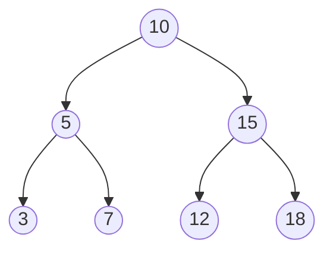
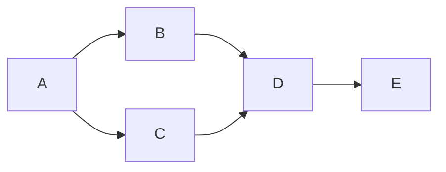
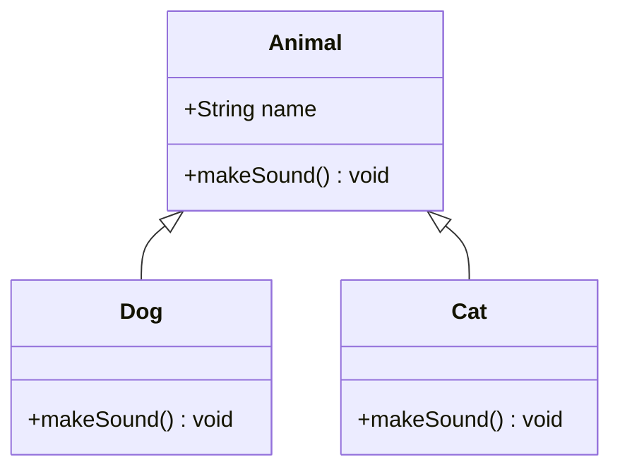
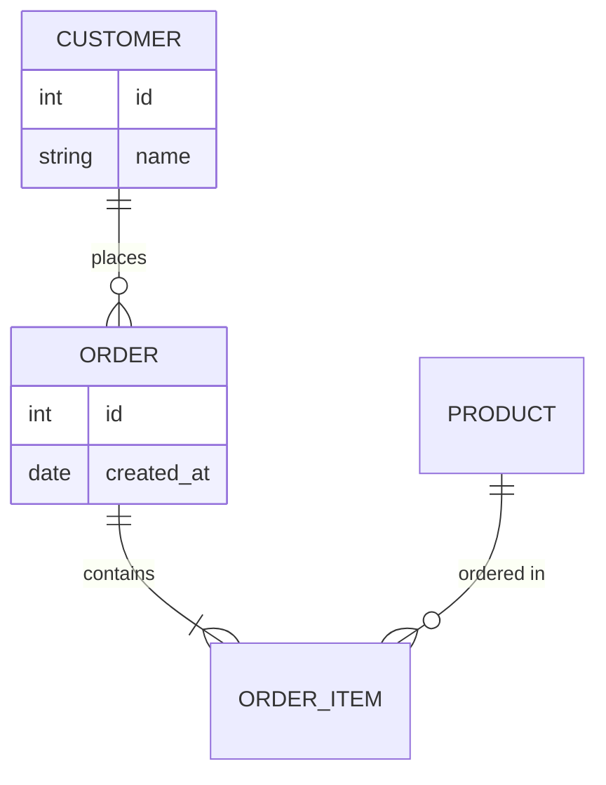
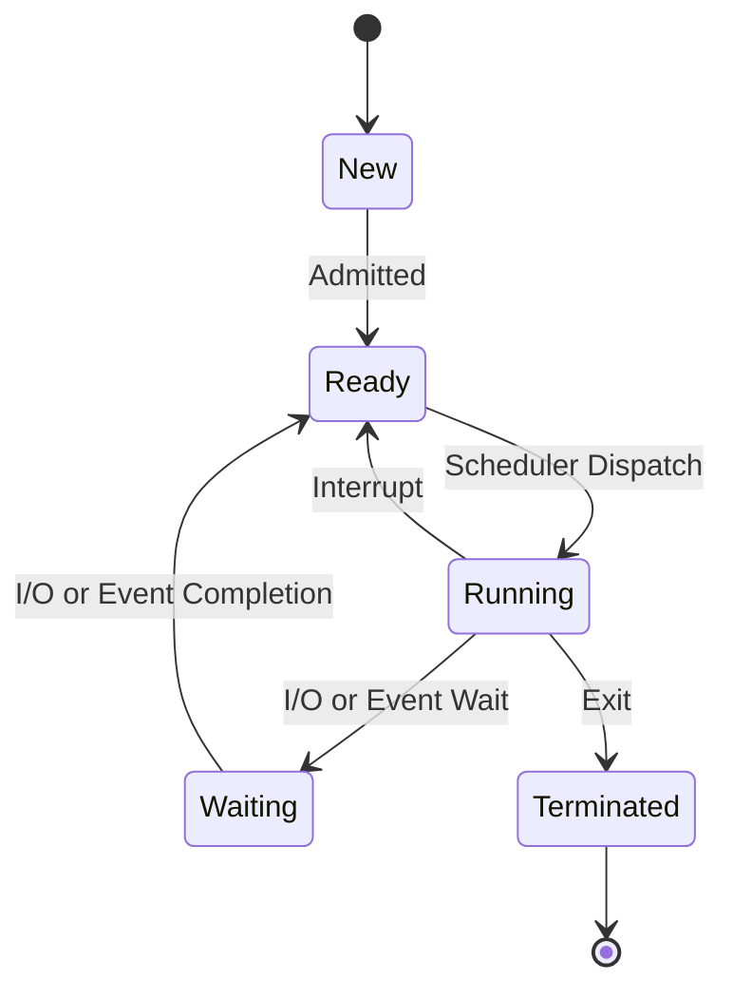
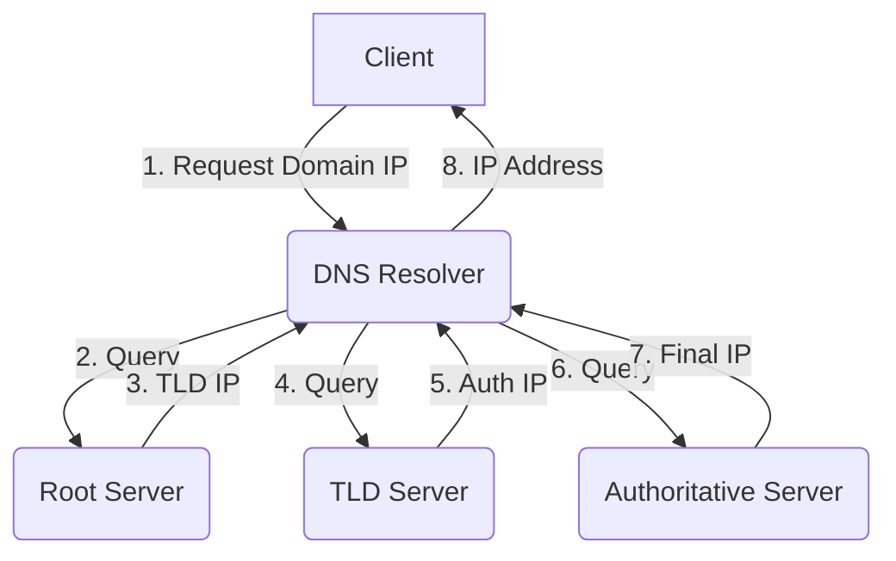

# DSA & CS Fundamentals Interview Study Guide

> [!NOTE]
> This study guide is designed for Rohit Sharma, focusing on the CodeHelp (Love Babbar) DSA certification, GATE 2026 CS qualification, and core concepts across Data Structures, Algorithms, Object-Oriented Programming, Database Management Systems, Operating Systems, and Computer Networks.

## 1. Data Structures & Algorithms Overview

### Time & Space Complexity Analysis
* **Big O (O)**: Upper bound on the time/space complexity. Represents the worst-case scenario.
* **Big Omega ($\Omega$)**: Lower bound. Represents the best-case scenario.
* **Big Theta ($\Theta$)**: Exact bound. Represents the average-case scenario when upper and lower bounds match.

### Common Complexity Classes
* **O(1) Constant**: Hash map lookup, accessing an array element by index.
* **O(log N) Logarithmic**: Binary search, inserting into a balanced BST.
* **O(N) Linear**: Iterating through an array, linear search.
* **O(N log N) Linearithmic**: Merge sort, Heap sort, Quick sort (average).
* **O(N^2) Quadratic**: Bubble sort, Insertion sort, exploring a 2D matrix unoptimally.
* **O(2^N) Exponential**: Recursive Fibonacci without memoization, subset generation.
* **O(N!) Factorial**: Generating permutations (e.g., Traveling Salesperson brute force).

> [!TIP]
> **How to Approach DSA Problems in Interviews:**
> 1. Understand the problem and clarify edge cases (e.g., empty array, negative numbers, duplicates).
> 2. Propose a brute-force solution to show basic understanding.
> 3. Analyze time/space complexity of the brute-force approach.
> 4. Optimize using appropriate data structures or algorithmic paradigms (Hash Map, Two Pointers, DP).
> 5. Dry run your optimized logic with a small test case.
> 6. Write clean, modular code.

### Data Structure Operations Complexity

| Data Structure | Access (Avg/Worst) | Search (Avg/Worst) | Insertion (Avg/Worst) | Deletion (Avg/Worst) | Space |
|---|---|---|---|---|---|
| Array (Dynamic) | O(1) / O(1) | O(n) / O(n) | O(1) / O(n) | O(n) / O(n) | O(n) |
| Singly Linked List | O(n) / O(n) | O(n) / O(n) | O(1) / O(1) | O(1) / O(1) | O(n) |
| Hash Table | - | O(1) / O(n) | O(1) / O(n) | O(1) / O(n) | O(n) |
| BST | O(log n) / O(n) | O(log n) / O(n) | O(log n) / O(n) | O(log n) / O(n) | O(n) |
| AVL / Red-Black Tree | O(log n) / O(log n) | O(log n) / O(log n) | O(log n) / O(log n) | O(log n) / O(log n) | O(n) |
| Min/Max Heap | - | O(n) / O(n) | O(log n) / O(log n) | O(log n) / O(log n) | O(n) |

---

## 2. Key Data Structures

### Arrays & Strings
**Concept**: Contiguous memory locations containing data. Strings are essentially arrays of characters.
**Complexities**: O(1) access, O(n) insertion/deletion at arbitrary positions.
**When to Use**: When fast index-based access is required, and size is mostly static or infrequently changing.
**Interview Patterns**: Sliding Window, Two Pointers, Prefix Sum.

### Linked Lists
**Concept**: Nodes connected via pointers (Singly, Doubly, Circular). Non-contiguous memory.
**When to Use**: Frequent insertions and deletions without reallocation. Implementing Stacks/Queues.
**Interview Patterns**: Fast & Slow pointers (Tortoise and Hare for cycles), Reversal, Merge.

### Stacks & Queues
**Concept**: 
- Stack: LIFO (Last In First Out). 
- Queue: FIFO (First In First Out).
- Monotonic Stack: Keeps elements in monotonically increasing/decreasing order.
- Priority Queue (Heap): Retrieves max or min element efficiently.
**When to Use**: Stacks for DFS, recursion, valid parentheses. Queues for BFS, scheduling. Monotonic stacks for "next greater element" problems.

### Trees
**Concept**: Hierarchical data structure. 
- BST: Left child < parent < right child.
- AVL / Red-Black: Self-balancing BSTs guaranteeing O(log n) height.
- Trie: Prefix tree for efficient string matching.
- Segment Tree: Useful for range queries (sum, min, max) and point updates in O(log n).



### Graphs
**Concept**: Nodes (vertices) connected by edges. Represented via Adjacency Matrix or Adjacency List.
**Algorithms**:
- BFS: Shortest path in unweighted graphs.
- DFS: Cycle detection, topological sort, exploring all paths.
- Dijkstra: Shortest path in weighted graph (no negative edges).
- Bellman-Ford: Shortest path with negative edges (detects negative weight cycles).
- Floyd-Warshall: All-pairs shortest path.
- Topological Sort: Ordering dependencies (DAGs only).



### Hash Tables
**Concept**: Key-value store using a hash function.
**Collision Handling**:
- Chaining: Array of linked lists.
- Open Addressing: Linear probing, quadratic probing, double hashing.

### Heaps
**Concept**: Complete binary tree satisfying the heap property (Min-Heap or Max-Heap).
**When to Use**: Top-K elements, merging K sorted arrays, priority scheduling.

---

## 3. Key Algorithms

### Sorting Algorithms Comparison

| Algorithm | Best Time | Avg Time | Worst Time | Space | Stable | Notes |
|---|---|---|---|---|---|---|
| Quick Sort | O(n log n) | O(n log n) | O(n^2) | O(log n) | No | Fast in practice, good cache locality. |
| Merge Sort | O(n log n) | O(n log n) | O(n log n) | O(n) | Yes | Used for linked lists, stable sort. |
| Heap Sort | O(n log n) | O(n log n) | O(n log n) | O(1) | No | In-place, no worst-case quadratic behavior. |
| Counting Sort | O(n+k) | O(n+k) | O(n+k) | O(n+k) | Yes | Non-comparison, limited range of integers. |
| Radix Sort | O(nk) | O(nk) | O(nk) | O(n+k) | Yes | Non-comparison, sorts digit by digit. |

### Searching & Specific Paradigms
- **Binary Search**: Finding a target, finding bounds (first/last occurrence), minimizing the maximum (e.g., book allocation).
- **Dynamic Programming (DP)**:
  - Top-Down (Memoization): Recursion + storing results.
  - Bottom-Up (Tabulation): Iterative state building.
  - Patterns: 0/1 Knapsack, Longest Common Subsequence (LCS), Longest Increasing Subsequence (LIS), Coin Change, Grid Paths.
- **Greedy**: Making locally optimal choices (Activity Selection, Huffman Coding).
- **Backtracking**: Exploring all possibilities and abandoning invalid paths early (N-Queens, Sudoku).
- **Divide & Conquer**: Breaking into subproblems (Merge Sort, Binary Search).

---

## 4. Object-Oriented Programming (OOP)

### Four Pillars
1. **Encapsulation**: Bundling data and methods, hiding internal state (using private variables).
2. **Abstraction**: Hiding complex implementation details, exposing a simple interface.
3. **Inheritance**: Creating new classes from existing ones to promote code reuse.
4. **Polymorphism**: Ability of different objects to respond to the same method call in their own way (Method Overloading, Method Overriding).

### SOLID Principles
- **S**ingle Responsibility: A class should have one reason to change.
- **O**pen/Closed: Open for extension, closed for modification.
- **L**iskov Substitution: Subtypes must be substitutable for base types.
- **I**nterface Segregation: Many client-specific interfaces are better than one general-purpose interface.
- **D**ependency Inversion: Depend on abstractions, not concretions.

### Design Patterns
- **Singleton**: Only one instance exists.
- **Factory**: Creates objects without specifying the exact class to create.
- **Observer**: Pub-Sub model; observers are notified of state changes.
- **Strategy**: Encapsulates a family of algorithms, making them interchangeable.
- **Builder**: Step-by-step construction of complex objects.
- **Adapter**: Allows incompatible interfaces to work together.

### Abstract Class vs Interface
- **Abstract Class**: Can have implemented and unimplemented methods. Supports state (fields).
- **Interface**: A contract of capabilities. Generally only method signatures (though modern languages allow default methods). Multiple inheritance is often supported through interfaces, but not abstract classes.

### Composition vs Inheritance
- **Inheritance** represents an "IS-A" relationship (e.g., Dog is an Animal).
- **Composition** represents a "HAS-A" relationship (e.g., Car has an Engine). Favor composition over inheritance to reduce tight coupling.



### OOP Q&A (15 Questions)
1. **What is an object?** Instance of a class containing state and behavior.
2. **What is a constructor?** A special method to initialize objects.
3. **Difference between overriding and overloading?** Overloading is compile-time (same method name, different args); overriding is run-time (subclass provides specific implementation of parent method).
4. **What is virtual function?** A function in base class meant to be overridden in derived class (enables run-time polymorphism).
5. **What is an abstract class?** A class that cannot be instantiated and usually contains abstract methods.
6. **What is a pure virtual function?** A virtual function that has no implementation in the base class and must be overridden.
7. **Can we instantiate an interface?** No, interfaces only provide contracts.
8. **What is encapsulation?** Binding data and methods into a single unit and restricting access.
9. **Explain "this" pointer.** A pointer accessible within non-static member functions, pointing to the object itself.
10. **What is a friend function in C++?** A function that has access to private/protected members of a class.
11. **Why favor composition over inheritance?** It reduces tight coupling and avoids fragile base class problem.
12. **What is multiple inheritance?** A class inheriting from multiple base classes (can cause Diamond Problem).
13. **How does Java/C# solve the diamond problem?** By disallowing multiple inheritance of classes and allowing it only for interfaces.
14. **What is a static method?** A method belonging to the class, not an instance.
15. **What is a destructor?** A method called automatically when an object's scope ends, used for cleanup.

---

## 5. Database Management Systems (DBMS)

### Relational vs NoSQL
- **Relational (SQL)**: Structured tables, schema-on-write, ACID compliant, scales vertically (MySQL, PostgreSQL).
- **NoSQL**: Document/key-value/graph based, schema-on-read, flexible, scales horizontally (MongoDB, Redis). Vector databases like Qdrant are used for embedding search in AI.

### Normalization
- **1NF**: Atomic values, no repeating groups.
- **2NF**: 1NF + no partial dependency (non-key attributes depend on whole primary key).
- **3NF**: 2NF + no transitive dependency.
- **BCNF**: Stricter 3NF; for every functional dependency X -> Y, X should be a superkey.

### ACID Properties
- **Atomicity**: All or nothing.
- **Consistency**: DB remains in a valid state before and after transaction.
- **Isolation**: Concurrent transactions do not affect each other.
- **Durability**: Committed data is permanently saved.

### Transactions, Concurrency & MVCC
- **Locks**: Shared (Read) vs Exclusive (Write). Prevents concurrent modification anomalies.
- **MVCC (Multi-Version Concurrency Control)**: Maintains multiple versions of data so readers don't block writers and vice versa.

### Indexing
- **B-Tree**: Balanced tree structures used for fast querying (O(log n)).
- **Hash Index**: Exact match queries (O(1)).
- **Compound Index**: Index on multiple columns. Order matters!

### SQL Fundamentals
- **JOINs**: INNER, LEFT, RIGHT, FULL OUTER.
- **Window Functions**: `ROW_NUMBER()`, `RANK()` over partitions without grouping rows.
- **GROUP BY**: Aggregates data (e.g., `SUM`, `COUNT`) with `HAVING` clause for filtering.

### CAP Theorem
A distributed system can deliver at most two of three desired characteristics: Consistency, Availability, Partition Tolerance. In the presence of a network partition (P), you must choose between C and A.



### DBMS Q&A (15 Questions)
1. **What is a Primary Key?** Unique identifier for a record.
2. **What is a Foreign Key?** An attribute referencing a primary key in another table.
3. **What is a View?** A virtual table based on a SQL query.
4. **What is a Trigger?** Procedural code automatically executed in response to DB events.
5. **Difference between DELETE and TRUNCATE?** DELETE is DML (can be rolled back), TRUNCATE is DDL (cannot be rolled back, faster).
6. **What is a stored procedure?** Precompiled SQL code stored in the DB.
7. **What is an index?** A data structure that improves data retrieval speed.
8. **What are the disadvantages of indexing?** Slower write operations and extra storage.
9. **Explain SQL Injection.** Inserting malicious SQL statements into input fields.
10. **What is a dead lock in DBMS?** Two transactions waiting for locks held by each other.
11. **What is write-ahead logging (WAL)?** Logging changes before they are written to the database (ensures atomicity/durability).
12. **Difference between OLTP and OLAP?** OLTP is for transaction processing (fast inserts); OLAP is for analytics (complex queries).
13. **What is Sharding?** Horizontal partitioning of data across multiple databases.
14. **What is a clustered index?** Defines the physical sorting order of data rows. (Only 1 per table).
15. **What is a non-clustered index?** Maintains a separate logical ordering with pointers to physical data.

---

## 6. Operating Systems

### Process vs Thread
- **Process**: An executing instance of a program. Has its own memory space (heap, stack, data, code). Heavyweight context switch.
- **Thread**: Smallest sequence of programmed instructions. Shares memory space (heap, data, code) with other threads in the same process, but has its own stack and registers. Lightweight context switch.

### Process Scheduling
- **FCFS**: First Come First Serve. Can cause Convoy Effect.
- **SJF**: Shortest Job First. Optimal for minimizing average wait time but can cause starvation.
- **Round Robin**: Time-slicing. Good for interactive systems.
- **Priority**: Executes based on priority, subject to starvation (solved via aging).

### Synchronization
- **Mutex**: Mutual exclusion object. Only the owner can release it. Protects critical sections.
- **Semaphore**: Signaling mechanism with a counter. (Binary vs Counting semaphore).
- **Monitor**: High-level synchronization construct combining mutex and condition variables.

### Deadlock
- **4 Necessary Conditions**: Mutual Exclusion, Hold & Wait, No Preemption, Circular Wait.
- **Prevention**: Break one of the 4 conditions.
- **Avoidance**: Banker's Algorithm (checks if allocating resources leaves system in a safe state).

### Memory Management
- **Paging**: Dividing physical memory into frames and logical memory into pages. Eliminates external fragmentation.
- **Segmentation**: Dividing logical memory into variable-sized segments representing program parts.
- **Virtual Memory**: Illusion of large main memory using disk space.
- **Page Replacement**: When memory is full, which page to swap out? (LRU, FIFO, Optimal).



### OS Q&A (15 Questions)
1. **What is a Kernel?** The core of the OS handling resource management.
2. **What is Context Switching?** Saving the state of an old process and loading the state of a new one.
3. **What is a PCB?** Process Control Block; stores process state, PC, registers, memory limits.
4. **Difference between preemptive and non-preemptive scheduling?** Preemptive allows interrupting a running process; non-preemptive waits until process yields or finishes.
5. **What is Starvation?** A process indefinitely waiting for resources.
6. **What is a Page Fault?** Accessing a page not currently in physical memory.
7. **What is Thrashing?** System spending more time paging (swapping) than executing.
8. **What is Virtual Memory?** Separation of logical memory from physical memory.
9. **What is a Spooling?** Putting jobs in a buffer (disk) so devices can access them when ready.
10. **Difference between Mutex and Semaphore?** Mutex is locking mechanism (ownership), Semaphore is signaling (counter).
11. **What is an Interrupt?** A signal to CPU indicating an event needs immediate attention.
12. **What is an Inode?** Data structure in Unix filesystems describing a file or directory.
13. **What is Belady's Anomaly?** Increasing the number of page frames results in more page faults (happens in FIFO).
14. **What is external fragmentation?** Total memory is enough for a request, but not contiguous.
15. **What is internal fragmentation?** Allocated memory is slightly larger than requested memory.

---

## 7. Computer Networks

### OSI Model vs TCP/IP
1. **Physical**: Bits over a physical medium.
2. **Data Link**: Frames, MAC addressing, switches.
3. **Network**: Packets, IP addressing, routers.
4. **Transport**: Segments, Port numbers, TCP/UDP.
5. **Session**: Establishes, manages, terminates sessions.
6. **Presentation**: Data translation, encryption.
7. **Application**: HTTP, FTP, DNS. (TCP/IP combines 5,6,7).

### TCP vs UDP
- **TCP**: Connection-oriented (3-way handshake: SYN, SYN-ACK, ACK). Reliable, ordered, flow control (sliding window), congestion control.
- **UDP**: Connectionless. Unreliable, fast, no ordering guarantee. Used for streaming, VoIP, DNS.

### HTTP/HTTPS & TLS
- **HTTP**: Stateless protocol over TCP.
- **HTTPS**: HTTP over TLS/SSL (encrypted).
- **TLS Handshake**: Client Hello -> Server Hello (Certificate) -> Key Exchange -> Finished. Ensures encryption (symmetric/asymmetric), authentication, integrity.

### DNS & Subnetting
- **DNS**: Resolves domain names to IP addresses. (Root server -> TLD server -> Authoritative server).
- **Subnetting**: Dividing a large network into smaller networks. Improves performance and security. Uses CIDR notation (e.g., /24).



### CN Q&A (15 Questions)
1. **What is an IP address?** Logical address assigned to a device on a network.
2. **What is a MAC address?** Physical address of a Network Interface Card.
3. **What is ARP?** Address Resolution Protocol (Maps IP to MAC).
4. **What is a Router?** Forwards packets between different networks based on IP.
5. **What is a Switch?** Forwards frames within the same network based on MAC.
6. **Difference between IPv4 and IPv6?** IPv4 is 32-bit; IPv6 is 128-bit.
7. **What is DHCP?** Dynamically assigns IP addresses to clients.
8. **What is a Subnet Mask?** Determines which part of an IP is network vs host.
9. **Explain TCP 3-way handshake.** SYN, SYN-ACK, ACK.
10. **What is ping?** Tool using ICMP to test connectivity between hosts.
11. **What is a port?** Logical endpoint for a process (0-65535).
12. **Difference between HTTP GET and POST?** GET retrieves data (params in URL); POST submits data (params in body).
13. **What is BGP?** Border Gateway Protocol, used for routing between autonomous systems.
14. **What is a WebSocket?** Full-duplex persistent connection over a single TCP connection.
15. **What is REST?** Representational State Transfer, an architectural style for web services.

---

## 8. Common Coding Patterns for AI Engineer Interviews

AI Engineer technical interviews often focus on foundational math-in-code and data transformations. 

### Matrix Operations (Machine Learning)
You must comfortably transpose, multiply, and reshape matrices.
```python
# Matrix Multiplication (Dot Product)
def matrix_multiply(A, B):
    m, n = len(A), len(A[0])
    p, q = len(B), len(B[0])
    if n != p: return None
    
    C = [[0] * q for _ in range(m)]
    for i in range(m):
        for j in range(q):
            for k in range(n):
                C[i][j] += A[i][k] * B[k][j]
    return C
```

### String Processing (NLP)
Tokenization, N-grams, Levenshtein Distance (Edit Distance), and Trie manipulation.
```python
# Tokenization / Stop Words removal baseline
def clean_text(text, stop_words):
    words = text.lower().split()
    return [w for w in words if w not in stop_words]
```

### Graph Algorithms (Knowledge Graphs)
Traversal, PageRank concepts, Entity linking. Understanding BFS for short path connections between entities.

### Probability & Statistics Basics
Implementing algorithms for Naive Bayes, calculating TF-IDF, mean, variance, standard deviation from scratch.
```python
def calc_variance(data):
    mean = sum(data) / len(data)
    return sum((x - mean) ** 2 for x in data) / len(data)
```

### Linear Algebra Essentials
- **Vectors**: Addition, Magnitude.
- **Dot Product**: Measures how aligned two vectors are.
- **Cosine Similarity**: Commonly used to find semantic similarity between embeddings.
```python
import math
def cosine_similarity(v1, v2):
    dot = sum(x*y for x, y in zip(v1, v2))
    mag1 = math.sqrt(sum(x**2 for x in v1))
    mag2 = math.sqrt(sum(x**2 for x in v2))
    return dot / (mag1 * mag2)
```

> [!IMPORTANT]
> For AI Roles, ensure you can translate mathematical formulas (like gradients or loss functions) into clean Python code without relying entirely on libraries like NumPy/PyTorch during the initial coding phase.
