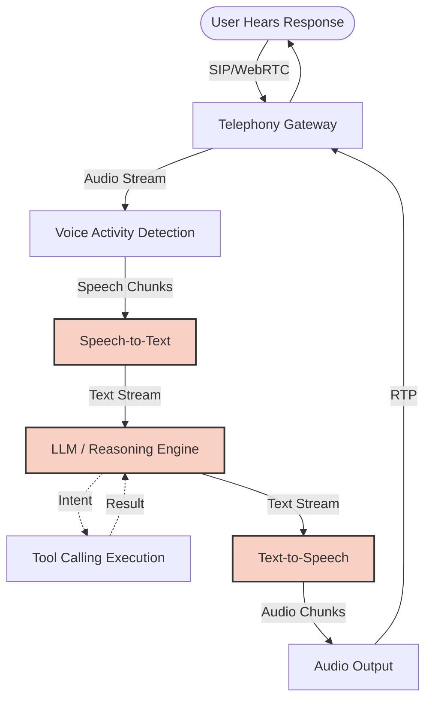
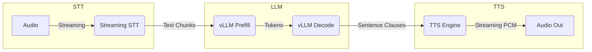
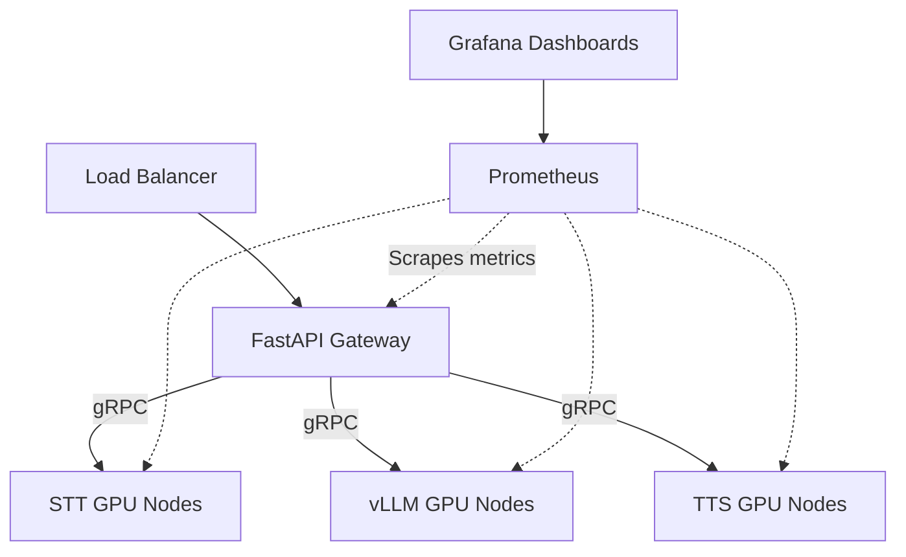

# IndusLabs AI: Work Experience Deep Dive
**Role:** Founding AI Engineer
**Location:** Noida (Mar 2025 – Present)

This study guide covers the technical architecture, fine-tuning processes, throughput optimization, and production deployment of scalable Voice AI pipelines at IndusLabs AI.

---

## 1. Voice AI Agent Architecture

A production-grade Voice AI Agent operates under strict latency requirements to ensure natural conversation.

### The Pipeline Architecture

> [!NOTE]
> The primary challenge in Voice AI is maintaining a Time-To-First-Byte (TTFB) of < 500ms (human conversational delay threshold) while chaining heavy ML models sequentially.

### Latency Breakdown
| Stage | Typical Latency (ms) | Where Time Goes |
|---|---|---|
| **VAD / Endpointing** | 50-150 | Waiting for silence to confirm user stopped speaking. |
| **STT (Whisper/Deepgram)** | 50-200 | Transcribing the last chunk of speech. |
| **LLM (GPT-4o/Llama3)** | 200-400 | TTFT (Time to First Token). Prompt evaluation and generation. |
| **TTS (FastPitch/VITS)** | 100-300 | Synthesizing the first chunk of text into audio. |
| **Network & Codec** | 50-100 | Encoding to G.711/Opus and network transmission. |
| **Total** | **450-1150 ms** | Goal: Consistently stay under 800ms, optimally <500ms. |

### End-to-End Latency Optimization
1. **Streaming Everything:** Audio streaming to STT, token streaming to LLM, text chunk streaming to TTS, audio chunk streaming to caller.
2. **Predictive Endpointing:** Using LLMs or separate models to predict if a user has finished their sentence before waiting for silence.
3. **Colocation:** Placing STT, LLM, and TTS inference on the same GPU node to avoid network hops.

### SIP Telephony Integration
SIP (Session Initiation Protocol) handles the signaling, while RTP (Real-time Transport Protocol) carries the media stream. LiveKit or similar WebRTC gateways can act as the bridge between standard SIP trunks (Twilio) and the AI backend, providing low-latency streaming audio.

### Q&A (Voice AI Architecture)
1. **How do you handle interruptions (barge-in)?** We run VAD constantly on the incoming stream. If speech is detected while the bot is speaking, we immediately send a "stop" signal to the TTS and LLM streams, flush the audio buffer, and process the new speech.
2. **What's the difference between WebRTC and SIP in this context?** SIP is a signaling protocol used heavily by telecom (Twilio). WebRTC is designed for low-latency peer-to-peer browser communication. Often, we use a bridge (like LiveKit SIP) to translate SIP to WebRTC for our backend.
3. **Why use FastAPI for this?** FastAPI supports async/await natively via Starlette, making it perfect for handling concurrent WebSockets or Server-Sent Events (SSE) which are required for streaming ML pipelines.
4. **How do you chunk text for TTS?** We chunk by punctuation (comma, period) so the TTS has enough context for prosody, rather than chunking by raw character count which sounds unnatural.
5. **How does VAD tuning affect latency?** A longer VAD silence threshold reduces interruptions but increases perceived latency. A shorter threshold feels faster but leads to the bot cutting the user off.
6. **What is echo cancellation (AEC) and why is it needed?** When the bot speaks over a phone line, the mic might pick up the bot's own voice. AEC subtracts the bot's audio from the input stream.
7. **How do you handle hallucinated speech in STT?** Fine-tuning the STT model, using confidence scores, and robust prompting in the LLM to ignore non-sensical small words.
8. **Explain the impact of vocabulary size on LLM latency.** Larger vocabularies increase the size of the final logits layer, slightly increasing compute, but the primary latency driver is model depth and KV cache size.
9. **How do you pass tool calling results back into the stream without breaking latency?** We use a system prompt that structures tool outputs concisely. We can also use filler words ("Let me check that...") generated instantly while the tool executes.
10. **What is the trade-off between STT accuracy and latency?** Larger STT models are more accurate but slower. We often use streaming STT (like Deepgram Nova) which provides rapid interim transcripts and a final accurate transcript.
11. **How does LiveKit fit into the architecture?** LiveKit provides the SFU (Selective Forwarding Unit) and WebRTC infrastructure, handling network jitter, packet loss, and pub/sub routing of audio tracks.
12. **Why not just use an end-to-end model like GPT-4o native voice?** End-to-end models are expensive, less customizable, and hard to run on-prem/self-hosted. A modular pipeline allows custom fine-tuning of the TTS for a specific brand voice.
13. **How do you monitor pipeline latency in production?** We inject trace IDs at the start of the audio chunk and log timestamps at every component boundary, aggregating metrics in Prometheus.
14. **What happens if the LLM generates a very long sentence?** Because we chunk by punctuation, the TTS can start generating audio for the first clause while the LLM is still generating the rest of the sentence.
15. **How do you prevent the bot from responding to background noise?** Advanced VAD models (like Silero VAD) are trained to distinguish human speech from noise. We also use noise suppression models before VAD.

---

## 2. TTS Fine-Tuning Deep Dive

> [!TIP]
> Modern TTS is moving from explicit acoustic models + vocoders to end-to-end discrete audio token modeling.

### Modern TTS Overview
- **Tacotron 2:** Autoregressive model predicting mel-spectrograms, paired with a vocoder (WaveGlow/HiFi-GAN). Slow and sequential.
- **VITS:** End-to-end TTS using normalizing flows and adversarial training. High quality, faster inference.
- **Bark / AudioLM:** LLM-based TTS. Treats audio as a language modeling problem using discrete audio tokens.

### SNAC (Sub-band Neural Audio Codec)
SNAC tokenizes audio into discrete codes across different frequency bands (sub-bands).
- **How it works:** Instead of predicting one stream of tokens, it encodes audio into multiple hierarchical streams (e.g., low frequency for structure, high frequency for detail).
- **Advantages:** Lower bitrate, higher fidelity, and allows language models to predict audio structure efficiently.

### Audio Codec Models
- **EnCodec (Meta):** Uses Residual Vector Quantization (RVQ) to compress audio into discrete tokens.
- **SoundStream (Google):** Similar to EnCodec, supports scalable bitrates.
- **SNAC:** Focuses on hierarchical sub-band tokenization, often yielding better results for speech synthesis when paired with LLMs.

### Prosody & Control
Prosody is the musicality of speech:
- **Pitch:** High/low frequency (emotion, questions).
- **Rhythm/Duration:** Speed of speaking.
- **Stress:** Emphasis on certain words.
- **Intonation:** Variation of pitch over a sentence.

**Controlling Prosody:** We can inject prosody embeddings (e.g., extracted from reference audio using pitch trackers like YAAPT) into the TTS model during inference to explicitly control how a sentence is spoken.

### Fine-Tuning Pipeline

### Emotionally Expressive TTS
To achieve this, models are either trained on heavily annotated emotional datasets or use a reference encoder (Style Tokens) that transfers the emotion of a reference audio clip to the target text.

### Q&A (TTS Fine-Tuning)
1. **What is MFA (Montreal Forced Aligner)?** It aligns text phonemes with precise timestamps in the audio file, essential for training duration predictors in models like FastPitch.
2. **How do you handle out-of-vocabulary (OOV) words?** We use G2P (Grapheme-to-Phoneme) models or dictionaries (like CMUDict) to convert text to phonemes before feeding it to the TTS.
3. **What is the vocoder's job?** To convert intermediate representations (like mel-spectrograms or discrete audio tokens) back into a raw audio waveform.
4. **Explain Mean Opinion Score (MOS).** A subjective evaluation metric where human listeners rate audio quality and naturalness on a scale of 1 to 5.
5. **How does fine-tuning a VITS model differ from an LLM-based TTS?** VITS fine-tuning updates continuous weights mapping phonemes to audio. LLM TTS fine-tuning is causal language modeling on discrete audio tokens.
6. **Why do we need a reference audio for zero-shot TTS?** The reference audio provides the speaker identity (timbre) and style embeddings.
7. **What happens if your fine-tuning dataset has background noise?** The model will learn to synthesize background noise. Clean data is critical.
8. **How do you control pitch at inference time?** By scaling the output of the pitch predictor module (in models like FastPitch) by a factor before feeding it to the decoder.
9. **What is cross-fade in audio synthesis?** Blending the end of one generated audio chunk with the beginning of the next to avoid clicking artifacts.
10. **Explain Residual Vector Quantization (RVQ).** It's a method where the quantization error of one codebook is passed to the next codebook, creating a hierarchy of tokens that refine the audio quality.
11. **How do you achieve multi-speaker TTS?** By adding a speaker embedding table to the model architecture and conditioning the generator on the selected speaker's embedding.
12. **What are the common artifacts in generated speech?** Metallic/robotic sounds (vocoder artifacts), mumbling (attention failures), and unnatural pauses.
13. **How does SNAC improve upon standard EnCodec?** By separating frequency bands, it handles high-frequency details better without bloating the sequence length for the LLM.
14. **What is phoneme duration prediction?** Predicting how many acoustic frames a specific phoneme will last, determining the speed of the spoken word.
15. **How do you evaluate emotionally expressive TTS?** Beyond MOS, we use ABX testing (which emotion matches better) or train a classifier to detect the emotion in the generated audio.

---

## 3. 30x Throughput Improvement (STAR Story)

> [!IMPORTANT]
> This is a high-impact architectural achievement. Be ready to explain the transition from naive sequential processing to a highly optimized concurrent pipeline.

### Situation
The original TTS pipeline was naive: a single FastAPI worker running a standard PyTorch model on a GPU. It processed one request at a time sequentially. When concurrent users increased, requests queued up, and TTFB (Time to First Byte) skyrocketed past 2-3 seconds.

### Task
We needed to support concurrent real-time voice conversations without degrading latency, targeting a TTFB of < 300ms for TTS specifically, while maximizing GPU utilization.

### Action
1. **Dynamic Batching:** Implemented continuous/dynamic batching (similar to vLLM for text) for the TTS model. Incoming requests within a 10ms window were batched together.
2. **Model Optimization:** Converted the PyTorch models to TensorRT/ONNX. Used INT8/FP16 mixed precision to increase compute speed and reduce memory footprint.
3. **Async Chunked Streaming:** Modified FastAPI to use `StreamingResponse`. The TTS model was rewritten to yield audio chunks immediately as the autoregressive steps completed, rather than waiting for the whole sentence.
4. **CUDA Graphs:** Used CUDA graphs to freeze the execution graph, eliminating CPU overhead for kernel launches during inference.
5. **Paged Memory Management:** Adopted KV-cache-like memory management for audio token generation to prevent memory fragmentation and allow higher batch sizes.

### Result
- **Throughput:** Increased concurrent request capacity by 30x on the same hardware.
- **Latency:** TTFB consistently < 300ms even under heavy load.
- **Cost:** Slashed AWS/GCP GPU costs significantly.

### Before vs After
| Metric | Before Optimization | After Optimization |
|---|---|---|
| Processing Model | Sequential (Single Request) | Continuous Batching |
| TTFB (1 User) | 400ms | 250ms |
| TTFB (30 Users) | 5000+ ms (Queued) | 280ms |
| GPU Utilization | 20% (CPU Bound) | 90% (Compute Bound) |
| Output Format | Full WAV File | Streamed PCM Chunks |

### Q&A (Throughput Optimization)
1. **How does continuous batching work for TTS?** Since sentences have different lengths, continuous batching injects new requests into the batch as soon as one sequence finishes, without waiting for the whole batch to complete.
2. **What challenges did you face with ONNX/TensorRT?** Some PyTorch operations (like dynamic control flow in autoregressive loops) don't export easily. We had to rewrite parts of the model to use static shapes or dynamic axes correctly.
3. **How do you stream audio before it's fully generated?** If the model uses a causal architecture or block-based processing, we can pass intermediate chunks through the vocoder and stream the raw PCM bytes immediately.
4. **Explain CUDA Graphs.** CUDA graphs record a sequence of GPU operations. Instead of the CPU launching each kernel individually (which has overhead), the CPU launches the whole graph at once.
5. **What was the hardest bottleneck to find?** The CPU-to-GPU memory transfer overhead. We found we were moving small tensors back and forth too often. We kept everything on VRAM until the final audio chunk was ready.
6. **How did you profile the GPU?** Used PyTorch Profiler and NVIDIA Nsight Systems to view the timeline of kernel executions and memory transfers.
7. **Why FastAPI and not gRPC?** We needed tight integration with WebSockets for the frontend clients, though we used gRPC for internal microservice communication between the LLM node and TTS node.
8. **What happens if a batch gets too large?** You hit OOM (Out of Memory). We implemented a strict max-batch-size and a queueing mechanism.
9. **How did you handle variable length inputs in batching?** Padding the sequences to the longest in the batch and using attention masks, though padding wastes compute.
10. **Did quantization affect audio quality?** FP16 had no noticeable degradation. INT8 required careful calibration (PTQ) of the vocoder to avoid introducing static noise.

---

## 4. Multilingual Speech Dataset Pipeline

Training TTS for different languages requires robust data pipelines.

### Key Steps
1. **Collection:** Scraping open-source datasets (CommonVoice, LibriVox) and recording custom studio data.
2. **Preprocessing:** 
   - Resampling everything to 24kHz/48kHz.
   - VAD to trim leading/trailing silence.
   - Normalizing LUFS (loudness).
3. **Transcription & Alignment:** Using Whisper to generate initial transcripts, then MFA to align phonemes to timestamps.
4. **Quality Control:** Training a small model to score Audio-Text alignment. Dropping pairs with bad scores to ensure high data quality.
5. **Augmentation:** Pitch shifting, speed perturbation, and adding background noise (to make the model robust, if training ASR; for TTS, we want clean data).

### Multilingual Challenges
- **Scripts:** Different alphabets require different text normalization pipelines (e.g., expanding numbers to words in Hindi vs English).
- **Phonemes:** Using International Phonetic Alphabet (IPA) as a universal representation.
- **Code-Switching:** Users saying "Hello *kaise ho*" requires the TTS to smoothly transition between English and Hindi phonetics without breaking the prosody.

### Q&A (Dataset Pipeline)
1. **How do you handle text normalization?** We built custom regex and dictionary-based normalizers to convert "Dr. Smith bought 2kg" to "Doctor Smith bought two kilograms".
2. **Why is LUFS normalization important?** If training data has varying volume levels, the TTS model might spontaneously change volume mid-sentence.
3. **What is code-switching and why is it hard?** Mixing languages in one sentence. It's hard because the G2P rules change mid-sentence, and language-specific models fail.
4. **How do you align audio for languages unsupported by MFA?** We used cross-lingual acoustic models or trained a simple CTC-based ASR model purely for alignment purposes.
5. **How did you filter out bad audio data?** We calculated the Signal-to-Noise Ratio (SNR) and dropped files with heavy background noise or clipping.
6. **What is the ideal audio length for TTS training?** Sentences between 2 to 10 seconds. Longer files cause attention alignment issues during training.
7. **How do you handle non-speech sounds (laughs, breaths)?** We either transcribed them as special tokens `<laugh>` or aggressively trimmed them out using VAD if the model didn't support them.
8. **Explain the role of IPA.** IPA provides a standard set of symbols for all human sounds, allowing a single model to learn cross-lingual phonetics.
9. **How do you balance the dataset for multilingual training?** Oversampling low-resource languages and using temperature-based sampling during training.
10. **What storage did you use for the dataset?** S3 buckets with metadata stored in PostgreSQL, allowing fast querying of specific subsets (e.g., "get 10 hours of clean Hindi male speech").

---

## 5. Low-Latency AI Pipelines

> [!WARNING]
> Latency compounds. A 100ms delay in STT, LLM, and TTS results in a 300ms total delay. Optimization must happen at every step.

### Optimization Techniques
- **Speculative Decoding:** Using a smaller, faster draft model to predict LLM tokens, and a larger model to verify them in parallel. Speeds up token generation.
- **Continuous Batching:** Processing requests at the token level, not the sequence level.
- **PagedAttention (vLLM):** Managing KV cache like OS virtual memory. Solves memory fragmentation, allowing massive batch sizes.
- **Quantization:** AWQ, GPTQ (INT4/INT8) reduces memory bandwidth, which is the primary bottleneck in LLM decoding.
- **Prefill/Decode Separation:** Isolating the compute-heavy prefill phase (processing the prompt) from the memory-bound decode phase (generating tokens).

### Q&A (Low-Latency Pipelines)
1. **What is PagedAttention?** It partitions the KV cache into fixed-size blocks. It eliminates internal fragmentation and allows sharing KV blocks between requests (e.g., system prompts).
2. **Why is LLM decoding memory-bandwidth bound?** For every single token generated, the entire model's weights must be loaded from HBM (VRAM) to the GPU compute cores.
3. **What is Speculative Decoding?** A technique where a small draft model predicts the next N tokens quickly. The large target model evaluates all N tokens in a single forward pass. If correct, we get N tokens for the time of 1.
4. **How does AWQ differ from GPTQ?** AWQ (Activation-aware Weight Quantization) protects a small percentage of salient weights based on activation magnitude, preserving accuracy better than GPTQ.
5. **What is the KV cache?** It stores previous Keys and Values in the Transformer attention mechanism so they don't have to be recomputed for every new token.
6. **How do you handle context length limits in long voice conversations?** We implemented an automated summarization tool that runs asynchronously, summarizing older context and keeping only the recent raw transcript.
7. **What is tensor parallelism?** Splitting the model weights across multiple GPUs. We use it to reduce latency for very large models (Llama 70B).
8. **Why stream chunk-by-chunk instead of word-by-word into TTS?** Word-by-word lacks prosodic context. The TTS needs to know if a sentence is a question or a statement, which requires at least a clause.
9. **Explain TTFT vs TPOT.** TTFT (Time to First Token) measures the prefill latency. TPOT (Time Per Output Token) measures the decoding speed.
10. **How do you keep connections alive for low latency?** Persistent WebSockets or gRPC streams. TCP handshakes and TLS negotiation add hundreds of milliseconds of latency.

---

## 6. Production Deployment & Monitoring

### Deployment Architecture

### Key Metrics Tracked
- **GPU Utilization:** Maintained >80%.
- **Queue Depth:** Number of requests waiting. Triggers auto-scaling.
- **TTFB & TPOT:** P95 and P99 latency metrics.
- **CUDA OOM Errors:** Logged immediately for alerting.

### Infrastructure
- **Docker:** All models containerized with specific CUDA base images (e.g., `nvidia/cuda:12.1.1-cudnn8-runtime-ubuntu22.04`).
- **Orchestration:** Kubernetes (EKS/GKE) with GPU node groups.
- **Auto-scaling:** KEDA (Kubernetes Event-driven Autoscaling) based on custom Prometheus metrics (queue length), not just CPU/Memory.

### Q&A (Deployment)
1. **Why scale based on queue depth instead of CPU?** GPU ML workloads pin the CPU/GPU at 100% easily. Queue depth tells us if requests are actually backing up.
2. **How do you handle cold starts?** We keep a minimum number of replicas warm. ML models take 10-30 seconds to load into VRAM, so cold starts are unacceptable in real-time voice.
3. **What's the difference between PyTorch and TensorRT in production?** PyTorch is great for research; TensorRT is highly optimized for inference on specific NVIDIA GPUs, fusing kernels and optimizing memory paths.
4. **How do you monitor GPU metrics?** Using DCGM (Data Center GPU Manager) exporter for Prometheus.
5. **How do you update models with zero downtime?** Blue-green deployments. Spin up the new model nodes, wait for them to load weights and report "ready", then shift traffic at the load balancer.
6. **What is an OOM error and how do you recover?** Out of Memory. We configure Docker/K8s to automatically restart the pod, and implement strict batch-size limits to prevent it.
7. **Explain the role of Grafana.** It visualizes the Prometheus time-series data, allowing us to build dashboards showing real-time latency breakdowns and GPU health.
8. **How do you handle network latency between microservices?** We deploy STT, LLM, and TTS nodes in the same availability zone (AZ) and use gRPC for highly efficient binary serialization.
9. **What is tracing?** Using tools like Jaeger/OpenTelemetry to track a single request (a single user utterance) as it flows through STT -> LLM -> TTS, showing exact timing.
10. **Why use FastAPI for the gateway?** It natively supports async, which is perfect for proxying streaming WebSocket connections to the backend gRPC services.

---

## 7. Founding Engineer Mindset

> [!TIP]
> As a Founding Engineer, you are not just writing code; you are making architectural decisions that balance speed-to-market with technical debt.

### Core Traits
- **0 to 1 Execution:** Building systems from scratch with no existing infrastructure.
- **Wearing Multiple Hats:** Doing MLOps, backend engineering, data collection, and API design simultaneously.
- **Pragmatic Decision Making:** Knowing when to use an API (OpenAI) vs when to self-host (vLLM/Llama) based on cost and latency constraints.

### Q&A (Behavioral)
1. **Tell me about a time you had to make a technical compromise.** (STAR) "Initially, we wanted to build our own STT. But to hit our launch deadline, I integrated Deepgram. Once we had users and revenue, I circled back and built our in-house pipeline."
2. **How do you handle shifting startup priorities?** Agile mindset. Building modular microservices so if the product pivots, the core ML infrastructure can be reused.
3. **Describe a difficult bug you tracked down.** "We had a memory leak causing OOMs every 4 hours. By profiling the PyTorch memory allocator, I found we were holding onto conversational history tensors that still had `requires_grad=True` attached, preventing garbage collection."
4. **How do you decide what to build vs buy?** If it's the core differentiator (our low-latency TTS), we build it. If it's a commodity (telephony SIP trunks), we buy it.

---

## 8. Tool Calling in Voice AI

Tool calling (function calling) allows the LLM to interact with external systems during the voice conversation.

### How it Works
1. The LLM is given a schema of available tools (e.g., `check_calendar(date)`, `book_appointment(time)`).
2. The user asks: "Do you have time tomorrow?"
3. The LLM outputs a specific JSON structure requesting the tool.
4. The system pauses TTS, executes the API call, and feeds the JSON result back to the LLM.
5. The LLM generates the final spoken response.

### Latency Mitigation
While the tool executes, the system can stream a "filler" audio file (e.g., keyboard typing sounds, or a pre-rendered "Let me check that for you...") to prevent dead air.

### Q&A (Tool Calling)
1. **How do you prompt an LLM to use tools effectively?** Clear descriptions of arguments and strict system prompts defining the JSON schema.
2. **What happens if the API call takes 5 seconds?** We use filler phrases. "Give me one moment while I pull up your file..." This resets the user's patience clock.
3. **How do you handle tool hallucination?** We validate the LLM's JSON output against a Pydantic schema before executing. If it fails, we prompt the LLM internally with the validation error.
4. **Can you stream tool calls?** Yes, some models support streaming the JSON tool call, allowing us to begin preparing the API request before the LLM finishes generating the arguments.
5. **How does tool calling affect the context window?** Tool results (JSON) consume tokens. We must aggressively trim or summarize old tool results to prevent context bloat.

---
*Generated for Rohit Sharma - Interview Preparation*
