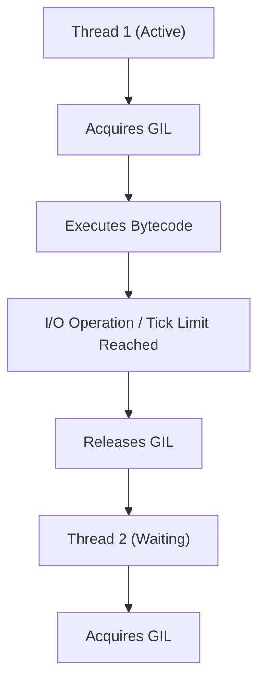
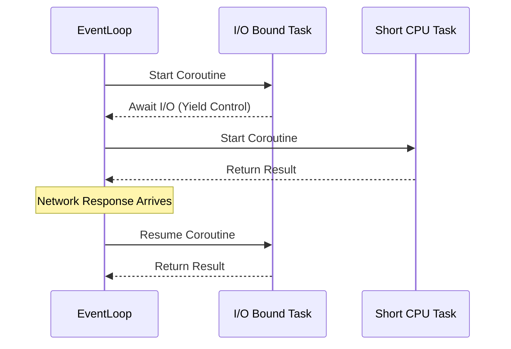

# Python Deep Dive - Interview Study Guide

> [!NOTE]
> This study guide is tailored for AI Engineers working with FastAPI, PyTorch, and asynchronous pipelines. It dives deep into CPython internals, async patterns, and advanced Python concepts that are crucial for senior-level interviews.

## 1. Python Internals

### Global Interpreter Lock (GIL)
- **What is it?**: A mutex in CPython that protects access to Python objects, preventing multiple native threads from executing Python bytecodes at once.
- **Why does it exist?**: CPython's memory management (reference counting) is not thread-safe. The GIL simplifies CPython implementation and makes single-threaded execution fast.
- **Multithreading**: Due to the GIL, CPU-bound tasks do not benefit from Python threading. Multithreading is only useful for I/O-bound tasks.



- **Bypassing the GIL**:
  - **`asyncio`**: Bypasses the need for threads altogether by using cooperative multitasking on a single thread.
  - **`multiprocessing`**: Uses separate processes, each with its own Python interpreter and memory space, effectively side-stepping the GIL.
- **When is it released?**: CPython releases the GIL during I/O operations (like network requests, file reading) and during expensive C extensions (e.g., NumPy or PyTorch operations).

### Memory Management
- **Reference Counting**: Primary mechanism. Every object has a count of references pointing to it. When it drops to zero, memory is freed immediately.
- **Cyclic Garbage Collector**: Handles reference cycles (e.g., object A points to B, and B points to A). Uses a generational approach (Generation 0, 1, 2) and is controlled via the `gc` module.
- **Memory Pools (pymalloc)**: CPython uses a specialized allocator for small objects (<= 512 bytes) to avoid OS overhead and memory fragmentation.
- **`__del__`**: Finalizer method called when an object is about to be destroyed.
- **Weak References (`weakref`)**: Allows referencing an object without increasing its reference count. Useful for caching.
- **`sys.getsizeof()`**: Returns the size of an object in bytes.

### `__slots__`
- **What is it?**: A class-level attribute that tells Python not to use a dynamic dictionary (`__dict__`) for instance attributes.
- **When to use?**: When creating millions of instances of a simple class, it drastically reduces memory overhead.
> [!TIP]
> Use `__slots__` strictly for memory optimization in data-heavy classes, not for attribute access control.

### Python Object Model
- **Everything is an object**: Functions, classes, and primitive types are all objects inheriting from `object`.
- **`id()`**: Returns the unique memory address of an object in CPython.
- **`is` vs `==`**: `is` checks for object identity (same memory address). `==` checks for value equality.
- **Interning**: Python caches small integers (-5 to 256) and some strings to save memory and improve performance.
- **Mutable vs Immutable**: Strings, tuples, and integers are immutable. Lists, dicts, and sets are mutable.

### CPython vs PyPy vs Cython
| Interpreter | Description | Best For |
|---|---|---|
| **CPython** | Default reference implementation (C-based). Has the GIL. | General purpose, C-extension compatibility (PyTorch/NumPy). |
| **PyPy** | Alternative implementation with a Just-In-Time (JIT) compiler. | Pure Python, long-running CPU-bound tasks. |
| **Cython** | Superset of Python that compiles to C/C++. | Writing C extensions, accelerating numerical Python code. |

### Q&A (15 Questions)
1. **Q:** What is the GIL and why is it a problem for multi-core processors?
   **A:** The GIL is a lock allowing only one thread to execute Python bytecode at a time per process. It prevents Python from natively utilizing multiple CPU cores for CPU-bound threading.
2. **Q:** How does CPython handle memory management?
   **A:** Primarily via reference counting, backed up by a generational cyclic garbage collector for reference loops.
3. **Q:** When does Python release the GIL?
   **A:** During blocking I/O operations (like `time.sleep`, socket reads) and within many C extensions (like PyTorch tensor ops).
4. **Q:** Can we disable the garbage collector?
   **A:** Yes, using `gc.disable()`. It's sometimes done during performance-critical sections to avoid unexpected GC pauses.
5. **Q:** What is the difference between shallow copy and deep copy?
   **A:** Shallow copy copies object references (inner objects are shared). Deep copy recursively copies all inner objects (`copy.deepcopy()`).
6. **Q:** Explain interning in Python.
   **A:** Python pre-allocates small integers and short identifier-like strings to save memory. `a = 256; b = 256; a is b` is True.
7. **Q:** What happens if `__del__` raises an exception?
   **A:** The exception is ignored, and a warning is printed to `sys.stderr`.
8. **Q:** Why shouldn't you use mutable default arguments?
   **A:** Default arguments are evaluated once at function definition. A mutable default (like `[]`) will be shared across all calls.
9. **Q:** How does `__slots__` save memory?
   **A:** By preventing the creation of a per-instance `__dict__` and `__weakref__` dictionary, storing attributes in a fixed-size array instead.
10. **Q:** How does `sys.getsizeof()` work on a list?
    **A:** It returns the size of the list object itself (the pointers), not the sum of the objects contained within it.
11. **Q:** How can you find memory leaks in Python?
    **A:** Using tools like `tracemalloc`, `objgraph`, or `memory_profiler`. Look for growing object counts in Generation 2 of `gc`.
12. **Q:** What is cyclic reference and how is it resolved?
    **A:** When object A points to B and B points to A, ref counts never hit 0. The cyclic GC detects this by checking if a group of objects only reference each other.
13. **Q:** Are Python strings mutable?
    **A:** No, they are immutable. Modifying a string creates a new string object.
14. **Q:** Why does Python not have true parallelism for threads?
    **A:** Because of the GIL, ensuring thread safety for the CPython memory management system without introducing complex fine-grained locking.
15. **Q:** What is PyPy and why isn't it the default?
    **A:** PyPy is a JIT-compiled interpreter. It isn't the default because it has historically struggled with full compatibility for C extensions like NumPy.

---

## 2. Decorators & Metaprogramming

### Decorators
- **How they work**: A decorator is a callable that takes another function (or class) as an argument and extends its behavior without explicitly modifying it. Functions are first-class objects.
- **`@functools.wraps`**: Copies the metadata (`__name__`, `__doc__`) from the original function to the wrapper function. Essential for debugging and framework routing (e.g., FastAPI).
- **Parameterized decorators**: Require three levels of nested functions. The outer takes args, the middle takes the func, the inner is the wrapper.
- **Class decorators**: Applied to classes. Useful for registering classes or modifying class attributes (e.g., `@dataclass`).

### Common Decorators
- **`@staticmethod`**: Method that doesn't take `self` or `cls`. Just a function placed in a class namespace.
- **`@classmethod`**: Takes `cls` as the first argument. Used for alternative constructors.
- **`@property`**: Turns a method into a read-only attribute, abstracting getter/setter logic.
- **`@abstractmethod`**: Marks a method as abstract in a base class (requires `abc.ABC`).
- **`@lru_cache`**: Caches function results based on arguments.
- **`@dataclass`**: Automatically generates `__init__`, `__repr__`, etc.

### Custom Decorator Examples
```python
import functools
import time

def timer_decorator(func):
    @functools.wraps(func)
    def wrapper(*args, **kwargs):
        start = time.perf_counter()
        result = func(*args, **kwargs)
        end = time.perf_counter()
        print(f"{func.__name__} took {end - start:.4f}s")
        return result
    return wrapper

def retry(times):
    # Parameterized Decorator
    def decorator(func):
        @functools.wraps(func)
        def wrapper(*args, **kwargs):
            for _ in range(times):
                try:
                    return func(*args, **kwargs)
                except Exception:
                    pass
            raise Exception("Failed")
        return wrapper
    return decorator
```

### Metaclasses & Descriptors
- **Metaclasses**: Classes that instantiate other classes. The default metaclass is `type`.
- **`__new__` vs `__init__`**: `__new__` is responsible for *creating* the instance, `__init__` is responsible for *initializing* it.
- **Descriptors**: Objects that implement `__get__`, `__set__`, or `__delete__`. `@property` uses descriptors under the hood.

### Q&A (10 Questions)
1. **Q:** What is the purpose of `@functools.wraps`?
   **A:** It preserves the original function's signature and docstrings.
2. **Q:** Can decorators be used on classes?
   **A:** Yes, class decorators take a class as an argument and return a modified class (like `@dataclass`).
3. **Q:** How do you pass arguments to a decorator?
   **A:** By creating a decorator factory (a function that takes the arguments and returns the actual decorator function).
4. **Q:** What is a descriptor?
   **A:** Any object that defines `__get__`, `__set__`, or `__delete__`.
5. **Q:** Difference between `@staticmethod` and `@classmethod`?
   **A:** `@classmethod` receives the class (`cls`) as an implicit first argument. `@staticmethod` receives no implicit arguments.
6. **Q:** What is a metaclass?
   **A:** A class whose instances are classes. `type` is the built-in metaclass.
7. **Q:** When would you use a metaclass over a class decorator?
   **A:** When you need to enforce rules universally across an inheritance hierarchy.
8. **Q:** Explain `__new__` vs `__init__`.
   **A:** `__new__` allocates memory and returns a new instance. `__init__` initializes the instance.
9. **Q:** How can you create a singleton using a metaclass?
   **A:** By overriding `__call__` in the metaclass to return an existing instance if one exists.
10. **Q:** Why do decorators sometimes break FastAPI routing?
    **A:** If `@functools.wraps` is omitted, FastAPI cannot inspect the original function signature for dependency injection.

---

## 3. Generators, Iterators & Context Managers

### Iterators vs Generators
- **Iterator**: An object implementing `__iter__()` and `__next__()`.
- **Generator**: A simpler way to create iterators using functions with the `yield` keyword.
- **Lazy Evaluation**: Generators compute values on-demand, saving massive amounts of memory for large sequences.

### Context Managers
- **`with` statement**: Ensures resources are cleaned up properly.
- **Protocol**: Requires `__enter__()` and `__exit__(exc_type, exc_val, traceback)`.
- **`@contextlib.contextmanager`**: A decorator to create a context manager using a generator.

### Q&A (10 Questions)
1. **Q:** What happens when an iterator is exhausted?
   **A:** It raises a `StopIteration` exception.
2. **Q:** What is the primary benefit of generators?
   **A:** Memory efficiency via lazy evaluation.
3. **Q:** How do you send a value back into a generator?
   **A:** Using the `generator.send(value)` method.
4. **Q:** What does `yield from` do?
   **A:** It creates a transparent bidirectional channel to a subgenerator.
5. **Q:** Can a generator be reused?
   **A:** No. Once exhausted, you must create a new one.
6. **Q:** What parameters does `__exit__` receive?
   **A:** `exc_type`, `exc_val`, and `traceback`.
7. **Q:** Why use `contextlib.contextmanager` instead of a class?
   **A:** It's more concise for simple setup/teardown logic.
8. **Q:** How do you write an async context manager?
   **A:** By defining `__aenter__` and `__aexit__`.
9. **Q:** Can you use `yield` inside a context manager created with `@contextmanager`?
   **A:** Yes, the function must yield exactly once.
10. **Q:** Give a PyTorch use case for context managers.
    **A:** `torch.no_grad()` disables gradient tracking to save memory.

---

## 4. Async Python Deep Dive

> [!CAUTION]
> Asyncio is cooperative multitasking. Blocking the event loop with synchronous code (like `time.sleep` or heavy CPU tasks) will freeze the entire application!



### The Event Loop & Coroutines
- **`asyncio.run(coro)`**: Entry point. Creates loop, runs coro, closes loop.
- **Coroutines**: Defined with `async def`. Must be awaited.
- **`asyncio.gather(*coros)`**: Runs awaitables concurrently.
- **`asyncio.create_task(coro)`**: Schedules a coroutine to run on the loop concurrently.

### FastAPI Context
- FastAPI handles `async def` endpoints natively on the event loop.
- Non-async `def` endpoints are run in a threadpool to prevent blocking.

### Q&A (15 Questions)
1. **Q:** What is cooperative multitasking?
   **A:** Tasks voluntarily yield control back to the event loop (via `await`).
2. **Q:** What happens if you put `time.sleep(10)` in an `async def` function?
   **A:** It blocks the entire event loop. Use `await asyncio.sleep(10)`.
3. **Q:** How do you run CPU-bound code in asyncio?
   **A:** Offload it to a `ProcessPoolExecutor` using `loop.run_in_executor()`.
4. **Q:** What is a Task in asyncio?
   **A:** A wrapper that schedules a coroutine to run on the event loop concurrently.
5. **Q:** What is `asyncio.gather()`?
   **A:** It schedules multiple awaitables concurrently and returns their results.
6. **Q:** What does `asyncio.shield()` do?
   **A:** Protects a coroutine from cancellation.
7. **Q:** Explain `async for`.
   **A:** Used to iterate over asynchronous iterators (`__aiter__` and `__anext__`).
8. **Q:** What is the difference between a coroutine and a future?
   **A:** A Future is a low-level object representing the eventual result of an async operation.
9. **Q:** How does FastAPI handle non-async dependencies?
   **A:** It runs them in a separate threadpool using `AnyIO`.
10. **Q:** Why are async DB drivers preferred in FastAPI?
    **A:** Sync drivers block the thread during network I/O, negating concurrency benefits.
11. **Q:** How does `asyncio.Queue` differ from `queue.Queue`?
    **A:** It uses `await q.put()` and `await q.get()` and is not thread-safe.
12. **Q:** How can you limit concurrent async operations?
    **A:** Use `asyncio.Semaphore(limit)`.
13. **Q:** What is an ASGI server?
    **A:** Asynchronous Server Gateway Interface (e.g., Uvicorn).
14. **Q:** Can you call `await` outside of an `async def` function?
    **A:** No, it is only valid inside `async def`.
15. **Q:** How do you test async code?
    **A:** Using `@pytest.mark.asyncio` and `AsyncMock`.

---

## 5. Python Data Model & Magic Methods

### Key Dunder Methods
- **Representation**: `__repr__` (developer exact representation), `__str__` (user-friendly).
- **Comparison**: `__eq__`, `__lt__`. Use `@functools.total_ordering` for the rest.
- **Callable**: `__call__` allows an instance to be called like a function. Very common in PyTorch (`model(inputs)`).

### Q&A (10 Questions)
1. **Q:** Difference between `__str__` and `__repr__`?
   **A:** `__repr__` is for debugging; `__str__` is for readable display.
2. **Q:** What is `__hash__`?
   **A:** Returns an integer hash value, required for use in sets or as dictionary keys.
3. **Q:** How do `__eq__` and `__hash__` relate?
   **A:** If two objects evaluate as equal via `__eq__`, they MUST have the same `__hash__`.
4. **Q:** How do you make an object iterable?
   **A:** Implement `__iter__` to return an iterator.
5. **Q:** What does `__getitem__` do?
   **A:** Enables array-style indexing/slicing (`obj[idx]`).
6. **Q:** How do you implement the `+` operator?
   **A:** By defining `__add__(self, other)`.
7. **Q:** What is `__radd__`?
   **A:** Reverse add, used if the left operand doesn't support `+`.
8. **Q:** Why do PyTorch modules use `__call__`?
   **A:** It allows the module to invoke pre/post-forward hooks internally.
9. **Q:** What is `__dict__`?
   **A:** A dictionary containing the object's writable attributes.
10. **Q:** How does Python determine boolean value of an object?
    **A:** Looks for `__bool__()`, falls back to `__len__()`.

---

## 6. Type Hints & Modern Python

### Modern Features
- **Walrus Operator (`:=`)**: Assigns and returns a value in the same expression.
- **Pattern Matching (`match/case`)**: Python 3.10+ structural matching.

### Data Containers
| Feature | `dataclasses` | `NamedTuple` | `Pydantic BaseModel` |
|---|---|---|---|
| **Mutable?** | Yes | No | Yes |
| **Validation?** | No | No | Yes |
| **Type coercion?** | No | No | Yes |

### Q&A (10 Questions)
1. **Q:** Do type hints make Python code run faster?
   **A:** No, Python ignores them at runtime.
2. **Q:** What is Duck Typing?
   **A:** Behavior over inheritance: "If it walks and quacks like a duck..."
3. **Q:** How does a `Protocol` differ from an `ABC`?
   **A:** `Protocol` uses implicit structural subtyping (duck typing).
4. **Q:** What is the walrus operator?
   **A:** `:=` allows assignment within an expression.
5. **Q:** How does FastAPI use type hints?
   **A:** Uses Pydantic to inspect endpoint hints for validation and Swagger.
6. **Q:** What is `Any`?
   **A:** Disables strict type checking for that variable.
7. **Q:** Difference between `List` and `list`?
   **A:** From Python 3.9+, use built-in `list[int]`.
8. **Q:** What is a `TypedDict`?
   **A:** Declares expected keys and value types of a dictionary.
9. **Q:** What does `Literal` do?
   **A:** Restricts a variable to specific explicit values.
10. **Q:** Return type for nothing?
    **A:** `-> None`.

---

## 7. Testing in Python

### Q&A (10 Questions)
1. **Q:** What is a pytest fixture?
   **A:** Function setting up state/dependencies injected into tests.
2. **Q:** Testing exceptions in pytest?
   **A:** `with pytest.raises(ExpectedException):`
3. **Q:** How to test FastAPI?
   **A:** `fastapi.testclient.TestClient`.
4. **Q:** What is monkeypatching?
   **A:** Dynamically modifying a class/module at runtime.
5. **Q:** Mocking an async function?
   **A:** Use `AsyncMock`.
6. **Q:** 100% coverage meaning?
   **A:** Every line was executed; doesn't mean bug-free.
7. **Q:** `conftest.py`?
   **A:** For sharing fixtures across test files.
8. **Q:** Mocking env variables?
   **A:** `monkeypatch.setenv("KEY", "VALUE")`.
9. **Q:** Snapshot testing?
   **A:** Saving complex outputs and comparing future runs to it.
10. **Q:** TDD cycle?
    **A:** Red, Green, Refactor.

---

## 8. Python Performance & Optimization

### Profiling
> [!IMPORTANT]
> Never guess bottlenecks. Profile using `cProfile` (overall) or `line_profiler` (line-by-line).

### Q&A (5 Questions)
1. **Q:** Why are Python loops slow?
   **A:** Dynamic typing requires type checking/dispatch on every iteration.
2. **Q:** `set` over `list`?
   **A:** Faster O(1) membership testing (`in`).
3. **Q:** `functools.lru_cache`?
   **A:** Memoizes pure functions based on arguments.
4. **Q:** `cProfile` vs sampling profiler?
   **A:** `cProfile` intercepts all calls (high overhead). Sampling checks periodically.
5. **Q:** Generator performance?
   **A:** Lazy evaluation keeps memory footprint low.

---

## 9. Common Python Interview Coding Patterns

### 1. Flatten a nested list
```python
def flatten(nested_list):
    result = []
    for item in nested_list:
        if isinstance(item, list):
            result.extend(flatten(item))
        else:
            result.append(item)
    return result
```

### 2. Thread-safe Singleton
```python
import threading

class Singleton:
    _instance = None
    _lock = threading.Lock()
    
    def __new__(cls):
        with cls._lock:
            if cls._instance is None:
                cls._instance = super().__new__(cls)
        return cls._instance
```

### 3. Implement `__eq__` and `__hash__`
```python
class Point:
    def __init__(self, x, y):
        self.x = x
        self.y = y
        
    def __eq__(self, other):
        if not isinstance(other, Point): return NotImplemented
        return self.x == other.x and self.y == other.y
        
    def __hash__(self):
        return hash((self.x, self.y))
```

### 4. Async Generator
```python
import asyncio

async def async_counter(limit):
    for i in range(limit):
        await asyncio.sleep(0.1)
        yield i
```

### 5. Grouping with defaultdict
```python
from collections import defaultdict
data = [('fruit', 'apple'), ('veg', 'carrot'), ('fruit', 'banana')]
grouped = defaultdict(list)
for k, v in data: grouped[k].append(v)
```

### 6. Retry with Exponential Backoff
```python
import time
def retry_backoff(retries=3, backoff=1):
    def decorator(func):
        def wrapper(*args, **kwargs):
            for x in range(retries + 1):
                try: return func(*args, **kwargs)
                except Exception as e:
                    if x == retries: raise e
                    time.sleep(backoff * (2 ** x))
        return wrapper
    return decorator
```

### 7. Resource Cleanup with Context Manager
```python
from contextlib import contextmanager
import time

@contextmanager
def time_block():
    start = time.perf_counter()
    try: yield
    finally: print(f"Took {time.perf_counter() - start}s")
```

### 8. Asyncio Producer-Consumer
```python
import asyncio

async def producer(q):
    for i in range(5):
        await q.put(i)
    await q.put(None)

async def consumer(q):
    while True:
        item = await q.get()
        if item is None: break
        print(item)
        q.task_done()
```

### 9. Decorator with Arguments
```python
def repeat(times):
    def decorator(func):
        def wrapper(*args, **kwargs):
            for _ in range(times):
                result = func(*args, **kwargs)
            return result
        return wrapper
    return decorator
```

### 10. Chain of Responsibility
```python
class Handler:
    def __init__(self, next_handler=None):
        self.next_handler = next_handler
    def handle(self, request):
        if self.next_handler: return self.next_handler.handle(request)
        return None
```
