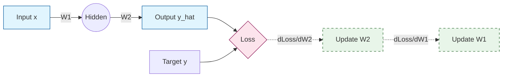
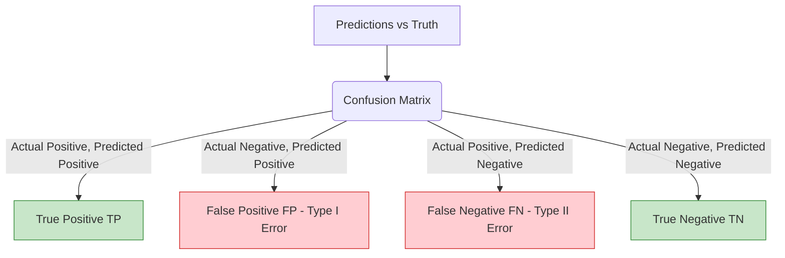
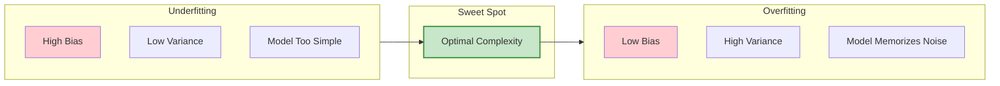

# ML Math and Evaluation Study Guide

> [!IMPORTANT]
> This study guide bridges the mathematical principles underlying machine learning with practical model evaluation, training strategies, and MLOps. Understanding *why* something works mathematically makes you a fundamentally stronger AI Engineer than just knowing *how* to call an API.

---

## 1. Mathematical Foundations for ML

### Linear Algebra Essentials

Linear algebra is the language of machine learning. Almost all operations in neural networks are matrix multiplications.

*   **Vectors**:
    *   **Dot Product**: $\mathbf{a} \cdot \mathbf{b} = \sum_{i=1}^{n} a_i b_i$. Represents the projection of one vector onto another.
    *   **Cross Product**: Produces a vector perpendicular to two given vectors in 3D space.
    *   **Norms**:
        *   **L1 Norm (Manhattan)**: $\|\mathbf{x}\|_1 = \sum |x_i|$
        *   **L2 Norm (Euclidean)**: $\|\mathbf{x}\|_2 = \sqrt{\sum x_i^2}$
    *   **Unit Vectors**: Vectors with an L2 norm of 1.

*   **Matrices**:
    *   **Multiplication**: To multiply $A$ (size $m \times n$) and $B$ (size $n \times p$), the inner dimensions must match. The result is $m \times p$.
    *   **Transpose ($A^T$)**: Rows become columns.
    *   **Inverse ($A^{-1}$)**: A matrix such that $A A^{-1} = I$ (Identity Matrix).
    *   **Determinant ($|A|$)**: A scalar representing the volume scaling factor of the linear transformation described by the matrix.
    *   **Rank**: The maximum number of linearly independent column (or row) vectors.

*   **Eigenvalues & Eigenvectors**:
    *   An eigenvector $\mathbf{v}$ of a matrix $A$ is a non-zero vector that changes at most by a scalar factor (eigenvalue $\lambda$) when that linear transformation is applied to it: $A\mathbf{v} = \lambda\mathbf{v}$.
    *   **PCA Connection**: Principal Component Analysis finds the principal components (directions of maximum variance), which are exactly the eigenvectors of the data's covariance matrix.

*   **Cosine Similarity**:
    *   **Formula**: $\cos(\theta) = \frac{\mathbf{A} \cdot \mathbf{B}}{\|\mathbf{A}\|_2 \|\mathbf{B}\|_2}$
    *   **Why it's used in RAG / Embeddings (MeetAI)**: In high-dimensional spaces, the magnitude of a vector often carries less semantic meaning than its direction. Cosine similarity isolates the directional similarity, ignoring the scale, making it ideal for comparing text embeddings.

> [!NOTE]
> **MeetAI Connection**: When retrieving context chunks for MeetAI, cosine similarity is likely used to rank the chunks. Chunks whose embedding vectors point in the same direction as the query vector are retrieved.

#### Q&A: Linear Algebra

1.  **What is the geometric interpretation of the dot product?**
    *   It measures the degree to which two vectors point in the same direction, scaling with their magnitudes. It's the length of the projection of vector A onto vector B, multiplied by the length of vector B.
2.  **Why do we use tensors instead of just matrices?**
    *   Tensors are a generalization of matrices to higher dimensions. An image is a 3D tensor (height, width, color channels), and a batch of images is a 4D tensor.
3.  **What happens to a vector when multiplied by an orthogonal matrix?**
    *   Its length (L2 norm) is preserved; it merely undergoes rotation or reflection.
4.  **Explain Singular Value Decomposition (SVD).**
    *   SVD factors any real matrix into $U \Sigma V^T$, where $U$ and $V$ are orthogonal matrices and $\Sigma$ is a diagonal matrix of singular values. It's fundamental to dimensionality reduction and pseudo-inverses.
5.  **How is matrix rank related to the capacity of a neural network layer?**
    *   A weight matrix with low rank implies a bottleneck. LoRA (Low-Rank Adaptation) leverages this by freezing the original weights and updating a low-rank approximation, drastically reducing trainable parameters.
6.  **Why is the L2 norm more commonly used than the L1 norm?**
    *   L2 is continuously differentiable everywhere except the origin, making it friendly for gradient descent. L1 leads to sparsity.
7.  **What does a determinant of zero imply?**
    *   The matrix is singular, meaning its transformation collapses space into a lower dimension, and it is not invertible.
8.  **How is cosine similarity related to Euclidean distance?**
    *   If both vectors are L2-normalized (length 1), maximizing cosine similarity is mathematically equivalent to minimizing Euclidean distance.
9.  **What is broadcasting in numpy/PyTorch?**
    *   A set of rules allowing operations on arrays of different shapes by implicitly expanding the smaller array to match the larger one without actually copying data.
10. **Explain the trace of a matrix.**
    *   The sum of the diagonal elements. It is equal to the sum of the eigenvalues.

---

### Probability & Statistics

*   **Bayes' Theorem**:
    *   **Formula**: $P(A|B) = \frac{P(B|A)P(A)}{P(B)}$
    *   **Intuition**: Updating our belief ($P(A)$, prior) about a hypothesis based on new evidence ($P(B|A)$, likelihood) to get the posterior $P(A|B)$.

*   **Probability Distributions**:
    *   **Normal (Gaussian)**: Bell curve, defined by mean ($\mu$) and variance ($\sigma^2$).
    *   **Bernoulli**: Single trial with two outcomes (success/failure).
    *   **Categorical**: Single trial with $k$ possible outcomes (generalization of Bernoulli).
    *   **Multinomial**: Counts of outcomes in $n$ independent trials of a categorical distribution.

*   **Expectation, Variance, Standard Deviation**:
    *   **Expectation (Mean)**: $E[X] = \sum x_i P(x_i)$ or $\int x f(x) dx$.
    *   **Variance**: $Var(X) = E[(X - \mu)^2]$.
    *   **Standard Deviation**: $\sigma = \sqrt{Var(X)}$.

*   **Types of Probability**:
    *   **Joint Probability**: $P(A, B)$ or $P(A \cap B)$. Probability of both A and B occurring.
    *   **Conditional Probability**: $P(A|B)$. Probability of A given B has occurred.
    *   **Marginal Probability**: $P(A) = \sum_B P(A, B)$.

*   **Maximum Likelihood Estimation (MLE)**:
    *   **Intuition**: Finding the parameters of a statistical model that maximize the likelihood of observing the training data.
    *   **Connection to Loss**: Minimizing the Negative Log-Likelihood (NLL) or Cross-Entropy is mathematically equivalent to performing MLE.

#### Q&A: Probability & Statistics

1.  **Explain the difference between MLE and MAP (Maximum A Posteriori).**
    *   MLE finds parameters maximizing the likelihood of the data: $P(Data | \theta)$. MAP includes a prior belief over the parameters, maximizing $P(Data | \theta) P(\theta)$. MAP with a Gaussian prior is equivalent to MLE with L2 regularization.
2.  **What is the Central Limit Theorem?**
    *   It states that the sum (or average) of many independent, identically distributed random variables tends toward a normal distribution, regardless of the original distribution.
3.  **What is a probability density function (PDF)?**
    *   A function describing the relative likelihood of a continuous random variable taking a given value. The area under the PDF curve represents actual probability.
4.  **What is covariance vs correlation?**
    *   Covariance measures how two variables vary together. Correlation is the normalized covariance (ranging from -1 to 1), making it unit-independent.
5.  **Explain the curse of dimensionality.**
    *   As the number of dimensions increases, the volume of the space increases exponentially, making data very sparse. Distance metrics (like Euclidean) become less meaningful because the distance between the nearest and farthest points converges.
6.  **What is KL Divergence?**
    *   A measure of how one probability distribution differs from a reference probability distribution. It is asymmetric. Minimizing Cross-Entropy minimizes KL divergence.
7.  **Why do we use log probabilities in ML?**
    *   To avoid numerical underflow. Multiplying many small probabilities results in zero. Logarithms turn multiplication into addition: $\log(a \cdot b) = \log(a) + \log(b)$.
8.  **What is a Naive Bayes classifier?**
    *   A classifier based on Bayes' theorem that assumes all features are conditionally independent given the class label—a "naive" assumption, but it works surprisingly well for text classification.
9.  **Explain the concept of independence vs mutually exclusive.**
    *   Independent: Occurrence of one doesn't affect the other ($P(A|B) = P(A)$). Mutually exclusive: They cannot occur at the same time ($P(A \cap B) = 0$).
10. **How does standardizing data (Z-score normalization) affect mean and variance?**
    *   It shifts the mean to 0 and scales the variance to 1. $z = \frac{x - \mu}{\sigma}$.

---

### Calculus for ML

*   **Derivatives and Gradients**:
    *   **Partial Derivative**: Derivative of a multivariable function with respect to one variable, keeping others constant. Indicates how the output changes if we tweak one weight.
    *   **Gradient Vector**: A vector containing all the partial derivatives. It points in the direction of the steepest ascent of the function.

*   **Chain Rule**:
    *   $\frac{dz}{dx} = \frac{dz}{dy} \cdot \frac{dy}{dx}$. The absolute core of backpropagation, allowing us to compute gradients through nested functions (layers).

*   **Jacobian and Hessian**:
    *   **Jacobian**: Matrix of all first-order partial derivatives of a vector-valued function.
    *   **Hessian**: Matrix of second-order partial derivatives. Describes the local curvature of a function. (Rarely computed explicitly in DL due to massive size).

#### Q&A: Calculus

1.  **Why is the gradient descent update rule $\theta = \theta - \alpha \nabla J(\theta)$?**
    *   The gradient $\nabla J$ points toward the steepest *increase* in loss. We subtract it (multiplied by learning rate $\alpha$) to move in the direction of steepest *decrease*.
2.  **What is a saddle point?**
    *   A point where the gradient is zero, but it is a minimum along one axis and a maximum along another. They are more common than local minima in high-dimensional spaces like neural networks.
3.  **Why don't we use second-order optimization methods (like Newton's method) in Deep Learning?**
    *   They require computing and inverting the Hessian matrix, which is $O(N^3)$ where $N$ is the number of parameters. For a model with millions of parameters, this is computationally impossible.
4.  **How is automatic differentiation (autograd) different from numerical differentiation?**
    *   Numerical differentiation uses finite differences ($\frac{f(x+h) - f(x)}{h}$), which is slow and prone to floating-point errors. Autograd explicitly builds a computational graph and applies the chain rule analytically, ensuring exact and efficient gradients.
5.  **What is the directional derivative?**
    *   The rate of change of a function in a specific direction (represented by a unit vector), computed as the dot product of the gradient and the direction vector.

---

## 2. Training Deep Learning Models

### Backpropagation

Backpropagation is the algorithm used to train neural networks.

1.  **Forward Pass**: Data moves from input to output. Activations and loss are computed.
2.  **Backward Pass**: Error (gradient of loss) flows from output back to input using the chain rule, updating weights along the way.

*   **Vanishing & Exploding Gradients**:
    *   **Causes**: Multiplying many gradients (values $<1$ or $>1$) via the chain rule in deep networks.
    *   **Solutions**:
        *   **Residual Connections (ResNets)**: Allows gradients to flow directly through skip connections.
        *   **Gradient Clipping**: Capping gradients at a maximum threshold to prevent explosion.
        *   **Proper Initialization**: e.g., Xavier/Glorot or Kaiming/He initialization ensures variance of activations remains constant across layers.

### Gradient Descent Variants

| Optimizer | Key Idea | Pros | Cons |
|---|---|---|---|
| **SGD** | Update using single sample/batch gradient | Simple, good generalization | Noisy, slow convergence in ravines |
| **SGD + Momentum** | Accumulates gradient history (moving average) | Faster convergence, overcomes local minima | Needs tuning of momentum parameter |
| **Adam** | Adaptive learning rates per parameter (RMSProp + Momentum) | Fast, excellent default choice | Can overfit, takes more memory |
| **AdamW** | Adam with decoupled weight decay | Better generalization than standard Adam | Slightly more complex |

*   **Learning Rate Scheduling**:
    *   **Step Decay**: Reduce LR by a factor every $N$ epochs.
    *   **Cosine Annealing**: Slowly reduce LR following a cosine curve.
    *   **Warmup**: Start with a very low LR and linearly increase it initially to avoid divergence in early unstable training stages.

> [!TIP]
> **Why AdamW over Adam?** In standard Adam, L2 regularization (weight decay) is mixed with the gradient updates. AdamW applies weight decay directly to the weights *after* the gradient update step, mathematically separating the two and leading to much better generalization, especially in Transformers.

#### Q&A: Optimizers & Training

1.  **Why do we use mini-batches instead of the full dataset (Batch GD) or single examples (Stochastic GD)?**
    *   Mini-batches offer a balance. They provide a more stable gradient estimate than pure SGD, but are much faster to compute than Batch GD and allow for vectorization on GPUs.
2.  **What is the purpose of the momentum term?**
    *   It helps accelerate SGD in relevant directions and dampens oscillations by maintaining a moving average of past gradients (like a ball rolling down a hill).
3.  **Why is learning rate warmup crucial for training Transformers?**
    *   Transformers lack stable initialization. In early iterations, gradients can be huge. Warmup prevents the optimizer from taking massive, destructive steps before the network normalizes.
4.  **Explain the one-cycle learning rate policy.**
    *   LR starts low, increases to a maximum midway, and then decreases to a very low value. It allows super-convergence and acts as a regularizer.
5.  **How does gradient accumulation work?**
    *   If a batch size is too large for GPU memory, we compute gradients for smaller micro-batches, sum (accumulate) them, and only perform the optimizer step after $N$ accumulations.
6.  **What is internal covariate shift?**
    *   The change in the distribution of network activations due to the change in network parameters during training. BatchNorm was introduced to address this.
7.  **Why do deep networks suffer from vanishing gradients more often with Sigmoid than ReLU?**
    *   The derivative of Sigmoid is at most 0.25. Multiplying many 0.25s through deep layers quickly shrinks the gradient to near zero. ReLU has a derivative of 1 for $x>0$.
8.  **What is catastrophic forgetting?**
    *   When a model forgets previously learned information upon learning new information. Common in continuous learning or fine-tuning.
9.  **Describe how mixed precision training works.**
    *   It uses FP16 (half-precision) for forward/backward passes to save memory and speed up math, but keeps an FP32 (single-precision) master copy of the weights for the optimizer step to prevent numerical underflow.
10. **What is gradient checkpointing?**
    *   A memory-saving technique where intermediate activations aren't saved during the forward pass. Instead, they are recomputed from checkpoints during the backward pass, trading computation time for memory.

---

### Loss Functions

*   **Cross-Entropy Loss**:
    *   **Categorical**: $-\sum y_i \log(\hat{y}_i)$. For multi-class classification.
    *   **Binary (BCE)**: $-[y \log(\hat{y}) + (1-y)\log(1-\hat{y})]$.
*   **MSE (Mean Squared Error)**: $\frac{1}{n} \sum (y_i - \hat{y}_i)^2$. Heavily penalizes large outliers. Used for regression.
*   **Focal Loss**:
    *   $FL(p_t) = -\alpha_t (1 - p_t)^\gamma \log(p_t)$
    *   **Siren Eyes Connection**: You had an extreme class imbalance (40 sirens vs 1960 negatives). Standard Cross Entropy would just learn to predict "negative" always. Focal loss adds the $(1-p_t)^\gamma$ term to down-weight easy, well-classified examples (the 1960 negatives) and force the model to focus on hard, misclassified examples (the rare sirens).
*   **Contrastive Loss / Triplet Loss**:
    *   Pulls embeddings of similar items together, pushes dissimilar items apart. Crucial for RAG/embedding models.
*   **CTC Loss (Connectionist Temporal Classification)**:
    *   Allows sequence-to-sequence training (like Speech-to-Text) when you don't know the exact alignment of input frames to output characters (e.g., Whisper).

#### Q&A: Loss Functions

1.  **Why use Cross-Entropy over MSE for classification?**
    *   MSE coupled with softmax/sigmoid produces a non-convex loss surface with flat regions (vanishing gradients) when predictions are confidently wrong. Cross-Entropy undoes the exponential in softmax, creating a steeper, convex gradient.
2.  **What is Label Smoothing?**
    *   Instead of targets being one-hot `[1, 0, 0]`, they become `[0.9, 0.05, 0.05]`. It prevents the model from becoming overly confident, acting as regularization.
3.  **Explain Triplet Loss.**
    *   Uses an Anchor (A), Positive (P), and Negative (N) sample. Loss is $\max(0, d(A,P) - d(A,N) + \text{margin})$. It ensures the anchor is closer to the positive than the negative by at least a margin.
4.  **What happens to Focal Loss if $\gamma = 0$?**
    *   It reduces to standard Cross-Entropy Loss.
5.  **How does Huber Loss compare to MSE and MAE?**
    *   It acts like MSE for small errors and MAE for large errors. It is robust to outliers (like MAE) but differentiable at 0 (like MSE).

---

### Regularization Techniques

*   **L1 (Lasso)**: Adds $\lambda \sum |w|$ to the loss. Drives unimportant weights to exactly zero, creating sparse models (feature selection).
*   **L2 (Ridge/Weight Decay)**: Adds $\lambda \sum w^2$ to the loss. Penalizes large weights, spreading responsibility across many features for a smoother model.
*   **Dropout**: Randomly zeroes out neurons during training with probability $p$. Forces the network to learn redundant representations. (Must be scaled during inference).
*   **Batch Normalization**:
    *   Normalizes activations across the batch dimension: $\hat{x} = \frac{x - \mu}{\sqrt{\sigma^2 + \epsilon}}$. Applies learnable scale $\gamma$ and shift $\beta$.
*   **Layer Normalization**:
    *   Normalizes activations across the *feature* dimension for a single example.
    *   **Why used in Transformers?** Text sequences have variable lengths, and batch sizes in LLMs are often small. BatchNorm struggles with variable lengths and small batches. LayerNorm is independent of batch size.
*   **Early Stopping**: Stop training when validation loss stops improving to prevent overfitting.

#### Q&A: Regularization

1.  **How does Dropout act as an ensemble method?**
    *   By randomly dropping neurons, every training iteration effectively trains a slightly different sub-network. At inference, using all neurons acts as an averaged ensemble of these sub-networks.
2.  **Why is Data Augmentation considered regularization?**
    *   It artificially increases the dataset size and variation, making it harder for the model to memorize the training data, thus reducing overfitting.
3.  **In testing/inference phase, how does Dropout behave?**
    *   Dropout is turned off. However, the weights must be scaled down by $(1-p)$ to ensure the expected sum of inputs to the next layer remains the same as during training. (Often frameworks do inverted dropout during training so inference needs no scaling).
4.  **What is the difference between Weight Decay and L2 Regularization?**
    *   Mathematically identical in standard SGD. But in adaptive optimizers like Adam, they differ (hence AdamW). L2 adds to the loss gradient, whereas Weight Decay decays the weight directly during the update step.
5.  **Why do we need learnable parameters $\gamma$ and $\beta$ in BatchNorm?**
    *   If we just normalize to mean 0, var 1, we restrict the representational power of the network (e.g., forcing a Sigmoid to only operate in its linear middle region). $\gamma$ and $\beta$ allow the network to learn to undo the normalization if it needs to.
6.  **Why is L1 regularization robust to outliers?**
    *   Actually, L1 *loss* (MAE) is robust to outliers in labels. L1 *regularization* creates sparsity.
7.  **Can we use Dropout and BatchNorm together?**
    *   Often they conflict because Dropout shifts the variance that BatchNorm is trying to stabilize (the "variance shift" problem). Usually, one or the other is used, or Dropout is placed carefully after BN.
8.  **What is CutMix vs MixUp data augmentation?**
    *   MixUp blends two images and their labels linearly. CutMix cuts a patch from one image and pastes it onto another, mixing the labels proportionally to the patch area.
9.  **Explain the role of the $\epsilon$ term in LayerNorm.**
    *   A tiny constant added to the variance in the denominator to prevent division by zero when the variance is perfectly zero.
10. **Does Early Stopping guarantee finding the global minimum?**
    *   No, it prevents overfitting. It stops at the point of best generalization on the validation set, which might just be a local minimum.

---

### Activation Functions

| Function | Formula | Pros | Cons | Used In |
|---|---|---|---|---|
| **ReLU** | $\max(0, x)$ | Fast, solves vanishing gradient for $x>0$ | "Dying ReLU" (neurons output 0 forever if $x \le 0$) | CNNs, older MLPs |
| **Leaky ReLU** | $\max(\alpha x, x)$ | Fixes dying ReLU problem | $\alpha$ needs tuning | GANs, CNNs |
| **GELU** | $x \cdot \Phi(x)$ | Smooth approximation of ReLU | Slightly slower to compute | BERT, ViTs, GPT |
| **SiLU (Swish)** | $x \cdot \sigma(x)$ | Smooth, non-monotonic (dips below 0) | Slightly slower to compute | LLaMA, Modern LLMs |
| **Sigmoid** | $\frac{1}{1+e^{-x}}$ | Outputs probability $[0,1]$ | Vanishing gradients at extremes | Output of binary class |
| **Softmax** | $\frac{e^{x_i}}{\sum e^{x_j}}$ | Outputs probability distribution | Sensitive to outliers | Multi-class output |

---

## 3. Model Evaluation Metrics

> [!WARNING]
> High accuracy can be completely misleading. In your Siren Eyes project, predicting "Not a Siren" 100% of the time on a set of 1960 negatives and 40 sirens yields 98% accuracy, but the model is completely useless. Always know your metrics!

### Classification Metrics

*   **Precision**: $TP / (TP + FP)$. Of all the things I called a siren, how many actually were sirens? (Mitigates False Positives).
*   **Recall (Sensitivity)**: $TP / (TP + FN)$. Of all the actual sirens out there, how many did I catch? (Mitigates False Negatives).
*   **F1 Score**: $2 \cdot \frac{Precision \cdot Recall}{Precision + Recall}$. Harmonic mean. Punishes extreme values (you can't have 1.0 recall and 0.01 precision and get a good F1).
*   **ROC Curve (Receiver Operating Characteristic)**: Plots True Positive Rate (Recall) vs False Positive Rate.
*   **AUC (Area Under Curve)**: Measures the entire 2D area underneath the entire ROC curve. Range 0.5 (random) to 1.0 (perfect).

> [!IMPORTANT]
> **Defending the Siren Eyes Metrics**:
> Your audio model has **Precision 0.40, Recall 0.80**, and ROC-AUC 0.9857.
> **Why this is good**: For a safety application, **Recall is king**. You want to catch 80% of real sirens (low False Negatives). The low precision (0.40) means it cries wolf sometimes (False Positives). *However*, in your architecture, the audio model is just the first filter! The visual object detection validates the audio. It's perfectly fine for the audio to over-trigger as long as the multimodal fusion corrects the false positives later.

#### Q&A: Classification Metrics

1.  **When would you prioritize Precision over Recall?**
    *   When the cost of a False Positive is very high. Example: Email Spam filter (you don't want an important email sent to spam).
2.  **When would you prioritize Recall over Precision?**
    *   When the cost of a False Negative is very high. Example: Cancer detection, or Siren detection (missing a siren is worse than a false alarm).
3.  **Why use the harmonic mean for F1 instead of arithmetic mean?**
    *   Arithmetic mean would allow a model with 1.0 Recall and 0.0 Precision to score 0.5. Harmonic mean severely penalizes cases where one metric is high and the other is near zero.
4.  **ROC curve vs Precision-Recall (PR) curve?**
    *   ROC curves can be deceiving on highly imbalanced datasets because True Negatives heavily influence the False Positive Rate formula. PR curves are strictly better for evaluating rare positive classes (like your sirens).
5.  **What does an ROC-AUC of 0.5 indicate?**
    *   The model has no discrimination capacity; it's equivalent to random guessing.
6.  **Explain Micro vs Macro F1 for multi-class classification.**
    *   **Macro F1**: Calculates F1 for each class independently and averages them. Treats all classes equally regardless of support size.
    *   **Micro F1**: Aggregates TP, FP, FN globally across all classes, then calculates one F1. Dominated by the majority class.
7.  **What is specificity?**
    *   True Negative Rate: $TN / (TN + FP)$. Of all actual negatives, how many did we correctly identify?
8.  **How do you threshold a model to balance precision and recall?**
    *   You output probabilities (0 to 1). By moving the decision threshold (e.g., from 0.5 to 0.7), you increase precision but decrease recall. You pick the threshold based on the business requirements using the PR curve.

### Object Detection Metrics

*   **IoU (Intersection over Union)**: Area of Overlap divided by Area of Union between the predicted bounding box and the ground truth box.
*   **mAP (Mean Average Precision)**:
    *   Calculate Average Precision (AP) for each class by finding the area under the Precision-Recall curve.
    *   mAP is the mean of AP across all classes.
    *   **mAP@0.5**: AP calculated where a prediction is considered a True Positive if IoU > 0.5.
    *   **mAP@0.5:0.95**: A stricter metric. Averages mAP calculated at varying IoU thresholds (0.5, 0.55, 0.6... 0.95). Your **Siren Eyes model got 92.6% mAP@0.5**, which is excellent for YOLO.

### LLM Evaluation

Evaluating generative models is notoriously difficult because there is no single "correct" answer.

*   **Perplexity**: Exp(Cross-Entropy Loss). Measures how "surprised" a model is by a sequence of text. Lower is better.
*   **BLEU**: Used mostly for translation. Measures n-gram overlap between generation and reference. Fails to capture semantic meaning.
*   **ROUGE**: Used mostly for summarization. Measures recall of n-grams (how much of the reference was captured).
*   **Standard Benchmarks**:
    *   **MMLU (Massive Multitask Language Understanding)**: Multi-choice questions across 57 academic subjects. Tests general knowledge.
    *   **HumanEval**: OpenAI's python coding benchmark. Measures Pass@1 (does the first generated code pass the unit tests?).
*   **LLM-as-a-Judge**: Using a stronger model (like GPT-4) to evaluate the outputs of a weaker model based on a rubric (relevance, tone, accuracy). Used heavily in RLHF.

#### Q&A: LLM & Detection Metrics

1.  **What is a major flaw of BLEU and ROUGE?**
    *   They rely on exact lexical overlap. "The feline sat" and "The cat sat" have low overlap but identical meaning. They cannot judge semantic similarity.
2.  **Explain the Pass@k metric in code generation.**
    *   The model generates $k$ different solutions. If *at least one* passes all unit tests, it counts as a success.
3.  **Why is IoU important in Object Detection?**
    *   Without IoU, a bounding box that encompasses the entire image would get 100% recall. IoU forces the prediction to be tight around the object.
4.  **What is Non-Maximum Suppression (NMS)?**
    *   An algorithm used in object detection to remove duplicate bounding boxes pointing to the same object. It keeps the box with the highest confidence and deletes overlapping boxes (IoU > threshold).
5.  **How do you measure hallucination in RAG systems?**
    *   Using metrics like Faithfulness (does the answer strictly follow the retrieved context?) and Answer Relevance (does it actually answer the query?). Frameworks like Ragas or TruLens do this via LLM-as-a-judge.

---

## 4. Data Preprocessing & Feature Engineering

*   **Imputation Strategies**: Mean, Median, Mode, or training a model to predict missing values (KNN Imputer).
*   **Scaling**:
    *   **StandardScaler**: $(x - \mu) / \sigma$. Crucial for linear models, SVMs, and NNs.
    *   **MinMaxScaler**: Scales to $[0, 1]$. Useful for image pixel values.
    *   **RobustScaler**: Uses median and interquartile range; resistant to outliers.
*   **Handling Imbalanced Data (Crucial for Siren Eyes)**:
    1.  **Class Weights**: Modify loss function to penalize errors on minority class more.
    2.  **Oversampling (SMOTE)**: Synthetically creating new minority class examples.
    3.  **Undersampling**: Throwing away majority class examples.
    4.  **Data Augmentation**: Your audio solution (pitch shift, noise mixing) is a form of targeted oversampling.
*   **Data Augmentation (Audio)**: Time-stretching, pitch-shifting, background noise addition, and **SpecAugment** (masking blocks of frequency or time on the spectrogram, exactly like Dropout but for input data).
*   **Cross-Validation**:
    *   **Stratified k-fold**: Ensures each fold has the same proportion of classes as the whole dataset. **Essential** when dealing with severe imbalances like the ESC-50 dataset.

#### Q&A: Preprocessing

1.  **Why should you fit your scaler ONLY on the training data, not the whole dataset?**
    *   To prevent data leakage. If you scale using the mean of the test set, information from the test set leaks into your training process, invalidating your evaluation.
2.  **What is the dummy variable trap in One-Hot Encoding?**
    *   If you have $k$ categories and create $k$ one-hot columns, they are perfectly collinear (they sum to 1). Linear models will struggle. You should drop one column (resulting in $k-1$ features).
3.  **Explain Target Encoding.**
    *   Replacing a categorical variable with the mean of the target variable for that category. Powerful for high-cardinality features but very prone to target leakage; must be done with cross-validation.
4.  **When is tree-based modeling (Random Forest/XGBoost) superior to Neural Networks?**
    *   On structured, tabular data with many categorical variables. Trees don't require feature scaling and handle non-linear relationships natively. NNs dominate unstructured data (images, text, audio).
5.  **Why did you use Stratified K-Fold for Siren Eyes?**
    *   Because with only 40 positive samples, a random split might result in 0 sirens in the validation set, making it impossible to evaluate. Stratification guarantees proportional representation.

---

## 5. Bias-Variance Tradeoff

*   **Bias**: Error from erroneous assumptions (e.g., assuming a non-linear problem is linear). High bias = Underfitting.
*   **Variance**: Error from sensitivity to small fluctuations in the training set. High variance = Overfitting.
*   **How to detect**:
    *   High Training Error + High Validation Error $\rightarrow$ Underfitting.
    *   Low Training Error + High Validation Error $\rightarrow$ Overfitting.
*   **How to fix Overfitting**: Add data, add regularization (L2, Dropout), use a smaller model, Early Stopping, Data Augmentation.
*   **How to fix Underfitting**: Increase model capacity (layers/neurons), train longer, reduce regularization, feature engineering.

---

## 6. MLOps & Model Serving

*   **Experiment Tracking (MLflow, W&B)**: Essential for comparing runs. Logs hyperparameters, metrics (loss, accuracy), and artifacts (saved weights).
*   **Model Serving**:
    *   **Triton/TorchServe**: Frameworks designed for low-latency batching on GPUs.
    *   **vLLM**: Specifically for LLMs, utilizes PagedAttention to manage KV cache memory efficiently, massively increasing throughput.
*   **Deployment Strategies**:
    *   **A/B Testing**: Randomly route traffic between Model A and Model B, compare business metrics.
    *   **Canary**: Deploy to 5% of users. Monitor errors. If good, roll out to 100%.
    *   **Shadow Mode**: Run the new model in production alongside the old one, but don't show its outputs to users. Just log them for comparison.
*   **Data Drift**: The statistical distribution of production inputs changes over time (e.g., a spam classifier breaking because spammers changed tactics).
*   **Concept Drift**: The mapping between inputs and targets changes (e.g., what constitutes "fashionable clothing" changes over time).

#### Q&A: MLOps

1.  **What is the difference between Data Drift and Concept Drift?**
    *   Data drift: Input distribution $P(X)$ changes. Concept drift: The underlying relationship $P(Y|X)$ changes.
2.  **How do feature stores differ from traditional databases?**
    *   They are designed to serve ML features consistently across two environments: offline (high-throughput batch for training) and online (low-latency key-value lookup for inference).
3.  **Explain the benefit of Dynamic Batching in Triton Inference Server.**
    *   Instead of processing inference requests one by one, the server briefly delays requests (e.g., by 5ms) to group them into a batch, fully utilizing GPU parallelism without significant latency penalties.
4.  **What is an ONNX format?**
    *   Open Neural Network Exchange. An open standard format that allows models trained in PyTorch or TensorFlow to be exported and run efficiently on various hardware accelerators (TensorRT, CPU).
5.  **How do you monitor for Data Drift in production?**
    *   Use statistical tests (like Kolmogorov-Smirnov or Kullback-Leibler divergence) to compare the distribution of incoming production data against a reference baseline from the training data.

---

## 7. Advanced AI Topics (Differentiators)

These topics show you are up-to-date with 2023/2024 AI paradigms.

*   **Flash Attention**: An exact, IO-aware algorithm that speeds up attention and reduces memory by tiling computation and keeping the KV cache in fast SRAM instead of moving it back and forth to slower HBM (GPU RAM).
*   **Grouped Query Attention (GQA)**: Standard Multi-Head Attention has one KV head per Query head. Multi-Query Attention shares one KV head for all Queries. GQA is the middle ground: groups of queries share a single KV head. Reduces memory bottleneck (KV cache size) during inference significantly, used in LLaMA 2/3.
*   **Mixture of Experts (MoE)**: Instead of passing data through all weights (dense), MoE uses a "Router" network to send tokens to only 2 of 8 expert sub-networks (used in Mixtral). Allows a massive model (47B parameters) to have the inference cost of a much smaller model (13B active parameters).
*   **Diffusion Models**:
    *   **Forward Process**: Incrementally adds Gaussian noise to an image until it is pure noise (Markov chain).
    *   **Reverse Process**: A U-Net learns to denoise the image step-by-step, conditioned on text embeddings (CLIP).
*   **LLM Hallucinations**:
    *   **Causes**: Training data contradictions, exposure bias (trained on teacher forcing, tested on autoregressive generation), knowledge cutoff.
    *   **Mitigation**: RAG (grounding), Chain-of-Thought (forcing reasoning steps), RLHF (punishing ungrounded answers).

#### Q&A: Advanced Topics

1.  **Why is the KV Cache a bottleneck in LLM inference?**
    *   Autoregressive generation generates one token at a time. To predict token $N$, attention needs the Keys and Values of all $N-1$ previous tokens. Recomputing them is slow. Caching them takes massive amounts of GPU memory, limiting batch size.
2.  **How does Flash Attention scale with sequence length compared to standard Attention?**
    *   Standard attention memory scales $O(N^2)$ due to the $N \times N$ attention matrix. Flash Attention memory scales linearly $O(N)$ and is significantly faster due to reduced IO overhead.
3.  **Explain the contrastive learning in CLIP.**
    *   Given an image and its text caption, CLIP encodes both into vectors. It trains the model to maximize the cosine similarity between the correct image-text pairs (on the diagonal of a batch matrix) and minimize similarity between all other combinations in the batch.
4.  **What is LoRA (Low-Rank Adaptation)?**
    *   A PEFT (Parameter-Efficient Fine-Tuning) method. Instead of updating all billions of weights in an LLM, LoRA injects small trainable rank-decomposition matrices into the transformer layers, reducing trainable parameters by 99% while maintaining performance.
5.  **What is the fundamental difference between how a VAE and a Diffusion Model generate images?**
    *   VAEs encode data into a low-dimensional latent space and decode it back in a single step. Diffusion models slowly destroy data with noise in a multi-step forward process and learn to iteratively reverse that exact process over many steps. Diffusion models generally produce much higher quality, sharper images.
