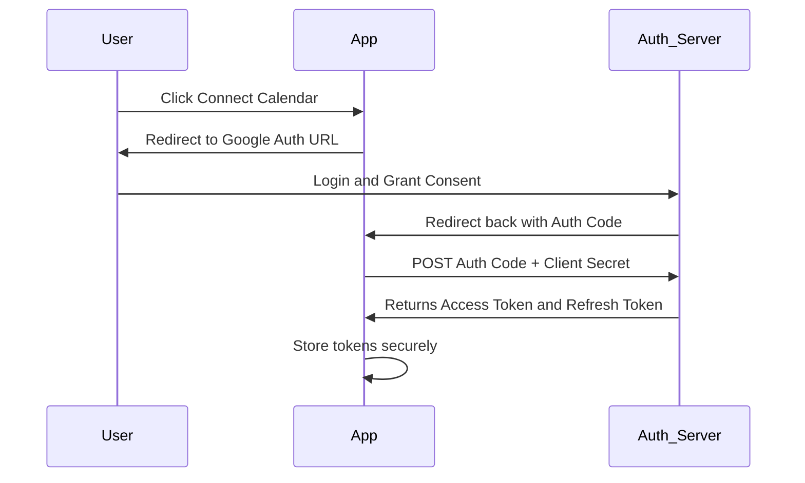

# HR, Security, and Interview Tips Study Guide

> [!NOTE]
> This guide is tailored for Rohit Sharma, a Founding AI Engineer at IndusLabs AI, B.Tech student, published researcher, hackathon winner, and GATE-qualified engineer.

## 1. HR & Cultural Fit Questions

### "Why should we hire you?"
**Variation 1: Startup**
"As a Founding AI Engineer at IndusLabs, I thrive in fast-paced environments where I can wear multiple hats. I’ve built end-to-end systems like an automated ad platform and highly concurrent audio processing pipelines. I don't just write code; I think about product impact, cost (like optimizing latency and server costs), and user experience. I can hit the ground running here."

**Variation 2: Big Tech**
"I bring a mix of strong fundamentals and practical production experience. I'm GATE-qualified with a solid grounding in CS core concepts, and I've published research in computer vision. Additionally, building robust architectures like MeetAI using Golang and gRPC taught me the importance of scalability, fault tolerance, and writing maintainable code—skills critical for engineering at scale."

**Variation 3: AI Research Lab**
"I have a proven track record of bridging the gap between research and production. My published research on retinal disease detection using ensemble CNNs shows my ability to tackle complex ML problems, while my work at IndusLabs and hackathon wins demonstrate I can deploy these models into real-world applications efficiently."

### "Where do you see yourself in 5 years?"
"I see myself as a Staff AI Engineer or Tech Lead, bridging the gap between cutting-edge AI research and scalable product engineering. I want to be architecting large-scale, intelligent systems that solve real human problems, and also mentoring junior engineers, much like how I’ve enjoyed leading projects and taking technical ownership at IndusLabs."

### "What are your strengths?"
1. **Full-Stack AI Engineering:** "I can build both the intelligent core (LLMs, CV models) and the scalable backend (Golang, gRPC, Node.js) to support it."
2. **First-Principles Problem Solving:** "Having cleared GATE, I rely on strong fundamentals to optimize systems—whether it’s reducing latency in MeetAI or chunking strategies for RAG."
3. **Execution & Ownership:** "As a founding engineer and hackathon winner, I’m used to taking an idea from 0 to 1, taking full responsibility for the technical delivery."

### "What are your weaknesses?"
"Because I get deeply invested in optimizing architectures, I sometimes over-engineer solutions early on. For instance, I initially considered microservices for a simple feature at IndusLabs before realizing a monolithic approach was more practical for our timeline. I've learned to counteract this by strictly defining MVPs and focusing on iterative development."

### "Why are you leaving your current role / Why do you want to join us?"
"I’ve learned a tremendous amount building the foundation at IndusLabs AI. However, I am now looking to tackle problems at a much larger scale [or specific domain relevant to the company], where I can learn from senior engineers and work on distributed systems handling millions of requests. Your work on [Company's specific project/tech] aligns perfectly with my background in high-performance backends and AI."

### "How do you handle conflict with a teammate?" (STAR)
**Situation:** "At IndusLabs, a teammate and I disagreed on the tech stack for a new real-time processing feature. They preferred Python for ease of use, while I advocated for Go for performance."
**Task:** "We needed to choose the right tool without delaying the project."
**Action:** "I suggested we look at the requirements: low latency and high concurrency were critical. I built a quick prototype in Go to demonstrate the memory footprint and speed advantages, while acknowledging Python's ease for the ML parts. We decided on a polyglot architecture: Go for the routing/concurrent processing and Python for the ML inference."
**Result:** "The project launched on time with excellent performance, and we maintained a great working relationship."

### "Tell me about a time you disagreed with your manager." (STAR)
**Situation:** "We had a tight deadline to release a feature, and my manager suggested skipping some automated tests to save time."
**Task:** "I needed to ensure product stability while respecting the deadline."
**Action:** "I explained that skipping tests on this critical path might lead to regressions that would cost us more time to fix post-launch. I proposed a compromise: I would write tests only for the core critical functions (P0 paths) and defer edge-case testing to the next sprint. I also stayed a bit late to get them done."
**Result:** "The manager agreed. The launch went smoothly, and the tests actually caught a bug right before deployment."

### "What motivates you?"
"I'm driven by the tangible impact of technology. Seeing a system I built—whether it’s helping detect retinal diseases or automating tedious tasks via MeetAI—actually making someone's life easier or work faster is incredibly rewarding. The intersection of hard engineering challenges and visible user impact is what gets me up in the morning."

### "How do you stay updated with the latest in AI?"
"I actively read papers on arXiv, follow key researchers on Twitter/X, and participate in Kaggle. I also frequently check GitHub trending for new open-source AI tools and listen to podcasts like Lex Fridman or Latent Space. Building side projects and doing hackathons is my favorite way to actually test new frameworks."

### "How do you handle pressure and tight deadlines?" (STAR)
**Situation:** "During a major hackathon, we had 24 hours to build a functional AI application."
**Task:** "We had to go from ideation to a working demo, and 12 hours in, our core API integration broke."
**Action:** "I kept the team calm. We quickly triaged the issue. I reassigned tasks: one person worked on a mock backend so the frontend could continue, while I dove into debugging the API. I time-boxed the debugging to one hour. We found a workaround using an alternative open-source model."
**Result:** "We finished the project on time and actually won the hackathon because our fallback mechanism demonstrated system resilience."

### "Describe your ideal work environment."
"An environment that values engineering excellence and continuous learning. I thrive where there's a good balance of autonomy to solve hard problems and collaborative code reviews to ensure quality. A culture that encourages asking 'why' and making data-driven decisions is ideal for me."

### "What's the most innovative thing you've built?"
"MeetAI. It wasn't just calling an LLM; it was engineering a highly concurrent pipeline using Golang, implementing advanced RAG, and dealing with real-time WebSocket communication for AI avatars. Solving the latency and memory challenges there was highly innovative for my level."

### "How do you prioritize when everything is urgent?"
"I use an impact vs. effort matrix. I look at which tasks block other team members (critical path) and which directly impact production stability or user experience. I communicate my prioritized list to stakeholders immediately to align expectations, ensuring I'm focusing on the true P0s."

### "Tell me about a time you went above and beyond."
"At IndusLabs, I noticed our API response times were creeping up as our user base grew. It wasn't my assigned ticket, but over a weekend, I profiled the application, identified an N+1 query issue, and implemented caching. On Monday, I presented the fix, which reduced latency by 40%."

### "What questions do you have for us?"
*(See Section 6 for full list)*

### "What's your expected salary?"
"Right now, I'm most focused on finding the right fit where I can contribute to exciting AI and backend challenges and grow as an engineer. I’m open to a competitive offer based on market rates for someone with my experience in Go, Node.js, and AI engineering."

### "Are you open to relocation?"
"Yes, I am completely open to relocation for the right opportunity."

### "Why AI/ML specifically?"
"AI is fundamentally changing how we interact with software. It shifts systems from being purely deterministic and rule-based to probabilistic and adaptive. I love the challenge of building infrastructure that can support this kind of intelligence reliably."

### "How do you handle ambiguity in requirements?"
"I over-communicate. I write up a quick PRD (Product Requirements Document) or design doc outlining my assumptions, proposed architecture, and the edge cases I see. I share this with the stakeholders to get early alignment before writing any code."

### "Tell me about your leadership style."
"I lead by example and technical execution. I believe in giving team members autonomy while being available to unblock them. During hackathons, I focus on breaking down the vision into actionable, parallelizable tasks so everyone knows exactly what to own."

---

## 2. Salary Negotiation Guide

### Research-Based Approach
- **Data is Power:** Use Levels.fyi (best for tech), Glassdoor, and Blind to find compensation bands for your target level and location.
- **Know Your Worth:** As an engineer with production AI experience and Go/Node skills, you command a premium over standard new grads.

### Deflecting Early Salary Questions
- **Recruiter:** "What are your salary expectations?"
- **Response:** "I’m currently focused on finding a role that’s a great technical and cultural fit. Could you share the approved compensation band for this role?"

### Negotiation Strategies
- **Never give the first number:** Let them anchor.
- **The Counter-Offer:** If offered X, you can say: *"I'm really excited about the team, but based on my research and the specific AI backend expertise I bring, I was hoping for something closer to Y. Is there flexibility here?"*
- **Total Compensation (TC):** Negotiate on all axes. If base salary is capped, ask for a signing bonus, more equity/RSUs, or an extra week of PTO.
- **The "Competing Offer" Leverage:** The strongest negotiation tactic is having another offer. Even interviewing elsewhere creates leverage.

### When to Walk Away
- When the offer is significantly below market and they refuse to budge.
- When the negotiation process reveals a toxic culture (e.g., exploding offers with 12-hour deadlines, aggressive recruiters).

---

## 3. Application Security (OWASP & Beyond)

> [!CAUTION]
> As a backend engineer, security is your responsibility. Always assume input is malicious.

### OWASP Top 10 (Tailored to Rohit's Stack)

| Vulnerability | Concept | Prevention in Your Stack |
| :--- | :--- | :--- |
| **Injection (SQL/NoSQL)** | Untrusted data is sent to an interpreter as part of a command. | Use ORMs (Prisma, GORM) or parameterized queries. Never use string concatenation for queries. |
| **Broken Auth** | Attackers compromise passwords, keys, or session tokens. | Enforce strong passwords, implement rate limiting on login, avoid JWTs for long-lived sessions without rotation. |
| **XSS (Cross-Site Scripting)** | Executing malicious scripts in the victim's browser. | Sanitize input. Use React/Next.js (which auto-escapes by default). Implement strict Content Security Policy (CSP). |
| **CSRF** | Forcing an authenticated user to execute unwanted actions. | Use SameSite cookie attributes. Implement Anti-CSRF tokens for state-changing requests. |
| **SSRF (Server-Side Request Forgery)** | *Critical for AI:* Server fetches a URL specified by the user. If an LLM agent accesses a local metadata URL (e.g., AWS 169.254...), it leaks secrets. | Allow-list URLs, disable redirects, run agents in sandboxed VPCs without internal network access. |
| **Broken Access Control** | IDOR. User A accesses User B's data (e.g., viewing another user's MeetAI transcript via `/api/meeting/123`). | Always verify that the authenticated user owns the requested resource ID. |
| **Security Misconfig** | Unnecessary features enabled, default passwords, open CORS. | Strict CORS (`Access-Control-Allow-Origin`), disable debug stack traces in production, harden cloud IAM. |
| **Sensitive Data Exposure** | Plaintext storage of sensitive data (API keys, transcripts). | Encrypt data at rest (AES-256-GCM, handled via KMS). Encrypt in transit (TLS 1.2+). |

### OAuth 2.0 Deep Dive
Used for third-party integrations (like Google Calendar in MeetAI).

- **Authorization Code Flow:** The most secure flow for web apps.
- **PKCE (Proof Key for Code Exchange):** Prevents interception attacks, mandatory for SPAs and mobile apps.
- **Scopes:** Principle of least privilege (e.g., only ask for `calendar.readonly`).

### API Security Best Practices
- **Rate Limiting:** Protect against DDoS and control costs (especially for LLM endpoints). Implement Token Bucket or Sliding Window algorithms using Redis.
- **Input Validation:** Use `Pydantic` (Python) or `validator` (Go/Node) to strictly define expected schemas.
- **Secrets Management:** Never hardcode secrets. Use `.env` files locally, and AWS Secrets Manager or HashiCorp Vault in production.

---

## 4. Communication & Soft Skills

> [!TIP]
> The best engineers don't just write code; they communicate complex ideas simply.

### Explaining Technical Concepts Framework
1. **Analogy:** Compare the technical concept to a real-world object (e.g., "Redis is like short-term memory on your desk, the database is the filing cabinet").
2. **Impact:** Explain *why* it matters (e.g., "Using Redis makes our app 10x faster for the user").
3. **Trade-off:** Acknowledge the downside (e.g., "But if the power goes out, we lose what's on the desk, which is why we also use the filing cabinet").

### Interview Frameworks
- **Whiteboard / System Design:**
  1. Clarify Requirements (Functional & Non-Functional).
  2. Back-of-the-envelope estimation (QPS, storage).
  3. High-level diagram (API Gateway -> Service -> DB).
  4. Deep dive into a specific component.
  5. Identify bottlenecks and discuss tradeoffs.
- **Coding:** Always "Think Aloud". State your assumptions. Write a brute-force approach first if stuck, then optimize. Mention Time (Big O) and Space complexity.

---

## 5. Interview Day Preparation

- **Night Before:** Review your resume, ensure your webcam/mic work, sleep at least 8 hours. Don't cram.
- **Environment:** Clean background, quiet room, a glass of water nearby. Have a notepad and pen.
- **Handling "I don't know":** "I haven't worked with that specific tool, but based on my knowledge of X, I would approach it by doing Y. Can you clarify how it differs from Z?"
- **Follow-up:** Send a brief thank-you email within 24 hours acknowledging a specific interesting topic discussed.

---

## 6. Questions to Ask the Interviewer

Always have questions ready. It shows interest and helps you evaluate them.

**Role & Tech Specific:**
1. What does the day-to-day look like for an engineer in this role?
2. What is the biggest technical challenge your team is facing right now?
3. How do you handle technical debt versus shipping new features?
4. Can you describe your CI/CD pipeline and deployment frequency?

**Team & Culture:**
5. How does the team handle code reviews and knowledge sharing?
6. What is the team's approach to work-life balance, especially around deadlines?
7. How are disagreements regarding architecture resolved?
8. What kind of mentorship or growth opportunities exist for engineers here?

**Product & Company:**
9. What is the primary metric the engineering team is currently trying to improve?
10. How are product requirements communicated to the engineering team?
