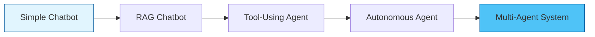
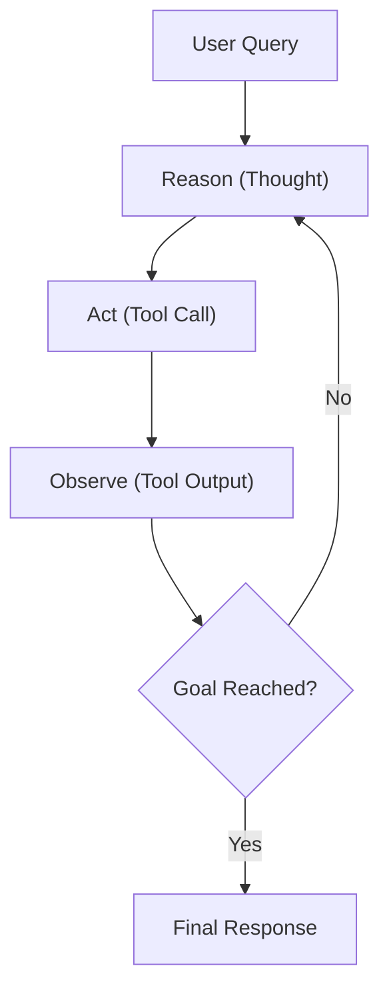
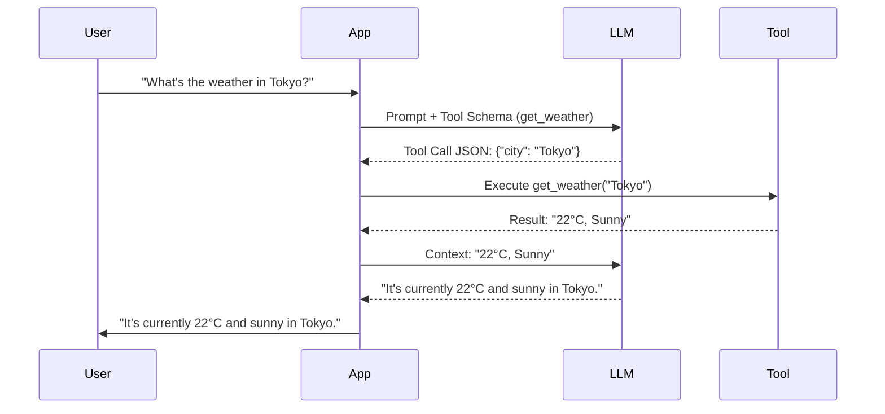
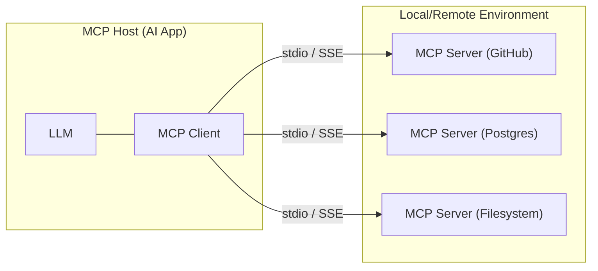
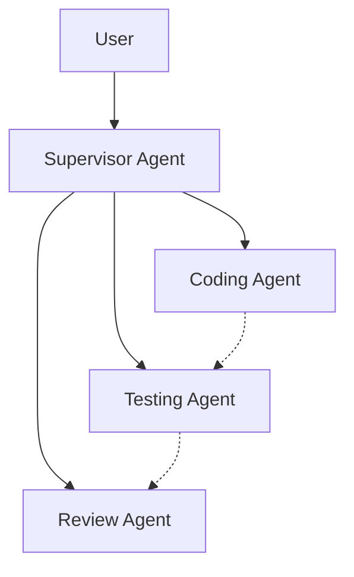

# 11. Agentic AI & Modern Trends: The Definitive Guide

> [!IMPORTANT]
> This guide is optimized for a GenAI & Voice Systems Engineer. It heavily emphasizes Agentic Workflows, Tool Calling, MCP, Inference, and Modern LLM trends. Be ready to tackle any question—if not deeply, at least have a solid 1-2 line intuition.

---

## 1. Agentic AI — Complete Deep Dive

### 1.1 What is Agentic AI?
**Agentic AI** refers to AI systems designed to autonomously plan, reason, use tools, and take actions to achieve specified goals with minimal human intervention. 
Unlike traditional LLMs which are *reactive* (answering queries based on static weights and provided context), Agentic AI is *proactive*—it breaks down problems, accesses real-time data, and executes code or API calls to solve complex tasks.

> [!NOTE]
> The Spectrum of AI Autonomy:
> **Simple Chatbot** $\rightarrow$ **RAG Chatbot** (Retrieves context) $\rightarrow$ **Tool-Using Agent** (Calls APIs) $\rightarrow$ **Autonomous Agent** (Plans & loops) $\rightarrow$ **Multi-Agent System** (Collaborating agents).

### 1.2 Agent Architectures (Deep Dive)

| Architecture | Description | Best Use Case |
|---|---|---|
| **ReAct (Reason + Act)** | Interleaves reasoning traces with actions. The LLM thinks, acts, observes, and repeats. | General-purpose tasks, simple tool use. |
| **Plan-and-Execute** | First generates a step-by-step plan, then executes it sequentially. | Complex tasks requiring long-term planning (e.g., coding, research). |
| **Reflexion** | Agent evaluates its own past actions and outcomes to refine future attempts. | Tasks prone to initial failure, iterative refinement. |
| **LATS (Language Agent Tree Search)** | Applies Monte Carlo Tree Search. Explores multiple reasoning paths and prunes bad ones. | High-stakes decision making, complex coding tasks. |
| **Self-Ask** | Decomposes complex questions into simpler sub-questions that it answers sequentially. | Multi-hop reasoning and complex QA. |

#### The ReAct Loop:

### 1.3 Tool Calling / Function Calling (Deep Dive)
**Tool Calling** enables LLMs to interact with external systems. You provide the LLM with a JSON schema of available functions; the LLM outputs a structured JSON object matching the schema instead of raw text.

- **OpenAI Function Calling vs Anthropic Tool Use:** OpenAI heavily relies on JSON schemas in the API parameters. Anthropic uses an XML-inspired or explicit `tool_use` block format in its native API, though SDKs abstract this.
- **Parallel Tool Calling:** The model outputs multiple tool calls simultaneously (e.g., fetching weather for 3 cities at once), reducing latency.
- **Nested/Sequential Tool Calling:** One tool's output is required as the input for the next tool.
- **Tool Descriptions:** The description IS the prompt. A well-written description tells the LLM *when* to use it and *how* to format inputs.
- **Error Handling:** If a tool fails, the system returns the error to the LLM as an observation, prompting the LLM to self-correct.
- **Validation:** Pydantic models are the standard for defining schemas and validating tool arguments before execution.

#### Q&A: Tool Calling
**Q: What happens if an LLM hallucinates a tool name?**
A: The application layer should catch the error or unknown tool execution, and feed an error message back to the LLM (e.g., "Tool X does not exist, use Y") so it can correct itself.
**Q: Why use Pydantic for tool calling?**
A: Pydantic automatically generates the JSON schema needed by the LLM and strictly validates the returned JSON, rejecting malformed arguments before execution.

### 1.4 MCP (Model Context Protocol) — DEEP DIVE
**What is MCP?** An open standard open-sourced by Anthropic to standardize how AI models access context and tools. It solves the N*M integration problem (N apps connecting to M tools). It is the "USB-C for AI".

**Architecture:**
- **MCP Host:** The AI application (e.g., Claude Desktop, Cursor).
- **MCP Client:** The component within the host that connects to servers.
- **MCP Server:** Exposes capabilities securely.

**Three Core Primitives:**
1. **Tools:** Executable functions (e.g., API calls, DB queries).
2. **Resources:** Readable data streams (e.g., files, DB schemas).
3. **Prompts:** Reusable prompt templates.

**Transport Mechanisms:**
- `stdio`: For local communication (secure, no network overhead).
- `HTTP + SSE`: For remote communication.

> [!TIP]
> **Why it matters:** Previously, integrating a new tool meant writing custom glue code for every LLM app. With MCP, you write one server, and any MCP-compliant host can instantly use those tools.

#### Q&A: MCP
**Q: How does MCP improve security?**
A: Servers run in separate processes. The Host only gets access to what the Server explicitly exposes, sandboxing the LLM's capabilities.
**Q: When would you use direct API integration instead of MCP?**
A: Direct API is better for ultra-low latency, highly custom, single-purpose pipelines where you don't need generalized tool sharing.

### 1.5 A2A (Agent-to-Agent Protocol by Google)
**What is A2A?** Google's protocol for enabling autonomous agents to discover each other, communicate, and delegate tasks.
- **Agent Card:** Like an API schema but for agents. Advertises capabilities, inputs, and costs.
- **A2A vs MCP:** MCP connects models to *tools* (data/APIs). A2A connects *agents to other agents*. They are complementary.

| Feature | MCP | A2A |
|---|---|---|
| **Goal** | Standardize Tool/Resource access | Standardize inter-agent communication |
| **Entities** | App $\leftrightarrow$ Server | Agent $\leftrightarrow$ Agent |
| **Focus** | Function execution, data reading | Task delegation, negotiation, workflow |

### 1.6 Agent Frameworks (Detailed Comparison)

| Framework | Key Idea | Best For | Complexity |
|---|---|---|---|
| **LangChain** | Chain-based LLM app toolkit | Simple RAG, chains | Medium |
| **LangGraph** | Stateful agent graphs (cyclic) | Complex multi-step agents, human-in-the-loop | High |
| **CrewAI** | Role-based multi-agent teams | Collaborative agent workflows | Medium |
| **AutoGen** | Multi-agent conversation | Research, code generation agents | Medium |
| **OpenAI Agents**| OpenAI's native agent framework | Production agents with OpenAI models | Low-Medium |
| **Semantic Kernel**| Enterprise AI orchestration | .NET/Java enterprise apps | Medium |
| **Haystack** | Production-ready pipelines | Search, RAG applications | Medium |
| **DSPy** | Programming (not prompting) LLMs | Optimizing prompts automatically | High |
| **Instructor** | Structured output extraction | Reliable JSON from LLMs using Pydantic | Low |
| **Outlines** | Constrained generation | Guaranteed structured output via regex/grammar | Low |
| **Marvin** | AI functions as Python functions | Quick AI-powered utilities | Low |

### 1.7 Multi-Agent Systems
Multi-agent systems involve multiple specialized LLM agents interacting to solve complex goals.
- **Supervisor Pattern:** A central agent plans and routes sub-tasks to worker agents.
- **Peer-to-Peer:** Agents negotiate and converse directly.
- **Challenges:** Context window exhaustion, error propagation, high token costs, and infinite feedback loops.

### 1.8 Agent Memory
- **Short-term memory:** In-context learning via the prompt window (KV Cache limits apply).
- **Long-term memory:** External storage (Vector DBs) to retrieve past facts/interactions via RAG.
- **Episodic memory:** Recalling specific past sessions/events.
- **Procedural memory:** Learned skills and dynamic tool generation.
- **Working memory:** The "scratchpad" where the agent writes temporary reasoning (CoT).

### 1.9 Agent Evaluation & Safety
- **Evaluation:** Track Task Completion Rate, Trajectory correctness, latency, and cost.
- **Safety Risks:** 
  - **Tool Misuse:** Dropping production databases.
  - **Prompt Injection:** Malicious inputs hijacking agent instructions.
  - **Infinite Loops:** Agent getting stuck retrying failed actions.
- **Guardrails:** Implement strict human-in-the-loop (HITL) checkpoints, budget caps, and read-only tool allowlists.

---

## 2. Modern LLM Landscape (Know Every Model)

### Frontier Models
- **GPT-4o / GPT-4.1:** OpenAI's flagship. Multimodal natively, extremely fast, best-in-class tool calling.
- **Claude 3.5 / 4 (Anthropic):** The developer favorite. Massive 200K context, unparalleled coding ability, trained via Constitutional AI.
- **Gemini 1.5 Pro / 2.5 (Google):** 1M to 2M token context window. Deeply multimodal, native Google Search grounding.
- **LLaMA 3.1 / 4 (Meta):** Open-weights king. The 405B model rivals GPT-4o. Pushing the boundaries of open-source AI.
- **Mistral / Mixtral:** French AI powerhouse. Known for highly efficient Mixture of Experts (MoE) models and Apache 2.0 licenses.
- **DeepSeek:** Chinese lab producing incredibly cheap, highly performant open models (DeepSeek-Coder is top-tier).
- **Qwen (Alibaba):** Extremely strong open models, exceptional at multilingual tasks and vision.
- **Command R+ (Cohere):** Purpose-built for RAG, enterprise data, and multi-step tool use.

### Specialized Models
- **Whisper (OpenAI):** The industry standard for robust, multilingual Speech-to-Text (STT).
- **Deepgram Nova:** Ultra-fast, streaming STT optimized for real-time WebSocket integrations.
- **ElevenLabs / Murf / PlayHT:** SOTA Voice synthesis (TTS) and zero-shot voice cloning.
- **Sora / Kling / Runway Gen-3:** State-of-the-art Text-to-Video generation.
- **Codex / Cursor / Claude Code:** AI models and environments purpose-built for software engineering.
- **Groq LPU:** Not a model, but a custom ASIC designed for deterministic, sub-100ms LLM inference.

---

## 3. Inference & Serving Technologies

- **vLLM:** High-throughput serving engine. Key innovation is **PagedAttention** and continuous batching.
- **TensorRT-LLM (NVIDIA):** NVIDIA's heavily optimized engine for running LLMs on Hopper/Ampere GPUs.
- **Ollama:** The easiest way to run LLMs locally. Wraps llama.cpp and uses GGUF formats.
- **llama.cpp:** Pure C/C++ inference engine. Runs on CPU/GPU, highly optimized for Apple Silicon (Metal).
- **MLX (Apple):** Apple's native machine learning framework for Apple Silicon.
- **NVIDIA NIM:** Pre-built docker containers with TensorRT-LLM for instant, optimized enterprise deployments.
- **Triton Inference Server:** NVIDIA's server for hosting models across multiple frameworks.
- **BentoML:** Framework to package, optimize, and deploy ML models as microservices.
- **Modal:** Serverless platform for AI. Spin up GPUs in seconds, pay per millisecond.
- **Replicate:** Cloud API for running open-source models effortlessly.
- **Together AI / Fireworks / Anyscale:** Inference providers offering highly optimized, low-latency API access.
- **Groq LPU Architecture:** Tensor Streaming Processor (TSP) that avoids memory bottlenecks, achieving 800+ tokens/sec.

---

## 4. AI Observability & Evaluation Tools

- **LangSmith:** Excellent for tracing agent trajectories, debugging chains, and evaluating datasets.
- **LangFuse:** Open-source alternative for LLM observability. Tracks latency, costs, and complex traces.
- **Helicone:** An API proxy. Change your base URL to Helicone, and it handles caching, rate limiting, and observability.
- **Weights & Biases (W&B):** The industry standard for experiment tracking and model registry during fine-tuning.
- **MLflow:** Open-source platform to manage the ML lifecycle.
- **Arize / Phoenix:** Focused on ML observability, detecting data drift, and evaluating RAG pipelines.
- **Prompt Caching:** Caching system prompts or large contexts on the provider side to drastically cut costs and latency.
- **Context Caching:** Keeping huge documents hot in memory (e.g. Gemini).

---

## 5. Data & Vector DB Ecosystem

| Database | Key Feature | Best For |
|---|---|---|
| **Qdrant** | Rust-based, blazing fast, powerful payload filtering. | Production RAG, high-performance metadata filtering. |
| **Pinecone** | Fully managed, serverless. | Enterprise teams wanting zero infrastructure overhead. |
| **Weaviate** | Open-source, hybrid search out of the box. | Applications needing vector + keyword search combined. |
| **ChromaDB** | Simple, in-memory/SQLite based. | Prototyping, local development, small apps. |
| **Milvus** | Distributed, GPU-accelerated. | Massive, billion-scale vector workloads. |
| **pgvector** | PostgreSQL extension for vectors. | Apps already using Postgres that want to avoid a new DB. |
| **LanceDB** | Embedded, multimodal, built on Apache Arrow. | Zero-server setups, edge computing, multimodal data. |

---

## 6. AI Safety, Ethics & Regulation

- **AI Alignment:** Ensuring AI outputs align with human values and intentions.
- **Constitutional AI:** Anthropic's method of providing the AI with a "Constitution" to critique and revise its own outputs.
- **RLHF vs DPO:** RLHF uses a separate reward model trained on human preferences. DPO bypasses the reward model, mathematically optimizing the LLM directly on preference pairs.
- **Red Teaming:** Actively trying to break the AI to find vulnerabilities.
- **Prompt Injection:** Tricking the LLM into ignoring its system prompt.
- **AI Hallucination:** Confidently stating falsehoods. Mitigated by RAG, temperature=0.
- **EU AI Act:** Categorizes AI by risk: Unacceptable (banned), High-risk (strict compliance), Limited-risk (transparency), Minimal-risk (unregulated).
- **US Executive Order:** Focuses on safety reporting for massive foundation models.
- **Deepfakes:** Synthetic media. Combated with watermarking and detection models.

---

## 7. Emerging Paradigms & Buzzwords

- **GraphRAG:** Enhances traditional vector RAG by incorporating Knowledge Graphs, allowing the model to understand complex relationships.
- **CRAG (Corrective RAG):** Evaluates retrieved documents. If they are irrelevant, it falls back to a web search.
- **Self-RAG:** The LLM dynamically chooses to retrieve, critiques the retrieved data, and edits its final response.
- **HyDE:** Generates a hypothetical answer to embed and search against, improving semantic match in RAG.
- **Agentic RAG:** Uses agents to dynamically route queries and perform multi-step research.
- **ColBERT / Late Interaction:** Retains token-level embeddings until the final scoring phase, vastly improving precision.
- **Sparse Embeddings (SPLADE):** Learned sparse vectors that combine the exact-match benefits of BM25 with semantic understanding.
- **Hybrid Search:** Combining Dense (Vector) and Sparse (BM25) search, merging results using Reciprocal Rank Fusion (RRF).
- **Reranking (Cross-Encoders):** A heavy model scores the relevance of the top-K retrieved chunks against the query.
- **Synthetic Data:** Using powerful LLMs to generate high-quality datasets to train smaller models.
- **Distillation:** Transferring knowledge from a massive model to a smaller model.
- **Mixture of Experts (MoE):** A routing network directs tokens to specialized sub-networks (experts), saving compute.
- **Mixture of Agents (MoA):** Routing queries to multiple LLMs and synthesizing their answers.
- **Chain of Thought (CoT):** Forcing the model to explicitly output its step-by-step reasoning.
- **Tree of Thoughts (ToT):** Exploring multiple reasoning paths simultaneously, scoring them, and backtracking if necessary.
- **Reasoning Models (o1/o3):** Models trained using RL to utilize a hidden Chain of Thought *during inference*.
- **Test-Time Compute:** Spending more computation during inference to yield a much better answer.
- **Compound AI Systems:** Moving beyond a single LLM call to systems involving LLMs, external tools, verifiers, and databases.
- **Computer Use / Browser Use:** Agents capable of observing screen pixels and taking raw mouse/keyboard actions.
- **Voice AI:** Real-time conversational AI using WebSockets for ultra-low latency.

---

## 8. Developer Tools & Ecosystem

- **Hugging Face:** Hosts models, datasets, and the ubiquitous `transformers` library.
- **LiteLLM:** A unified Python library to call 100+ different LLM APIs using the same format.
- **Instructor:** Pydantic-driven library for extracting structured JSON from LLMs.
- **Outlines:** Library for guaranteed neural text generation based on regex or JSON schemas.
- **Gradio & Streamlit:** Python libraries to build instant web UIs for ML models.
- **FastAPI & Pydantic:** The gold standard for building async Python microservices and validating data.
- **ONNX Runtime:** High-performance engine to run ML models across hardware architectures.
- **WebGPU / WebLLM:** Running powerful LLMs directly in the browser utilizing local GPU.

---

## 9. Quick-Fire Q&A (50 Rapid Questions)

> [!WARNING]
> Use this section to drill core concepts. You must know these instinctively.

1. **What is MCP and why does it matter?**  
   An open standard (Anthropic) for connecting AI models to tools and data, standardizing AI tool usage.
2. **What's the difference between MCP and A2A?**  
   MCP connects models to external tools/resources; A2A connects autonomous agents to other agents.
3. **Name 3 agent frameworks and when you'd use each.**  
   LangChain (simple RAG), LangGraph (stateful cyclic agents), CrewAI (role-playing multi-agent teams).
4. **What is ReAct?**  
   An agent paradigm interleaving Reasoning (Thought) and Acting (Tool Call) to solve problems dynamically.
5. **How does function calling work in LLMs?**  
   You provide a JSON schema; the model outputs a JSON string matching the schema instead of raw text.
6. **What is GraphRAG?**  
   Enhancing RAG by extracting entities and relationships into a Knowledge Graph.
7. **What's the difference between RAG and Agentic RAG?**  
   Standard RAG is a linear pipeline. Agentic RAG actively decides *what*, *where*, and *if* it needs to search.
8. **What is vLLM's key innovation?**  
   PagedAttention, which manages the KV cache in non-contiguous blocks, allowing massive continuous batching.
9. **What is Groq's LPU?**  
   A custom ASIC designed purely for deterministic, ultra-fast LLM inference.
10. **What is Constitutional AI?**  
    Anthropic's alignment method where a model is trained to critique and revise its own behavior based on a set of rules.
11. **Explain the EU AI Act in 2 sentences.**  
    A risk-based legal framework regulating AI in the EU, banning unacceptable risks and regulating high-risk systems.
12. **What is RLHF?**  
    Reinforcement Learning from Human Feedback. Training a reward model on human preferences to optimize the LLM.
13. **What is DPO and how does it differ from RLHF?**  
    Direct Preference Optimization. It mathematically optimizes the LLM directly on chosen/rejected pairs, skipping the reward model.
14. **What is Flash Attention?**  
    An algorithm that speeds up attention computation by optimizing GPU memory IO.
15. **What is Mixture of Experts (MoE)?**  
    An architecture where only a subset of the network activates per token.
16. **What is speculative decoding?**  
    Using a small model to guess tokens, and a large model to verify them in parallel.
17. **What is quantization and why does it matter?**  
    Reducing precision of model weights (e.g., INT4) to slash memory and speed up inference.
18. **What is LoRA?**  
    Low-Rank Adaptation. Injecting small trainable matrices into a model while freezing base weights.
19. **What is the KV cache?**  
    Memory storing previously computed Key and Value tensors to prevent recalculation.
20. **What is prompt caching?**  
    Storing the computed KV cache of long prompts on the API side to reduce latency.
21. **What are reasoning models (like o1)?**  
    Models that generate a hidden "Chain of Thought" during inference to solve complex logic.
22. **What is test-time compute?**  
    Allowing the model to spend more computation during inference to yield better answers.
23. **What is an AI coding agent?**  
    Tools like Cursor or Devin that autonomously edit code across multiple files.
24. **What is Computer Use (Anthropic)?**  
    A capability allowing an agent to view screen pixels and control a desktop OS.
25. **What is LangGraph?**  
    A library for building stateful, multi-actor applications with cyclic graphs.
26. **What is DSPy?**  
    A framework for programming LLMs and automatically optimizing prompts.
27. **What is Instructor?**  
    A Python library leveraging Pydantic to ensure LLMs reliably output structured JSON.
28. **What is Ollama?**  
    A lightweight framework to run open-source LLMs locally.
29. **What is TensorRT-LLM?**  
    NVIDIA's highly optimized library to compile and run LLMs.
30. **What is NVIDIA NIM?**  
    Pre-configured inference microservices (Docker containers).
31. **What is BentoML?**  
    A framework for packaging ML models as optimized API endpoints.
32. **What is LangSmith vs LangFuse?**  
    Both are LLM observability platforms. LangSmith is by LangChain; LangFuse is open-source.
33. **What is W&B?**  
    Weights & Biases, the industry standard for tracking ML experiments.
34. **What is data drift?**  
    When production data properties deviate from training data, degrading performance.
35. **What is feature store?**  
    A centralized repository for storing ML features.
36. **What is HyDE?**  
    Hypothetical Document Embeddings. Generating a fake answer to search against.
37. **What is SPLADE?**  
    A sparse embedding model that performs semantic expansion.
38. **What is hybrid search?**  
    Combining dense and sparse search and merging results.
39. **What is cross-encoder reranking?**  
    A second retrieval stage where a model scores the (Query + Document) pair accurately.
40. **What is synthetic data?**  
    Data generated algorithmically by AI to train other AI models.
41. **What is model distillation?**  
    Training a smaller "student" model to replicate a massive "teacher" model.
42. **What is prompt injection?**  
    Hiding malicious instructions in user input to override the LLM's prompt.
43. **How do you prevent prompt injection?**  
    Delimiters, output parsing, LLM firewalls, and sandboxing.
44. **What is red teaming for AI?**  
    Systematically attacking an AI system to discover vulnerabilities.
45. **What is AI hallucination and how do you mitigate it?**  
    Stating false information confidently. Mitigate via RAG and grounding.
46. **What is CRAG?**  
    Corrective RAG. An evaluator checks retrieved documents and rewrites queries if needed.
47. **What is Self-RAG?**  
    The LLM dynamically chooses to retrieve and edits its final response.
48. **What is Skeleton of Thought?**  
    Prompting the model to generate an outline first, then filling in details in parallel.
49. **What is Compound AI Systems?**  
    Systems involving LLMs, tools, retrievers, and verifiers combined.
50. **What is the difference between fine-tuning and RAG?**  
    Fine-tuning updates internal weights; RAG provides external context at inference time.
